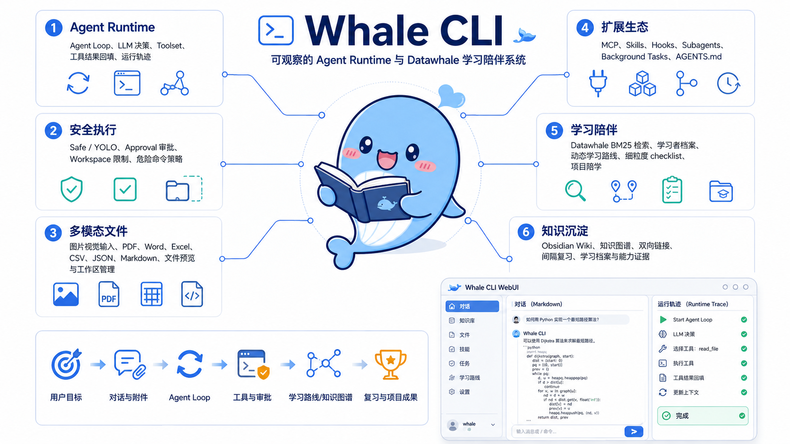

<p align="center">
  
</p>

<h1 align="center">Whale CLI</h1>

<p align="center"><strong>从 Agent Loop 到学习陪伴，一套能读、能跑、能改、能验证的学习型 Agent 系统。</strong></p>

<p align="center">
  
  
  
  
</p>

<p align="center">
  <a href="webui/public/project-intro.html">项目介绍</a> ·
  <a href="docs/新手入门/README.md">28 章教程</a> ·
  <a href="docs/部署与发布.md">部署指南</a> ·
  <a href="docs/测试报告.md">测试报告</a> ·
  <a href="CHANGELOG.md">Changelog</a>
</p>

---

Whale CLI 面向两类人：想亲手理解 coding agent 如何工作的学习者，以及希望用 AI 规划 Datawhale 学习路线、连接知识和完成项目的实践者。

它不是一个只返回答案的聊天壳。模型调用、工具分发、审批、会话、MCP 和学习状态都能在源码、测试和 WebUI 运行轨迹中找到对应位置。

<p align="center">
  
</p>

## 你能用它做什么

| 方向 | 能力 | 你会看到什么 |
|---|---|---|
| Agent Runtime | ReAct loop、Toolset、Todo、Compaction、Approval | 模型为什么调用工具、结果怎样进入下一轮、任务何时结束 |
| Harness | Agents、Hooks、Skills、Subagents、Background、AGENTS.md | 功能如何独立扩展，而不把核心循环改成一组 `if/elif` |
| MCP | stdio、Streamable HTTP、SSE | 外部工具如何进入统一 schema、审批和生命周期 |
| 文件任务 | 代码、图片、PDF、Office、表格和文本 | 附件预览、视觉输入、工作区文件浏览与受控写入 |
| 学习规划 | Datawhale BM25、学习者档案、动态路线 | 推荐依据、路线子任务、手动 checklist 与完成状态 |
| 知识沉淀 | Obsidian Wiki、知识图谱、间隔复习、学习档案 | 学过什么、知识如何关联、何时复习、项目留下了什么证据 |

## 五分钟开始

### 1. 安装

在本 README 所在目录执行。Python 必须为 3.10 或更高版本。

```bash
python3 --version
python3 -m venv .venv
source .venv/bin/activate
python -m pip install --upgrade pip
python -m pip install -e ".[dev]"
```

Windows PowerShell 使用：

```powershell
.venv\Scripts\Activate.ps1
```

### 2. 配置模型

Whale 默认使用 OpenAI 兼容的 Step Plan 接口和 `step-3.7-flash`。推荐通过环境变量配置：

```bash
export STEP_API_KEY="your-step-plan-key"
```

也支持 `step-explore`。它只接受 Anthropic Messages API；只需设置模型和它的密钥，Whale 会自动改用 `https://api.stepfun.com/v1/messages`、`x-api-key` 和 `anthropic-version`，不要填写 Step Plan 的 `base_url`：

```bash
export STEPFUN_API_KEY="your-step-explore-key"
export LLM_MODEL="step-explore"
unset LLM_BASE_URL
```

`step-explore` 当前在 Whale 中用于文本对话、总结和规划，不支持本项目的 OpenAI 工具调用或图片输入；需要读写文件、MCP、学习路线落盘或视觉任务时，请切换回 `step-3.7-flash`。该模型需先在 StepFun 开放平台完成开通和 API 白名单/Plan 审核。

也可以保存到本机配置文件：

```bash
mkdir -p ~/.whale
cp config.example.json ~/.whale/config.json
```

```json
{
  "llm": {
    "api_key": "your-step-plan-key",
    "base_url": "",
    "model": "step-3.7-flash",
    "vision_enabled": true
  }
}
```

真实 Key 不要写入仓库、教程、截图或提交记录。

### 3. 选择入口

终端 REPL：

```bash
whale-doctor
whale-cli
```

React WebUI：

```bash
make web
whale-doctor --web
whale-web
```

打开 <http://127.0.0.1:8765>。WebUI 提供 Markdown 对话、图片和文档输入、历史会话、命令面板、运行轨迹、审批、教程阅读、知识图谱、路线、复习和学习档案。

## 第一次对话

可以从这些任务开始：

```text
请先探索这个仓库，告诉我入口、主要模块和测试命令。
```

```text
请解释 Whale CLI 的 Agent Loop：模型如何选择工具，结果如何回填到下一轮？
```

```text
我是 Python 初学者，每周可以学习 6 小时，目标是四周完成一个 Agent 小项目。请根据 Datawhale 本地知识库先给我预览一条学习路线，不要直接确认生成。
```

```text
请从本地聊天记录生成今天的间隔复习表，并打开 Agent Loop 的复习资料。
```

## 系统如何工作

```text
User / WebUI / CLI
        │
        ▼
Session + Project Context
        │
        ▼
Soul.run() ── LLM Client
        │          │
        │      tool calls
        ▼          │
Toolset ◄──────────┘
  │
  ├── Approval + Workspace Policy
  ├── File / Bash / Web / Todo
  ├── MCP / Skills / Subagents / Background
  └── Profile / Knowledge / Roadmap / Review / Portfolio
        │
        ▼
tool result → messages → next turn or final answer
```

核心原则：

- `Soul` 只负责循环，不直接实现每一种工具。
- 工具通过 `Toolset` 暴露 schema、统一调用和回填结果。
- 写文件与命令默认需要审批，并继续受工作区策略限制。
- 会话、学习状态和运行数据使用 JSON/JSONL，本地可读、可迁移。
- CLI 与 WebUI 共用同一套运行时和学习模块。

## 学习陪伴闭环

Whale 的垂直能力不是一次性生成一份计划，而是一条由用户确认推进的学习循环：

1. `LearnerProfile` 记录基础、目标、时间和偏好。
2. Datawhale BM25 根据项目元数据和 GitHub README 检索证据。
3. `KnowledgeMap` 描述知识点的前置、关联、作用和可以解锁的能力。
4. `LearningRoadmap` 先预览路线，用户确认后才生成，并拆成任务和 checklist。
5. 用户在 CLI 对话或 WebUI 中明确标记完成。
6. `LearningReview` 根据日期生成间隔复习表，由用户自评回忆质量。
7. Obsidian Wiki、项目产出和 `LearningPortfolio` 留下可回看的学习证据。

## 教程地图与 WebUI 共学

教程位于 [`docs/新手入门/`](docs/新手入门/README.md)。每章都对应代码模块、最小案例和验证命令；不要只顺着 Markdown 阅读，推荐把 WebUI 和终端同时打开：

```bash
make web
whale-web
```

打开 <http://127.0.0.1:8765> 后，从左侧 **学习地图** 进入对应教程。把 **运行架构** 作为观察窗口：在聊天页完成章节中的任务时，查看模型回合、工具请求、审批和结果怎样流动。涉及学习能力的章节，再到 **学习图谱**、**学习路线**、**间隔复习** 和 **学习档案** 亲手确认状态变化。

难度约定：`入门` 只要求会运行命令和阅读 Python；`进阶` 需要理解函数、类和 JSON；`挑战` 建议先完成前置章节并愿意阅读多个模块。预计时间不含模型回复和自行扩展练习。

### 推荐体验顺序

| 阶段 | 适合谁 | CLI 要做什么 | WebUI 一起看什么 |
|---|---|---|---|
| 00-03 先跑起来 | 第一次接触 Agent | 启动 REPL，完成第一次对话和会话恢复 | 聊天、历史会话、学习地图 |
| 04-10 核心循环 | 想弄懂 Agent 为什么会行动 | 让模型调用工具、写 Todo、观察压缩 | 运行架构、运行轨迹、审批 |
| 11-20 扩展能力 | 想改造自己的 Agent | 配置 Agent、接入 MCP、尝试附件和后台任务 | 设置、命令面板、文件与轨迹 |
| 21-27 学习陪伴 | 想把项目用在真实学习上 | 生成路线、确认完成、复习并沉淀成果 | 学习图谱、路线 checklist、复习表、档案 |

### 00-03：先获得可观察的对话

| 章节 | 难度 | 预计 | 学完后你能做什么 |
|---|---|---:|---|
| [00 为什么要做这个 CLI](docs/新手入门/00-为什么要做这个CLI.md) | 入门 | 15 分钟 | 区分聊天机器人和可调用工具的 Agent，知道本项目的学习边界。 |
| [01 5 分钟体验：能帮你做什么](docs/新手入门/01-5分钟体验-能帮你做什么.md) | 入门 | 20 分钟 | 配好模型并完成一次可验证的任务。 |
| [02 REPL 与会话：把聊天框做成系统](docs/新手入门/02-REPL与会话-把聊天框做成系统.md) | 入门 | 35 分钟 | 理解消息、会话、命令和历史恢复。 |
| [03 最小 LLM Client：先打通对话](docs/新手入门/03-最小LLMClient-先打通对话.md) | 入门 | 35 分钟 | 看懂 OpenAI 兼容请求、模型配置和最小响应链路。 |

**WebUI 配合**：在聊天页完成第一个提问，刷新页面后从历史会话回到同一段对话；随后从学习地图打开 02、03，对照消息和运行轨迹阅读代码。

### 04-10：掌握 Agent 核心循环

| 章节 | 难度 | 预计 | 学完后你能做什么 |
|---|---|---:|---|
| [04 AgentLoop v0：从聊天到会做事的循环](docs/新手入门/04-AgentLoopv0-从聊天到会做事的循环.md) | 进阶 | 50 分钟 | 解释模型决策、工具调用、结果回填和结束条件。 |
| [05 Tools v0：最小工具箱](docs/新手入门/05-Toolsv0-最小工具箱.md) | 入门 | 35 分钟 | 注册并调用一个结构化工具。 |
| [06 Tools v1：写文件与跑命令](docs/新手入门/06-Toolsv1-写文件与跑命令.md) | 进阶 | 45 分钟 | 理解写入、命令审批和受控执行的边界。 |
| [07 TodoList：把计划变成可追踪任务](docs/新手入门/07-TodoList-把计划变成可追踪任务.md) | 入门 | 30 分钟 | 让 Agent 把工作拆成可见状态。 |
| [08 Skills：把套路沉淀成能力包](docs/新手入门/08-Skills-把套路沉淀成能力包.md) | 进阶 | 40 分钟 | 把可复用指导从提示词中拆为 Skill。 |
| [09 SessionNote 与上下文压缩：稳态系统](docs/新手入门/09-SessionNote与上下文压缩-稳态系统.md) | 进阶 | 45 分钟 | 理解长会话为何需要摘要、如何恢复上下文。 |
| [10 Part 1 结尾：Demo 清单](docs/新手入门/10-Part1结尾-Demo清单.md) | 入门 | 25 分钟 | 用一组 Demo 验证核心闭环确实跑通。 |

**WebUI 配合**：选择一个需要读取文件或生成 Todo 的任务，观察 **运行架构** 中的每一步；当出现写文件或运行命令请求时，在审批面板亲自选择，别把 Safe 模式当成后台装饰。

### 11-20：把最小 Agent 扩展成可维护系统

| 章节 | 难度 | 预计 | 学完后你能做什么 |
|---|---|---:|---|
| [11 Agents 与系统提示词：把配置从代码里拿出来](docs/新手入门/11-Agents与系统提示词-把配置从代码里拿出来.md) | 进阶 | 40 分钟 | 用配置和模板定义不同 Agent 的职责。 |
| [12 Hooks：把自动化护栏挂在循环外](docs/新手入门/12-Hooks-把自动化护栏挂在循环外.md) | 进阶 | 45 分钟 | 在生命周期中加入可组合的检查与记录。 |
| [13 Subagents：把复杂任务交给干净上下文](docs/新手入门/13-Subagents-把复杂任务交给干净上下文.md) | 进阶 | 50 分钟 | 让子代理承担独立子任务而不污染主会话。 |
| [14 Background Tasks：让慢任务后台跑](docs/新手入门/14-BackgroundTasks-让慢任务后台跑.md) | 挑战 | 50 分钟 | 理解后台任务、状态轮询和结果回收。 |
| [15 Skills 进阶：按来源分层发现](docs/新手入门/15-Skills进阶-按来源分层发现.md) | 进阶 | 35 分钟 | 管理项目、用户和内置 Skill 的优先级。 |
| [16 MCP 与插件：把外部能力接进工具池](docs/新手入门/16-MCP与插件-把外部能力接进工具池.md) | 挑战 | 60 分钟 | 接入 stdio、HTTP 或 SSE MCP，并保持统一工具边界。 |
| [17 AGENTS 与项目上下文：让仓库规则自动生效](docs/新手入门/17-AGENTS与项目上下文-让仓库规则自动生效.md) | 进阶 | 35 分钟 | 让项目规则随目录加载，而非重复粘贴提示词。 |
| [18 进阶收束：Whale CLI 扩展路线](docs/新手入门/18-进阶收束-WhaleCLI扩展路线.md) | 入门 | 25 分钟 | 根据自身目标选择下一类扩展，而不盲目堆功能。 |
| [19 四种 Loop 模式：让 Agent 按条件持续工作](docs/新手入门/19-四种Loop模式-让Agent按条件持续工作.md) | 挑战 | 55 分钟 | 区分 turn、goal、time、proactive 四种循环控制方式。 |
| [20 附件与文件输入：让多格式资料进入任务](docs/新手入门/20-附件与文件输入-让多格式资料进入任务.md) | 进阶 | 45 分钟 | 用图片、PDF、Office 和文本资料驱动任务。 |

**WebUI 配合**：在 **设置** 中确认模型与视觉开关；用命令面板快速发起章节任务，上传一个小文件，并在运行轨迹中对照 MCP、Subagent 或后台任务事件。真实外部工具只接入可信来源。

### 21-27：把 Agent 变成学习陪伴系统

| 章节 | 难度 | 预计 | 学完后你能做什么 |
|---|---|---:|---|
| [21 Datawhale 学习规划 Subagent：用知识库做垂直路线](docs/新手入门/21-Datawhale学习规划Subagent-用知识库做垂直路线.md) | 进阶 | 50 分钟 | 用 BM25 证据为学习建议提供资料来源。 |
| [22 学习者档案：先知道要帮谁](docs/新手入门/22-学习者档案-先知道要帮谁.md) | 入门 | 30 分钟 | 记录目标、基础、时间和偏好，避免千人一面。 |
| [23 双链知识图谱：把学过的东西连起来](docs/新手入门/23-双链知识图谱-把学过的东西连起来.md) | 进阶 | 50 分钟 | 生成 Obsidian 可读的 Wiki 与概念关系。 |
| [24 动态学习路线：下一步只做一件事](docs/新手入门/24-动态学习路线-下一步只做一件事.md) | 进阶 | 45 分钟 | 先预览再确认路线，并用任务和子任务推进。 |
| [25 间隔复习：让学过的内容留下来](docs/新手入门/25-间隔复习-让学过的内容留下来.md) | 入门 | 40 分钟 | 生成复习表、查看资料摘要并记录回忆反馈。 |
| [26 项目陪学：从推荐到本地练习](docs/新手入门/26-项目陪学-从推荐到本地练习.md) | 进阶 | 50 分钟 | 把课程或仓库转为有前置补充与产出要求的项目任务。 |
| [27 学习档案与社区反馈：把进步留下来](docs/新手入门/27-学习档案与社区反馈-把进步留下来.md) | 入门 | 35 分钟 | 浏览学习证据、生成总结，并准备可选的社区反馈草稿。 |

**WebUI 配合**：先在对话里说明你的学习目标，只让 Agent **预览**路线；确认后到 **学习路线** 勾选 checklist。再打开 **学习图谱** 查看知识点关系，在 **间隔复习** 中完成复习，最后到 **学习档案** 浏览可展示的证据。路线和完成状态应由学习者确认，而不是由模型自行宣告。

## 目录结构

```text
src/whale_cli/
├── soul/             # Agent Loop、Toolset、Approval、Todo、Compaction
├── llm/              # OpenAI 兼容客户端
├── tools/            # 文件、命令、网页、学习与后台工具
├── storage/          # JSONL 会话持久化
├── loops/            # turn / goal / time / proactive
├── mcp/              # 配置、transport、adapter 与 auth
├── learning/         # 档案、图谱、路线、复习、项目、Wiki 与作品集
├── agents/           # agent.yaml 与 system template
├── skills/           # 内置能力包
├── hooks/            # 生命周期事件
├── subagents/        # 干净上下文与 Datawhale 子代理
├── security/         # 工作区与危险命令策略
├── runtime.py        # 运行目录配置
├── doctor.py         # 安装与部署诊断
└── web/server.py     # 可安装 WebUI 后端

webui/                # React 前端与静态项目介绍页
docs/新手入门/        # 00-27 渐进教程
tests/                # 单元、模块、集成与真实模型 E2E
```

## MCP

项目级 MCP 配置默认保存在 `.whale_cli/mcp.json`：

```bash
mkdir -p .whale_cli
cp mcp.example.json .whale_cli/mcp.json
whale-cli
```

当前支持 `stdio`、Streamable HTTP 和 SSE。外部工具会被转换为 Whale `Tool`，继续经过统一审批、Hooks 和结果回填。OAuth 交互回调尚未完成，不作为当前稳定能力承诺。

## 运行数据

| 位置 | 内容 |
|---|---|
| `~/.whale/` 或 `$WHALE_HOME` | 模型配置、会话、上传文件 |
| 当前目录或 `$WHALE_WORKSPACE` | 项目文件和项目级学习数据 |
| `.whale_cli/learning/` | 档案、图谱、路线、复习与项目状态 |
| `.whale_cli/mcp.json` | 项目 MCP 配置 |
| `learning-wiki/` | 可由 Obsidian 打开的 Markdown Wiki |

## Docker

```bash
export STEP_API_KEY="your-step-plan-key"
export WHALE_WORKSPACE_PATH="$PWD"
docker compose up -d --build
curl http://127.0.0.1:8765/ready
```

Compose 默认只向宿主机 `127.0.0.1` 发布端口。运行数据保存在 `whale-data` volume，工作区通过 bind mount 提供给 Agent。

### 阿里云 ACR 公网镜像

项目的公网镜像仓库为：

```text
crpi-l4ex9om7pwr2is5u.cn-shanghai.personal.cr.aliyuncs.com/while_cli/while_cli
```

仓库是公开的，因此已发布的版本可以直接拉取；但推送仍需使用此 ACR 实例的访问凭证登录。当控制台中出现 `0.3.0` 标签后，可使用：

```bash
docker pull crpi-l4ex9om7pwr2is5u.cn-shanghai.personal.cr.aliyuncs.com/while_cli/while_cli:0.3.0
```

维护者的推送、验证和发布标签流程见 [`docs/部署与发布.md`](docs/部署与发布.md)。

完整的源码、wheel、Docker 和 systemd 部署流程见 [`docs/部署与发布.md`](docs/部署与发布.md)。

## 测试与发布

```bash
# 离线测试，不调用真实模型
python -m pytest

# 真实 step-3.7-flash E2E
RUN_E2E=1 python -m pytest tests/test_e2e.py -v

# Python + React + doctor + wheel 发布门禁
make release
```

0.3.0 当前验证状态：

- 174 项离线测试通过，4 项真实模型 E2E 默认跳过。
- React 生产构建通过。
- wheel 在独立 Python 3.11 环境安装并启动通过。
- Docker 镜像构建、容器 health 和 HTTP API 烟测通过。

详情见 [`docs/测试报告.md`](docs/测试报告.md)。

## 安全边界

- Safe 模式会在写文件和执行命令前询问；YOLO 只跳过询问，不绕过工作区策略。
- 审批不是完整操作系统沙箱。只应向 Whale 提供你愿意让它访问的工作区。
- WebUI 当前定位为单用户本地或可信内网工具，默认监听 `127.0.0.1`。
- 直接公网部署前必须增加 HTTPS、身份认证、限流和多用户隔离。
- MCP server、skills 和 plugins 都属于可执行扩展，只加载可信来源。

## 参与项目

提交改动前请运行：

```bash
make test
git diff --check
```

新增能力时，请同时补充对应测试与教程章节，让代码、示例和解释保持一致。版本变化记录在 [`CHANGELOG.md`](CHANGELOG.md)。

## License

Whale CLI 使用 [MIT License](LICENSE)。
