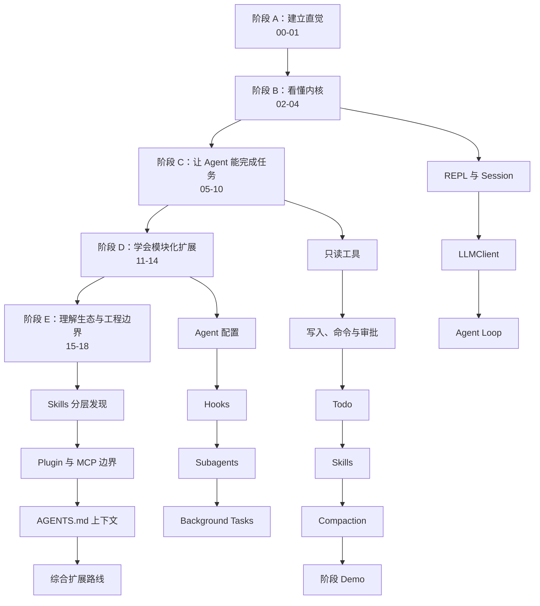

# Whale CLI 教程分层改造与逐章修改意见

> 用途：这是一份教程编辑实施说明，不是新的教程正文。它把修改任务拆成可独立执行、可验证的小步骤，便于能力较弱的模型逐章修改，避免一次改动过多后出现事实错误、章节串线或代码与正文不一致。

## 1) 范围与假设

- 分析范围：`docs/新手入门/00` 至 `18`、教程总目录、对应的 `src/whale_cli/` 实现与 `tests/`。
- 对照范围：本地 `learn-claude-code` 的递进式教学方法，重点参考“每章只新增一个机制、概念后紧跟可运行代码、明确下一章增量”的组织方式。
- 未覆盖范围：本文件不直接重写 20 章正文，不实现当前代码中缺失的安全沙箱、额外 MCP transport 或 OAuth，也不替教程补外部网页引用。
- 关键假设：教程目标不是只教读者使用 Whale CLI，而是让读者理解并能亲手实现一个小型 coding-agent harness。
- 修改原则：教程只能描述已经实现并能验证的行为。尚未实现的内容必须明确标注为“设计草案”“扩展练习”或“与当前实现的差距”。

## 2) 项目与教程现状总览

Whale CLI 已经有一条完整的 20 章教学线，覆盖 REPL、会话、模型客户端、Agent Loop、工具、审批、Todo、上下文压缩、Agents、Hooks、Subagents、后台任务、Skills、插件、项目上下文和四种 Loop 模式。当前问题主要不是章节缺失，而是以下四类教学问题。

### 2.1 学习坡度不均

- 00、01 偏产品体验，02 突然进入较完整的会话设计，初学者容易从“会运行”直接跳到“理解多文件状态系统”。
- 03、04 才解释模型调用和 Agent Loop，但它们其实是后续所有模块的共同内核。
- 11 至 17 使用“生产级参考实现”作为叙事主线，却没有始终先解释当前 Whale CLI 的最小机制，再讲生产差距。

证据：02 章已经展开真实启动链、消息持久化和出站消息投影（`docs/新手入门/02-REPL与会话-把聊天框做成系统.md:26`、`:104`、`:353`），而 04 章才正式介绍 Agent Loop（`docs/新手入门/04-AgentLoopv0-从聊天到会做事的循环.md:20`）。

### 2.2 “代码片段”不等于“可运行课程代码”

现有每章都有“本章模块化代码”，这是很好的基础。但多数代码是从最终项目中截取的片段，省略了 import、依赖创建、输入数据和运行入口。读者能看懂局部，却不一定能独立跑通本章机制。

对照 `learn-claude-code`，建议每章保留两套代码视角：

1. 教学快照：只包含本章新增机制，可直接运行。
2. 正式实现映射：指出该机制在 `src/whale_cli/` 中的真实位置、调用者和测试。

### 2.3 部分正文与当前实现不一致

必须先处理的事实冲突：

| 优先级 | 章节 | 当前问题 | 代码事实 |
|---|---|---|---|
| P0 | 00、02 | 正文残留 `cite...` 内部引用占位符 | 这些不是可访问链接，会破坏发布质量（`00`:38，`02`:185） |
| P0 | 01 | 使用 `MOONSHOT_API_KEY`，并把预期输出写死为 Windows 10 | 默认配置是 Step Plan；系统信息在运行时生成（`src/whale_cli/llm/client.py:23`、`src/whale_cli/soul/soul.py:120`） |
| P0 | 03 | 说“改源码里的 `self.model`”，又说错误不会让上层循环崩溃 | 模型已有 `LLM_MODEL` 和配置文件入口；`LLMClient.chat()` 会重新抛错，由 `Soul.run()` 捕获（`src/whale_cli/llm/client.py:97`、`:155`，`src/whale_cli/soul/soul.py:321`） |
| P0 | 05 | 把 `ListDir` 列为 v0 工具，但默认工具池没有它 | 当前只读工具是 `ReadFile`、`Glob`、`Grep`（`src/whale_cli/soul/soul.py:45`） |
| P0 | 06 | 正文说命令和文件只能在 workspace 内执行，并拦截危险命令 | 当前只做审批和少量 `..` 检查；Bash 仍是 `shell=True`，没有工作区沙箱（`src/whale_cli/tools/bash/bash_tool.py:28`、`src/whale_cli/tools/file/write_tool.py:35`） |
| P0 | 07 | 正文声称 Todo 持久化，字段为 id/title/status/notes | 当前 `TodoStore` 只在内存中，数据只有 title/status，状态为 pending/in_progress/done（`src/whale_cli/soul/todo_store.py:20`、`:35`） |
| P0 | 09 | 标题和正文把 Session Note 描述为独立长期存储 | 当前只有压缩摘要消息，没有独立 Session Note store（`src/whale_cli/soul/compaction.py:79`） |
| 已修复 | 16 | 旧版把 MCP 与插件混写，读者无法判断什么能运行 | 当前已实现项目本地插件和 MCP stdio / HTTP / SSE transport；OAuth 交互回调、健康检查与连接池仍是生产差距（`src/whale_cli/mcp/loader.py:49`） |

### 2.4 测试没有成为学习路径的一部分

项目现有测试覆盖了 LLMClient、Toolset、文件工具、审批、Todo、Compaction、Hooks、Subagent、Background、Skills、Plugins、AGENTS 上下文和 Soul 集成。教程却没有统一告诉读者“这一章应读哪个测试、先跑哪个单测、如何制造一个失败用例”。例如会话系统已经讲得很深，但当前 `tests/` 中没有独立的 SessionStore 回归测试。

测试证据示例：

- Agent Loop：`tests/test_soul_integration.py:16`、`:88`
- 工具分发：`tests/test_toolset.py:57`、`:65`、`:72`
- Todo：`tests/test_todo.py:12`、`:72`
- 压缩：`tests/test_compaction.py:58`、`:87`、`:109`
- Hooks：`tests/test_hooks.py:15`、`:25`
- 插件与 Subagent：`tests/test_plugin_and_subagent.py:8`、`:28`

## 3) 分层学习架构图（Mermaid）



学习路线必须遵守一个约束：后一个阶段只能使用前一阶段已经解释过的名词。首次出现的名词必须在同章用一句白话定义，并给出一个最小输入输出例子。

## 4) 分层学习架构图（ASCII）

```text
[先相信它能工作]
  00 为什么做  ->  01 五分钟体验
                         |
                         v
[看懂最小内核]
  02 REPL/Session -> 03 LLMClient -> 04 Agent Loop
                                         |
                                         v
[让它能完成任务]
  05 只读工具 -> 06 写入/命令/审批 -> 07 Todo
       -> 08 Skills -> 09 Compaction -> 10 Demo
                                         |
                                         v
[学会扩展运行时]
  11 Agent 配置 -> 12 Hooks -> 13 Subagents -> 14 Background
                                         |
                                         v
[理解生态边界]
  15 Skill 发现 -> 16 Plugin/MCP -> 17 AGENTS.md -> 18 路线图
```

## 5) 教程模块职责与边界

| 教学模块 | 对应章节 | 读者必须掌握 | 暂不要求掌握 | 实现证据 |
|---|---|---|---|---|
| 使用入口 | 00-01 | 能安装、配置、启动、退出，能观察一次工具调用 | Agent 内部状态 | `src/whale_cli/ui/shell/main.py:307` |
| 会话层 | 02 | 控制命令与消息分离、消息追加、恢复边界 | 数据库迁移、并发写 | `src/whale_cli/storage/session_store.py:21` |
| 模型边界 | 03 | 配置优先级、出站消息、单次模型调用 | 多 provider 抽象 | `src/whale_cli/llm/client.py:118` |
| 循环内核 | 04 | assistant/tool 消息闭环、停止条件、最大步数 | 流式执行、并发工具 | `src/whale_cli/soul/soul.py:298` |
| 工具协议 | 05-06 | schema、注册、分发、标准结果、审批 | 真正的沙箱 | `src/whale_cli/soul/toolset.py:30` |
| 任务状态 | 07 | Todo 整体替换、状态约束、UI 查看 | 持久化任务图 | `src/whale_cli/soul/todo_store.py:35` |
| 知识加载 | 08、15 | 发现、去重、索引注入、按需读取 | 远程技能市场 | `src/whale_cli/skill/discovery.py:15` |
| 上下文管理 | 09 | token 估算、触发、摘要、最近消息保留 | 独立 Session Note | `src/whale_cli/soul/compaction.py:29` |
| Prompt 配置 | 11 | agent.yaml、system.md、模板组装 | 完整 YAML 与热更新 | `src/whale_cli/agents/loader.py:47` |
| 事件扩展 | 12 | Pre/Post 事件、block/allow/append | 异步 hooks、配置加载 | `src/whale_cli/hooks/engine.py:17` |
| 子上下文 | 13 | 独立 messages、受限工具集、摘要回传 | 并行 agent team | `src/whale_cli/subagents/runner.py:32` |
| 后台运行 | 14 | 状态机、输出增量读取、超时 | 进程重连、任务队列 | `src/whale_cli/background/manager.py:15` |
| 外部扩展 | 16 | 本地插件与 MCP 多 transport 如何适配成 Tool | OAuth 交互回调、健康检查、连接池 | `src/whale_cli/mcp/loader.py:49` |
| 项目规则 | 17 | 根到叶发现、合并、预算 | 多格式规则优先级策略 | `src/whale_cli/context/project.py:59` |

## 6) 跨文件完整调用栈与教学顺序

教程中的代码不能只给类定义，还应至少解释以下五条完整链路。每条链路都应在对应章节中出现一次“输入 -> 调用 -> 状态变化 -> 输出 -> 失败点”。

### 链路 1：启动与恢复会话

- 触发源：执行 `whale-cli`。
- 调用序列：`main()` -> `_get_store()` -> `_restore_latest_session()` -> `SessionStore.get_latest_session_id()` -> `load_messages()` -> `Soul(initial_messages=...)`。
- I/O 边界：`.whale_cli/sessions/index.jsonl` 与会话 JSONL 文件。
- 失败处理：无历史或消息为空时创建新会话；坏 JSON 行被跳过。
- 教学落点：02 章。
- 证据：`src/whale_cli/ui/shell/main.py:282`、`:296`、`:307`；`src/whale_cli/storage/session_store.py:140`、`:146`。

### 链路 2：一次普通对话

- 触发源：REPL 中输入非斜杠命令。
- 调用序列：`main()` -> `_run_with_esc_pause()` -> `Soul.run()` -> `_append_message(user)` -> `_maybe_compact()` -> `LLMClient.chat()` -> `_append_message(assistant)`。
- I/O 边界：模型 HTTP 请求与 SessionStore 追加写。
- 失败处理：模型异常由 `Soul.run()` 捕获并结束本次运行；不会继续本轮循环。
- 教学落点：03 章解释模型边界，04 章解释循环。
- 证据：`src/whale_cli/ui/shell/main.py:133`；`src/whale_cli/soul/soul.py:298`、`:321`；`src/whale_cli/llm/client.py:155`。

### 链路 3：一次工具调用

- 触发源：模型返回 `tool_calls`。
- 调用序列：`Soul.run()` -> `Toolset.handle()` -> JSON 参数解析 -> PreToolUse hook -> Approval -> `Tool.__call__()` -> PostToolUse/PostToolUseFailure -> 标准结果 -> tool message -> 下一轮模型调用。
- I/O 边界：具体工具可能访问文件、命令或网络。
- 失败处理：未知工具、坏 JSON、参数错误和工具异常都转换为 `exit_code != 0`，单个工具失败不直接打断 Agent Loop。
- 教学落点：04、05、06、12。
- 证据：`src/whale_cli/soul/soul.py:330`、`:356`、`:364`；`src/whale_cli/soul/toolset.py:80`、`:113`、`:132`、`:144`。

### 链路 4：上下文压缩

- 触发源：每轮模型调用前执行 `_maybe_compact()`。
- 调用序列：`estimate_tokens()` -> `should_compact()` -> PreCompact -> `compact()` -> `llm.chat(tools=None)` -> 替换内存 messages -> PostCompact。
- I/O 边界：压缩会产生一次额外模型调用。
- 失败处理：压缩异常只打印提示，不终止用户任务。
- 教学落点：09、12。
- 证据：`src/whale_cli/soul/soul.py:260`、`:317`；`src/whale_cli/soul/compaction.py:29`、`:47`、`:79`。

### 链路 5：子 Agent 与后台任务

- 子 Agent：`AgentTool.__call__()` -> `SubagentRunner.run()` -> 新建 `Soul` -> 独立 messages 和受限工具 -> 提取最后一条 assistant 摘要。
- 后台任务：`BackgroundStartTool` -> `BackgroundTaskManager.start()` -> daemon thread -> `subprocess.Popen()` -> `BackgroundTaskStore` 写状态和输出。
- 失败处理：子 Agent 返回摘要/转录；后台超时或命令非零退出被记录为 failed。
- 教学落点：13、14。
- 证据：`src/whale_cli/subagents/runner.py:48`；`src/whale_cli/background/manager.py:23`、`:56`。

## 7) 依赖关系与统一写作规范

### 7.1 每章固定结构

所有章节统一为以下顺序。弱模型修改时不得调整顺序。

逐小节写法、整章 Markdown 骨架、基础模型任务指令和交付检查表见 `docs/教程小节标准化写作模板.md`。执行模型应以该文件为直接操作规范，本节只保留结构摘要。

1. 本章一句话：只说明本章新增的一个机制。
2. 前置知识：列出最多 3 个前章概念，并附链接。
3. 问题：给出一个没有本章机制就会失败的具体场景。
4. 最小解法：先用 10 至 30 行伪代码或最小代码建立直觉。
5. 工作原理：按步骤解释输入、状态变化、输出和停止条件。
6. 真实实现：给出 `src/whale_cli/` 文件、入口函数、调用者、被调用者。
7. 设计原理：解释为什么这样拆层，以及没有这样拆会出现什么问题。
8. 当前边界：分成“已实现”“未实现”“不能声称已实现”。
9. 动手实验：一个正常用例、一个失败用例。
10. 测试：给出精确 pytest 命令和测试函数名。
11. 本章模块化代码：保留可运行教学快照，并映射正式实现。
12. 自测题：3 个问题，答案放入折叠区或章末。
13. 下一章：只说明下一章在当前机制上新增什么。

### 7.2 每章代码交付标准

建议新增目录：

```text
examples/tutorial_steps/
├── s01_smoke/
│   └── run.py
├── s02_session/
│   └── code.py
├── s03_llm_client/
│   └── code.py
└── ...

tests/tutorial_steps/
├── test_s02_session.py
├── test_s03_llm_client.py
└── ...
```

每个 `code.py` 必须满足：

- 复制到临时目录也能运行，或在文件头写清唯一运行命令。
- 只使用本章及以前出现的概念。
- 不把真实 API Key 写进代码。
- 默认测试不访问网络；模型调用用 fake/mock。
- 文件末尾提供 `main()` 或一个最小可调用示例。
- 与正式实现不同的地方必须写“教学简化”，不能让读者误以为两者完全相同。

### 7.3 概念标签

正文使用以下标签，避免混淆“已经实现”和“未来设计”：

- `当前实现`：仓库代码中存在，且有测试或可运行验证。
- `教学简化`：为解释概念而省略了生产保护。
- `扩展练习`：读者可自行实现，当前仓库没有。
- `生产差距`：成熟系统通常需要，但本项目暂未覆盖。
- `危险边界`：代码可运行，但不等于安全沙箱。

### 7.4 测试分级

| 级别 | 用途 | 是否联网 | 示例 |
|---|---|---|---|
| L1 | 纯函数或数据结构 | 否 | token 估算、Todo 状态校验 |
| L2 | 模块集成 | 否 | Soul + MockLLM + Toolset |
| L3 | CLI/文件系统流程 | 否 | 临时目录中的会话、插件、后台任务 |
| L4 | 真实模型 E2E | 是 | `step-3.7-flash` 完成工具任务 |

每章至少提供一个 L1/L2/L3 测试。只有 01、03、10、18 可以把 L4 作为可选验收，不能把联网测试当作初学者唯一成功条件。

## 8) 重构与逐章修改计划（可执行）

### P0：先修事实，再扩写教学

#### 00. 为什么要做这个 CLI

- 学习阶段：零基础读者，建立 harness 心智模型。
- 保留：能力地图、整体架构图、验收标准。
- 必须修改：删除全部 `cite...` 占位符；需要引用的地方改成正常 Markdown 链接，无法确认来源的行业结论改成项目自身的设计目标。
- 必须新增：用 6 至 10 行代码展示唯一内核 `用户消息 -> 模型 -> 工具 -> 工具结果 -> 模型`；解释“模型负责决定，harness 负责执行”。
- 不要新增：这一章不展开 SessionStore、HookEngine、MCP 协议细节。
- 代码映射：`src/whale_cli/soul/soul.py:298`、`src/whale_cli/soul/toolset.py:80`。
- 验收：读者能用自己的话区分模型、Agent Loop、Tool 和 CLI UI。

#### 01. 5 分钟体验

- 学习阶段：只会运行命令的读者。
- 必须修改：把 API Key 改为 `STEP_API_KEY`；配置示例同时给 macOS/Linux 与 PowerShell；删除固定 Windows 10 和固定工具列表的预期文本。
- 必须修改：真正的“5 分钟主线”只保留启动、一次纯对话、一次只读工具调用。写文件与联网搜索移到“可选体验”，否则标题与实际时长不一致。
- 必须新增：每一步加入“失败时看哪里”，例如命令不存在、缺少 Key、网络错误、审批提示。
- 必须新增：明确真实模型输出存在差异，验收应看行为信号，不逐字匹配示例文本。
- 代码映射：入口 `src/whale_cli/ui/shell/main.py:307`，配置 `src/whale_cli/llm/client.py:65`。
- 测试映射：可选运行 `pytest tests/test_e2e.py -q`；默认先跑 `pytest tests/test_llm_client.py -q`。
- 验收：新读者在没有修改源码的情况下能完成一次对话和一次只读工具调用。

#### 02. REPL 与会话

- 学习阶段：理解系统状态的初学者。
- 当前优点：真实调用链、五个设计原则和恢复边界已经比较完整，应作为其他章节的深度标杆。
- 必须修改：删除 JSONL/SQLite 段落中的内部引用占位符；如果保留外部事实，改成正常链接。
- 必须拆层：先用一个只有 `while/input/dispatch` 的 20 行 REPL，再解释当前 416 行 UI 文件中的自动补全、ESC 暂停和 slash commands，避免一次加载过多概念。
- 必须新增：一张“内存消息、磁盘消息、发给模型的消息”字段对照表。
- 必须新增：独立 SessionStore 测试建议，至少覆盖创建、追加、恢复、坏 JSON 行、latest-session last-wins。
- 代码映射：`src/whale_cli/ui/shell/main.py:282`、`:290`、`:296`；`src/whale_cli/storage/session_store.py:46`、`:146`、`:168`。
- 验收：读者能解释 `/clear` 为什么创建新会话，以及 slash command 为什么不进入模型上下文。

#### 03. 最小 LLMClient

- 学习阶段：第一次接触模型 API 的 Python 读者。
- 必须修改：运行命令使用 `STEP_API_KEY`，不再把 `MOONSHOT_API_KEY` 作为主示例。
- 必须修改：“改源码中的 `self.model`”改为设置 `LLM_MODEL` 或 `~/.whale/config.json`；说明显式构造参数优先级最高。
- 必须修改：错误行为写准确。`LLMClient.chat()` 打印后重新抛出，`Soul.run()` 捕获并结束当前请求，不是自动重试。
- 必须新增：请求与响应最小 JSON 示例，说明 assistant 文本和 tool_calls 是两种合法响应。
- 必须新增：MockLLM/Fake OpenAI SDK 测试解释，避免初学者每次测试都消耗真实额度。
- 代码映射：`src/whale_cli/llm/client.py:65`、`:88`、`:97`、`:155`；`tests/test_llm_client.py:79`。
- 验收：只改环境变量即可切换 model/base_url；单元测试不联网。

#### 04. Agent Loop v0

- 学习阶段：掌握 Python 循环和列表的读者。
- 必须新增：先给不超过 30 行的最小 loop，再逐段映射到正式 `Soul.run()`；正式代码放在“深入实现”，不要一开始展示完整运行时。
- 必须新增：消息时间线，至少含 user -> assistant(tool_calls) -> tool -> assistant(text)。
- 必须新增：四种停止路径：无 tool_calls、达到 max_steps、用户暂停、LLM 调用失败。
- 必须澄清：当前工具按返回顺序串行执行，没有并行调度。
- 测试映射：`tests/test_soul_integration.py::test_soul_tool_call_round_trip` 和 `::test_soul_max_steps_caps_loop`。
- 代码映射：`src/whale_cli/soul/soul.py:298`、`:330`、`:339`、`:370`。
- 验收：读者能手画一轮工具调用的四条消息，并指出循环继续和停止的判断位置。

#### 05. Tools v0

- 学习阶段：会写简单类和函数的读者。
- 必须修改：删除未实现的 `ListDir`，或把它标成扩展练习；当前示例路径应使用 Glob/ReadFile/Grep。
- 必须新增：先解释 `Tool` 基类的四个成员：name、description、schema、`__call__`。
- 必须新增：schema 是给模型看的，handler 是给 Python 运行时调用的；两者名称和参数必须一致。
- 必须新增：Toolset 对未知工具、坏 JSON、错误参数、异常和字符串结果的归一化流程。
- 必须新增：读文件的分页、二进制拒绝和 grep 回退策略，作为“工具输出预算”的入门概念。
- 测试映射：`tests/test_toolset.py:57` 至 `:94`；`tests/test_file_tools.py:18` 至 `:114`。
- 代码映射：`src/whale_cli/tools/base.py:23`、`src/whale_cli/soul/toolset.py:80`。
- 验收：读者能新增一个只读工具，并通过 Toolset 调用，而不修改 `Soul.run()`。

#### 06. Tools v1

- 学习阶段：第一次让 Agent 修改文件和执行命令的读者。
- 必须修改：把 workspace 限制和危险命令检测从“当前安全策略”移动到“尚未实现的安全目标”。当前实现只有审批、超时和有限路径检查，不能称为沙箱。
- 必须新增：审批顺序图 `PreToolUse -> Approval -> Tool -> PostToolUse`，并解释 hook block=125、用户拒绝=126。
- 必须新增：`WriteFile`、`Edit`、`Bash` 的风险对照表，包括覆盖写、绝对路径、shell=True、命令注入和 changed_files 不完整。
- 必须新增：失败实验。拒绝一次审批、让 Edit 找不到 old_string、让 Bash 超时。
- 测试映射：`tests/test_approval.py:82`、`:96`；`tests/test_file_tools.py:124`；`tests/test_toolset.py:149`。
- 代码映射：`src/whale_cli/soul/approval.py:60`、`src/whale_cli/tools/bash/bash_tool.py:28`。
- 验收：读者能明确回答“有审批为什么仍不等于沙箱”。

#### 07. Todo List

- 学习阶段：理解可变状态和 dataclass 的读者。
- 必须修改：正文数据结构改为当前真实的 `title + status`，状态改为 pending/in_progress/done。
- 必须修改：明确 TodoStore 只活在当前 Soul 内存中，重启和恢复会话后 Todo 不会恢复。持久化放入扩展练习。
- 必须修改：删除 `todoread` 独立工具的描述。当前 TodoWrite 在 `todos=None` 时兼任读取。
- 必须新增：整体替换语义的优缺点，以及输入校验失败时旧列表保持不变的说明。
- 必须新增：解释 system prompt 如何要求模型在 3 步以上任务中维护 Todo。
- 测试映射：`tests/test_todo.py:30`、`:72`、`:105`、`:127`。
- 代码映射：`src/whale_cli/soul/todo_store.py:20`、`:35`；`src/whale_cli/tools/todo/todo_tool.py:62`。
- 验收：读者能说清“会话消息持久化”和“Todo 状态持久化”不是同一件事。

#### 08. Skills

- 学习阶段：知道 system prompt 和文件读取工具的读者。
- 必须新增：解释 Skill 不是可执行插件，而是被发现、索引并按需读取的知识文件。
- 必须新增：当前加载链 `discover_skills -> format_skills_for_prompt -> system prompt`，并说明正文不会全部注入。
- 必须新增：一个真正可运行的本地 Skill 实验，包括目录、frontmatter、重启会话、观察 system prompt 或模型行为。
- 必须澄清：当前没有专用 `Skill` 工具，模型依靠索引中的路径再用 ReadFile 读取正文。
- 测试映射：`tests/test_skills_and_agents.py:7`、`:16`。
- 代码映射：`src/whale_cli/skill/discovery.py:62`、`:80`、`:88`。
- 验收：读者能区分 Skill、Tool、Plugin 三者。

#### 09. Session Note 与上下文压缩

- 学习阶段：理解消息历史和 token 的读者。
- 必须修改：二选一。方案 A 是把标题改为“上下文压缩”；方案 B 是实现真正的 Session Note store 后再保留当前标题。推荐先用方案 A。
- 必须修改：不要声称“超过 30 轮仍保持目标”已被验证，除非补对应自动测试或实验记录。
- 必须新增：token 估算误差、0.85 阈值、`preserve_recent=2` 和额外模型调用成本。
- 必须新增：压缩前后消息数组的具体 JSON 示例，并解释摘要被包装成 user message 的原因与风险。
- 必须新增：模型压缩失败时的 fallback 路径，以及内存消息被压缩后是否同步重写磁盘历史。当前不会重写既有会话 JSONL，应明确说明。
- 测试映射：`tests/test_compaction.py:58`、`:87`、`:109`。
- 代码映射：`src/whale_cli/soul/compaction.py:79`；`src/whale_cli/soul/soul.py:260`。
- 验收：读者能列出压缩保留了什么、没有持久化什么、失败时会发生什么。

#### 10. Part 1 Demo

- 学习阶段：完成第一个完整闭环的读者。
- 必须新增：把 Demo 改成固定仓库夹具或临时目录任务，避免“加一条日志”因项目不同无法复现。
- 必须新增：评分表，分为探索、计划、审批、修改、测试、失败恢复、最终总结七项。
- 必须新增：一次故意失败的测试，让读者观察 Agent 是否读取 stderr 并修复。
- 必须新增：Part 1 依赖图和精确测试命令；测试失败时不要继续进入 Part 2。
- 测试映射：现有 `tests/test_llm_client.py`、`test_toolset.py`、`test_file_tools.py`、`test_todo.py`、`test_soul_integration.py`。
- 验收：同一个 Demo 可以重复运行，第二次不会产生不可控重复修改。

### P1：把进阶章节改成“先当前实现，后生产差距”

#### 11. Agents 与系统提示词

- 学习阶段：理解配置与运行时代码分离的读者。
- 调整顺序：先展示硬编码 prompt 的痛点，再展示 agent.yaml + system.md，最后对照生产级结构。
- 必须新增：AgentSpec 字段、模板变量来源、渲染结果和 fallback prompt 的完整链路。
- 必须新增：简单 YAML parser 的限制；不要让读者误以为支持完整 YAML 语法。
- 必须新增：模板缺变量、文件缺失、解析失败三个失败用例，并解释当前 `Soul` 会回退到内置 prompt。
- 测试映射：`tests/test_skills_and_agents.py:32`。
- 代码映射：`src/whale_cli/agents/loader.py:19`、`:47`、`:61`；`src/whale_cli/soul/soul.py:164`。
- 验收：改 system.md 后无需修改 Soul 代码即可改变角色说明。

#### 12. Hooks

- 学习阶段：理解事件回调的读者。
- 必须新增：从一次工具调用出发，逐行展示事件 payload、callback、HookResult、Toolset 行为。
- 必须新增：allow/block/append 三种语义表。特别说明当前 append 只提供聚合辅助方法，并非所有事件都自动注入模型上下文。
- 必须新增：hook 抛异常和返回非法类型时会 fail-closed，转换成 block。
- 必须澄清：当前 hooks 在内存注册，没有配置文件、shell hook、异步执行或持久化。
- 测试映射：`tests/test_hooks.py:15`、`:25`。
- 代码映射：`src/whale_cli/hooks/engine.py:34`；`src/whale_cli/soul/toolset.py:113`。
- 验收：读者能增加一个阻止特定工具参数的 PreToolUse hook，而不修改 `Soul.run()`。

#### 13. Subagents

- 学习阶段：理解上下文隔离和依赖注入的读者。
- 必须新增：父 Soul 和子 Soul 的对象对照表，明确共享 LLM/Approval，不共享 messages/Todo/Toolset。
- 必须新增：explore 与 coder 工具集差异，以及 coder 为什么仍会触发共享 Approval。
- 必须新增：子 Agent 的 transcript 如何被捕获、summary 如何从最后一条 assistant 消息提取。
- 必须澄清：当前是同步调用，不是并行团队；父会话只拿到工具返回结果。
- 测试映射：`tests/test_plugin_and_subagent.py:28`。
- 代码映射：`src/whale_cli/subagents/runner.py:25`、`:48`。
- 验收：父 messages 不包含子 Agent 的完整中间消息，只包含 AgentTool 的结果。

#### 14. Background Tasks

- 学习阶段：理解线程、进程和持久状态区别的读者。
- 必须新增：TaskSpec、TaskRuntime、TaskView 三层数据的职责表。
- 必须新增：状态转换 pending -> running -> completed/failed/killed，以及 timeout 路径。
- 必须新增：daemon thread、Popen process 和 JSON store 的关系；“状态落盘”不等于“进程可在 CLI 重启后继续管理”。
- 必须澄清：manager 有 stop，但当前默认工具池只暴露 start/list/output；若正文讲停止能力，应先补工具和测试。
- 测试映射：`tests/test_background.py:7`、`:23`。
- 代码映射：`src/whale_cli/background/manager.py:23`、`:44`、`:56`。
- 验收：读者能通过 output offset 增量读取日志，并识别一个超时任务。

#### 15. Skills 进阶

- 学习阶段：已理解第 08 章 Skill 基础的读者。
- 必须先复习：本章只新增“多来源、优先级、去重”，不要重复讲 Skill 是什么。
- 必须新增：每个搜索根的 scope、路径与优先级表；用两个同名 Skill 做覆盖实验。
- 必须新增：frontmatter 解析失败、缺 description 和重复名称的行为。
- 必须说明：高优先级先赢是列表顺序决定的，不是按文件时间或版本号。
- 测试映射：`tests/test_skills_and_agents.py:16`。
- 代码映射：`src/whale_cli/skill/discovery.py:15`、`:28`、`:62`。
- 验收：读者能预测同名 Skill 最终来自哪个 scope，并用测试证明。

#### 16. MCP 与插件

- 学习阶段：理解 Tool 协议和动态导入的读者。
- 当前实现：本地插件与真实 MCP（stdio / HTTP / SSE）都会适配成 Tool；教程必须区分两者的发现与执行方式。
- 必须新增：插件发现 -> manifest -> 动态 import -> Tool 实例，以及 MCP 配置 -> session 初始化 -> list_tools -> adapter -> tools/call -> lifecycle close 的完整链路。
- 必须新增：插件与 MCP server 都是外部代码；前者与 CLI 同进程，后者是受配置启动的外部进程，两者都不是沙箱。
- 必须新增：坏 manifest、导入失败、MCP 配置错误、server 发现失败、远端工具错误与超时的行为说明。
- 测试映射：`tests/test_plugin_and_subagent.py:8`、`tests/test_mcp.py:49`。
- 代码映射：`src/whale_cli/plugin/loader.py:16`、`:27`；`src/whale_cli/mcp/loader.py:24`；`src/whale_cli/mcp/client.py:20`。
- 验收：本地 Echo 插件与 stdio MCP Echo server 都能进入 Toolset；读者能区分已实现的三种 transport 和未完成的 OAuth 交互回调。

#### 17. AGENTS 与项目上下文

- 学习阶段：理解目录树和 prompt 组装的读者。
- 必须新增：一个三层临时目录实验，在根目录和子目录放不同 AGENTS.md，展示 root-to-leaf 合并结果。
- 必须新增：项目根识别、候选文件、预算截断、leaf 优先保留的完整算法。
- 必须新增：文件不存在、空文件、超预算和多个候选文件的边界行为。
- 必须解释：项目上下文在 Soul 初始化时注入，运行中修改 AGENTS.md 不会自动刷新当前 Soul。
- 测试映射：`tests/test_project_context.py:4`、`:20`。
- 代码映射：`src/whale_cli/context/project.py:10`、`:34`、`:59`；`src/whale_cli/soul/soul.py:162`。
- 验收：读者能预测三层规则的最终拼接顺序和预算保留方向。

#### 18. 进阶收束

- 学习阶段：准备独立扩展项目的读者。
- 必须新增：一张“当前已实现/部分实现/未实现”能力矩阵，避免结尾只给抽象路线。
- 必须新增：三个难度递增的毕业项目：持久化 Todo、WorkspaceSandbox、MCP 连接管理；每个项目写最小改动集、测试和完成定义。
- 必须新增：从用户输入到文件/命令副作用的总调用链复盘。
- 必须新增：让读者选择一条路线，而不是同时实现所有高级能力。
- 必须新增：生产化前的安全清单，明确 shell=True、动态插件、外部网络、密钥和日志中的敏感数据风险。
- 代码映射：`src/whale_cli/soul/soul.py:45`、`:78`、`:298`。
- 验收：读者能独立选择一个扩展点，写测试，再改实现，并说明它对现有层次的影响。

### P2：统一语言、链接与版式

- 统一中英文空格、全角引号、代码标识和命令块语言标签。
- 删除会随模型输出变化的逐字“预期回答”，改成行为检查项。
- 外部引用使用可点击 Markdown 链接，不保留搜索工具内部引用 ID。
- 每章开头注明预计时间和难度，但时间必须与主线任务规模一致。
- 每章结尾加入“本章没有实现什么”，主动约束读者预期。
- 每个图只解释一个关系；正文必须能在图片无法显示时仍独立成立。
- 避免“生产级”“行业标准”“一定”等无证据的绝对说法，改为可由本地代码或测试支持的表述。

## 9) 分阶段上手与编辑计划

这里同时给读者学习计划和教程编辑计划。每完成一天，都应有可检查产物。

### Day 1：校准事实

- 修改章节：00、01、03、05、06、07、09、16。
- 任务：只修事实冲突、过时配置、未实现能力和引用占位符，不扩写大段原理。
- 产物：正文中所有“当前支持”都能在源码或测试中找到证据。
- 检查：全文搜索 `cite`、`MOONSHOT_API_KEY`、`Windows 10`、`ListDir`、`Session Note`、`MCP`。

### Day 2：建立统一章模板

- 修改章节：先用 04 章做模板样板。
- 任务：按“问题、最小解法、工作原理、真实实现、设计原理、边界、实验、测试、下一章”重排。
- 产物：04 章可以让读者从 30 行 loop 逐步走到正式 `Soul.run()`。
- 检查：初学者不读完整 Soul 也能解释 Agent Loop。

### Day 3：补核心链路

- 修改章节：02、03、05、06。
- 任务：分别补启动恢复链、模型调用链、工具注册分发链和审批链。
- 产物：每章都有一条完整调用链和一个失败路径。
- 检查：代码路径、函数名和当前仓库一致。

### Day 4：补状态系统

- 修改章节：07、09、14、17。
- 任务：补 Todo、Compaction、Background、AGENTS 的状态结构、生命周期和持久化边界。
- 产物：每章都有状态转换表和“重启后还剩什么”的说明。
- 检查：不再把内存态描述成持久态。

### Day 5：补扩展机制

- 修改章节：08、11、12、13、15、16。
- 任务：统一解释“扩展点如何进入主运行时”，并补失败行为。
- 产物：Skill、Tool、Hook、Subagent、Plugin 的边界对照表。
- 检查：读者不会把 Skill 当可执行插件，也不会把 Plugin 当 MCP。

### Day 6：补可运行教学快照

- 修改范围：`examples/tutorial_steps/` 与 `tests/tutorial_steps/`。
- 任务：优先实现 02 至 07 的最小快照，后续章节分批补。
- 产物：每个快照有一条运行命令和至少一个离线测试。
- 检查：快照不依赖未来章节代码，不包含真实密钥。

### Day 7：总体验收

- 修改章节：10、18、README。
- 任务：更新学习地图、阶段 Demo、毕业项目和测试矩阵。
- 产物：新读者可以按 README 从零走到一个可重复的完整任务。
- 检查：Markdown 代码围栏完整、链接存在、离线测试全过、真实 E2E 为可选项。

## 10) 风险、未知项与验证待办

### 已确认风险

- 安全文案超出代码能力：审批不等于 workspace 沙箱，`shell=True` 和动态插件仍有高权限风险。
- 状态文案超出代码能力：Todo 非持久化，Session Note 未独立实现。
- MCP 当前支持 stdio、Streamable HTTP 与 SSE，并在 Soul 退出时释放 client；OAuth 交互回调、健康检查、重连与连接池仍是生产差距。
- 教程输出过度具体：模型回答、工具选择和操作系统文本不应逐字固定。
- 会话模块缺专门测试：02 章的关键持久化行为没有独立测试文件作为学习入口。

### 未确认但需要验证

- Step Plan 的最大上下文是否始终等于代码默认的 256000；教程应把它写成本地配置默认值，而不是未经验证的模型保证。
- 搜索工具在不同网络环境下的稳定性；01 章不应把联网搜索作为必过主线。
- 后台 daemon thread 在 CLI 退出时的状态一致性；当前落盘状态不代表进程可恢复。
- 插件加载失败全部静默跳过是否适合教学；建议至少提供 debug 日志或诊断命令。

### 发布前验证清单

```text
[ ] 20 章都包含“前置知识”与“当前边界”
[ ] 20 章都能指出正式实现文件
[ ] 02-17 每章至少关联一个离线测试
[ ] 不存在内部引用占位符
[ ] 不存在明文 API Key
[ ] 不把未实现能力写成当前功能
[ ] 所有 shell 命令注明适用平台或给出两套写法
[ ] 所有示例输出改成行为验收，不要求逐字一致
[ ] Markdown 代码围栏成对
[ ] 本地图片引用存在
[ ] pytest 离线测试通过
[ ] 真实 Step 3.7 E2E 只在显式启用时运行
```

## 附录 A：给能力较弱模型的单章修改指令

下面这段提示词可以直接复用。每次只替换一个章节，禁止一次改多章。

```text
你现在只修改一个 Whale CLI 教程文件。

目标文件：<填写一个绝对路径>
本章主题：<填写主题>
本章对应源码：<填写 1-4 个文件>
本章对应测试：<填写 1-3 个测试文件或测试函数>

严格执行以下步骤：
1. 先读取目标教程全文。
2. 再读取列出的源码和测试，不要根据记忆猜实现。
3. 列出正文与代码不一致的地方；先修事实错误。
4. 按以下固定顺序组织章节：
   本章一句话 -> 前置知识 -> 问题 -> 最小解法 -> 工作原理
   -> 真实实现 -> 设计原理 -> 当前边界 -> 动手实验
   -> 测试 -> 本章模块化代码 -> 自测题 -> 下一章。
5. 每次只介绍一个新增机制，不提前使用后续章节概念。
6. 代码片段必须来自当前仓库，或明确标注“教学简化”。
7. 未实现的功能必须写成“扩展练习”或“生产差距”，不能写成当前能力。
8. 不写真实 API Key，不生成假的引用，不保留类似 cite 的占位符。
9. 给出一个正常实验和一个失败实验。
10. 给出精确 pytest 命令；默认测试不得联网。

完成后执行检查：
- 搜索过时项目名和过时环境变量。
- 检查 Markdown 代码围栏是否成对。
- 检查文中源码路径是否存在。
- 运行本章对应离线测试。

最终只汇报：修改了什么、哪些事实已校准、测试结果、仍未实现的边界。
不要顺手修改其他章节或重构源码。
```

## 附录 B：单章任务卡模板

弱模型开始修改前，先填写任务卡。字段不能为空。

```yaml
chapter: "06-Toolsv1-写文件与跑命令.md"
learner_level: "会 Python 基础，第一次接触工具权限"
one_new_mechanism: "危险工具在执行前经过审批"
prerequisites:
  - "04 Agent Loop"
  - "05 Tool 与 Toolset"
source_files:
  - "src/whale_cli/soul/toolset.py"
  - "src/whale_cli/soul/approval.py"
  - "src/whale_cli/tools/bash/bash_tool.py"
tests:
  - "tests/test_approval.py"
  - "tests/test_toolset.py"
must_fix:
  - "不能把审批写成沙箱"
  - "不能声称已限制 workspace"
must_add:
  - "审批调用顺序"
  - "拒绝和超时失败实验"
out_of_scope:
  - "不实现容器沙箱"
  - "不新增命令黑名单"
acceptance:
  - "正文行为与源码一致"
  - "离线测试通过"
```

## 附录 C：完成定义

只有同时满足以下条件，一章才算改完：

1. 初学者能先看懂最小版本，不必先读完整项目。
2. 进阶读者能沿文件路径追到正式实现。
3. 正文至少解释一个设计选择和一个失败边界。
4. 代码示例可以运行，或明确标注为不可独立运行的节选。
5. 至少一个离线测试证明本章核心机制。
6. 没有把未来能力、生产能力或参考项目能力写成 Whale CLI 当前能力。
7. 下一章只增加一个清晰的新机制，学习坡度连续。
