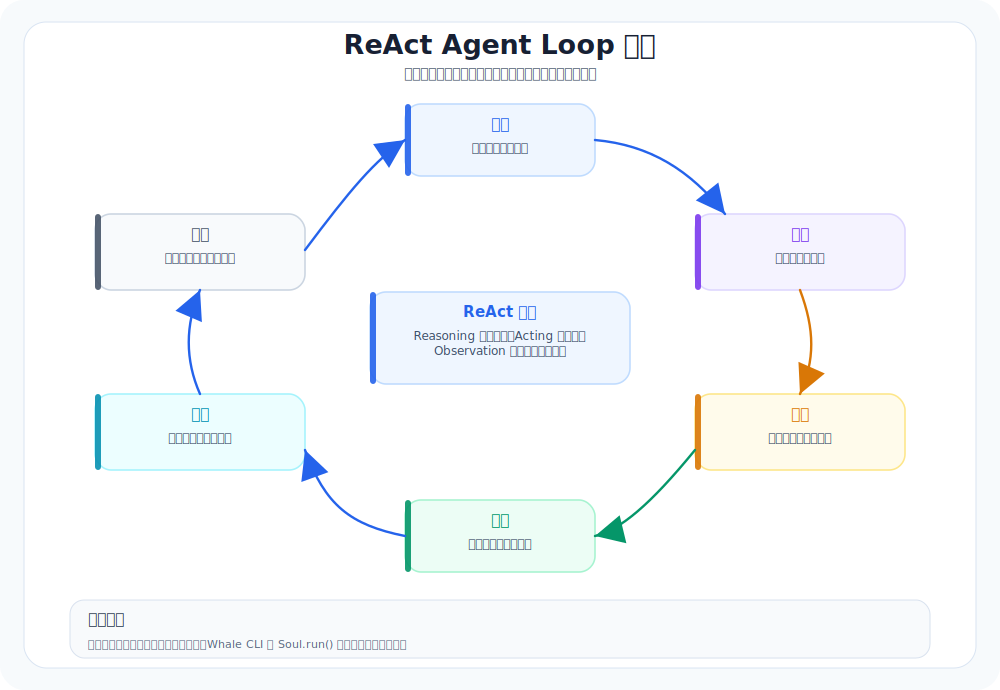

# 00. 为什么要做这个 CLI（先建立正确目标）

本章导航：

- 新增机制：先区分模型、Agent Loop、Tool 和 CLI 运行环境。
- 正式入口：`src/whale_cli/soul/soul.py` 与 `src/whale_cli/soul/toolset.py`。
- 验证方式：能用一句话说清“模型负责决定，harness 负责执行和回填结果”。
- 本章不展开：配置、会话存储和具体工具实现会在后续章节说明。

Whale CLI 是一个给模型提供终端、文件和任务状态的运行环境。模型决定下一步做什么；CLI 负责执行、记录和把结果送回模型。

这套教程会带你拆开这个运行环境：先让它跑起来，再逐步理解会话、模型调用、工具、审批和扩展机制。

## 学习前提

- 会在终端中进入项目目录、执行一条命令。
- 不需要先理解 LLM API 或 Agent 框架；03、04 章会从最小调用和最小循环讲起。
- 这一章只建立地图，不要求修改代码。

---

## 整体架构预览


上图展示了 Whale CLI 从用户终端到模型+工具的完整分层架构。每一层在后续章节中都会逐一展开。

---

## 我们真正想要的能力（不是口号，是验收标准）

下面这 5 点，就是你之后每一章都要反复对齐的”北极星”。

### 1) 在终端里完成完整任务

不是“回答问题”，而是**从目标到结果**：
- 修 bug
- 加功能
- 跑测试
- 改文件
- 总结与复盘

这要求 Agent 不只是生成文本，而是能调用工具、观察结果、继续推进。

### 2) 对仓库有真实理解（Repo Awareness）

我们不接受“模型脑补”。

想回答“入口在哪”“测试怎么跑”，必须先读真实仓库，而不是让模型猜。Whale CLI 当前提供 ReadFile、Glob、Grep、Bash、WriteFile 和 Edit 等工具；后面的章节会分别解释它们的边界。

### 3) 有稳定闭环（Loop，而不是一次性回答）

真正可靠的 Agent，一定是循环系统：



没有 loop 的系统，本质上只是”会写字的壳”。

### 4) 行为可控、可审计（安全是功能，不是附加项）

当 Agent 具有 bash / 写文件能力时，风险就已经进场了。

Whale CLI 当前的教学版会在写文件和执行命令前请求用户确认。更细的 allow/ask/deny 规则和工作区沙箱属于后续扩展，不应和当前能力混为一谈。

### 5) 能沉淀套路（Skills / Rules / Hooks / Plugins / MCP）

一次性“表现好”不难，难的是“下一次也好”。

Whale CLI 依次加入 Skill、项目规则、Hook、插件等机制。它们解决的问题不同：Skill 提供按需知识，项目规则提供仓库约束，Hook 在事件发生时执行确定性检查，插件把外部 Python 工具接入工具池。

---

## 这套教程怎么拆问题

后面每章只增加一个机制：04 章给循环，05 章给只读工具，06 章给写入与审批，09 章处理长对话，11 至 17 章再把配置、事件和扩展能力从主循环里拆出去。这个顺序的好处是，每次出问题时都能知道问题落在哪一层。

---

## 0.2 现在市场上的 CLI Agent 到底在比什么（抽象成共识能力）

如果先不管模型供应商，CLI Agent 的差异往往出在这些运行时能力是否完整：

### 共识能力清单（之后我们会逐章落地）

1. 工具是第一性原理
- read / grep / list / glob / bash / edit / write / patch
- 重点不在工具多，而在工具边界清晰、结果结构稳定

2. 权限是安全底线
- allow / ask / deny
- 支持通配/模式匹配
- 高风险动作默认 ask

3. Agent 是“角色配置”，不是单一人格
- 不同 agent 可以有不同权限与行为范围
- 可以给 plan/build 不同的能力边界

4. rules / instructions 是工程约束的入口
- 把“团队规范”变成系统输入，而不是靠人提醒
- 这是让多人项目稳定使用 Agent 的基础

5. hooks / 自动化护栏是稳定性的放大器
- hooks 的价值是“确定性执行”
- 它把一部分约束从模型判断中拿出来

---

## 这一章的验收标准（非常具体）

读完这一章，你应该能做到两件事：

1. 用一句话讲清楚目标
- Whale CLI 不是聊天壳，而是：LLM + 工具 + 循环 + 权限/护栏 + 经验沉淀。

2. 用一张简单流程图讲清楚闭环

```text
目标 → 计划 → 工具 → 观察 → 调整 → 完成
```

只要你把这两件事讲清楚，后面的章节就不会走偏。

---

## 当前实现的边界

- 当前有审批，但没有真正的工作区沙箱；06 章会专门说明这层差别。
- 当前能加载本地插件和 MCP 工具，MCP 支持 stdio、Streamable HTTP 和 SSE；OAuth 交互回调、健康检查与连接池仍是后续扩展。
- 当前 Todo 只保存在本次运行的内存中；会话消息才会写入 JSONL。

## 下一步建议（衔接到 Part 0）

下一章你就要进入“5 分钟体验”：
- 不解释概念
- 直接用任务驱动
- 通过工具调用日志建立信任感

建议你接着读：`docs/新手入门/01-5分钟体验-能帮你做什么.md`。

---

## 本章模块化代码

learn-claude-code 的做法是：概念后面马上给一段能落地的代码。Whale CLI 这套教程也按这个方式读：先认清模块边界，再逐章拆开。

### 1. 全局模块地图

```text
src/whale_cli/
├── ui/shell/main.py          # 终端入口：读用户输入、展示输出
├── llm/client.py             # 模型客户端：OpenAI 兼容接口
├── soul/soul.py              # Agent loop：调用模型、执行工具、回填结果
├── soul/toolset.py           # 工具注册表：替代 if/elif 分发
├── soul/approval.py          # 权限审批：危险工具调用前确认
├── soul/todo_store.py        # 任务清单：让多步任务可追踪
├── soul/compaction.py        # 上下文压缩：长会话保留状态
├── tools/                    # 可行动作：文件、bash、web、todo 等
├── storage/session_store.py  # 会话持久化：jsonl
└── agents/default/           # agent.yaml + system.md
```

### 2. 所有工具共享的最小契约

文件：`src/whale_cli/tools/base.py`

```python
class Tool:
    name: str = ""
    description: str = ""
    schema: dict = {}
    approval_action: str | None = None

    def __call__(self, **kwargs) -> dict:
        raise NotImplementedError


def ok(stdout: str = "", changed_files=None) -> dict:
    return {
        "stdout": stdout,
        "stderr": "",
        "exit_code": 0,
        "changed_files": changed_files or [],
    }


def err(stderr: str, exit_code: int = 1) -> dict:
    return {
        "stdout": "",
        "stderr": stderr,
        "exit_code": exit_code,
        "changed_files": [],
    }
```

你后面看到的所有模块，最后都会回到这个闭环：`Soul` 让模型选工具，`Toolset` 调工具，工具返回标准 dict，再回填给模型。

## 本章小结

Whale CLI 不是把模型包进终端，而是给模型加上一条可执行的闭环。模型负责选择下一步，Agent Loop 负责推进，Toolset 负责分发，工具结果成为下一轮观察。现在只需要记住这条主线；具体入口和一次真实运行放到下一章。

下一章：[01-5分钟体验-能帮你做什么.md](01-5分钟体验-能帮你做什么.md)。它只做一件事：启动 CLI 并观察这条闭环第一次发生。
