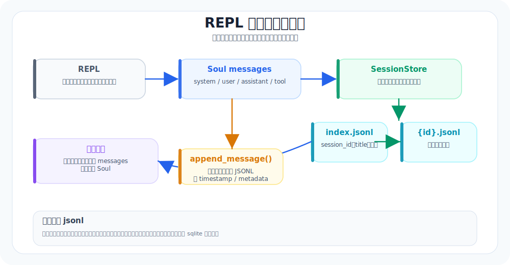

# 02. REPL 与会话：把“聊天框”做成“会话系统”

本章导航：

- 新增机制：把终端输入、会话 id、消息历史和 JSONL 存储连成可恢复会话。
- 正式入口：`src/whale_cli/ui/shell/main.py`、`src/whale_cli/storage/session_store.py`。
- 验证方式：新开一次会话、退出再启动，确认最近会话可恢复。
- 本章不展开：模型 API 调用由下一章负责；消息如何驱动工具由 04 章负责。

这一章的目标很务实：别只做一个 `input()` 循环，而是做一个**可恢复、可回放、可审计**的会话系统。

当你做到这一步，Whale CLI 就从“玩具”迈向“工具”了。

---

## 本章目标（验收标准）

完成以下两条，就算通过：
- 支持持续对话，并提供 `/help`、`/exit`、`/clear`、`/session` 这些基础命令
- 重启 CLI 后，能恢复最近一次会话的主要上下文

额外加分项：
- 工具调用过程可回放（你能看到它做过什么）

---

## 会话存储架构



---

## 先按真实代码跑一遍

这一章最容易写成“做一个 input 循环”。但 Whale CLI 的实现里，REPL 其实承担了 4 个职责：

1. 找到本地会话目录
2. 启动时恢复最近会话，或者创建新会话
3. 把斜杠命令留在命令层处理
4. 把普通用户输入交给 `Soul.run()`，由 `Soul` 负责追加消息与落盘

真实启动路径在 `src/whale_cli/ui/shell/main.py`：

```text
main()
  ├─ _get_store()
  │    └─ WHALE_CLI_HOME 或 当前目录/.whale_cli
  ├─ _restore_latest_session(store)
  │    ├─ store.get_latest_session_id()
  │    ├─ store.load_messages(session_id)
  │    └─ Soul(initial_messages=messages)
  ├─ 如果没有可恢复消息
  │    └─ _start_new_session(store)
  │         ├─ store.create_session()
  │         └─ Soul(session_store=store, session_id=session_id)
  └─ while True
       ├─ _read_line("User>")
       ├─ 斜杠命令：REPL 本地处理
       └─ 普通输入：_run_with_esc_pause(agent, user_input)
```

这里有个很重要的设计判断：**斜杠命令不是对话内容**。

比如 `/session`、`/clear`、`/todo` 是控制 CLI 的操作，不应该写进模型上下文。否则模型会把“查看会话列表”也当成用户意图，后面的回答会越来越脏。

普通输入才会进入 `Soul.run()`：

```text
普通用户输入
  → Soul.run(user_input)
  → _append_message({"role": "user", "content": user_input})
  → llm.chat(messages, tools)
  → _append_message(assistant message)
  → 如果有 tool_call：
       Toolset.handle(...)
       _append_message({"role": "tool", ...})
```

所以，会话系统不是 REPL 自己在“记聊天记录”。真正的消息落盘入口在 `Soul._append_message()`。

---

## 你真正要搭的三块底座

### 1) REPL loop：输入 → 处理 → 输出

你需要的不是复杂 UI，而是稳定主循环：
- 读用户输入
- 识别命令（以 `/` 开头）
- 非命令则进入 agent loop
- 渲染输出

### 2) Message model：消息是“系统状态机”的最小单位

建议从一开始就把消息做成结构化数据，而不是随手拼字符串。

最小推荐字段：
- `role`：system / user / assistant / tool
- `content`：文本内容（或结构化字符串）
- `timestamp`：时间戳（便于审计与排序）
- `metadata`：额外信息（比如工具名、耗时、是否截断）

### 3) Session storage：关键不是“存”，而是“能恢复 + 能回放”

你可以先用 jsonl，也可以直接用 sqlite。关键是两件事：
- 可恢复：重启后还能接着干
- 可回放：你能还原一次任务的关键路径

---

## 这套实现的 5 个设计原则

### 1) 控制命令和对话消息分离

REPL 里的 `/help`、`/clear`、`/session load <id>` 都是**控制面命令**，只改变 CLI 状态，不进入 `messages`。

设计原因很朴素：
- 模型只需要看到用户真实任务
- 会话管理不应该污染上下文
- 控制命令失败时，也不应该影响后续模型推理

### 2) 消息只从一个入口落盘

`SessionStore` 不直接暴露给工具，也不让 REPL 手写消息文件。所有用户消息、assistant 消息、tool 消息，都走：

```text
Soul._append_message()
  ├─ 补 timestamp
  ├─ 补 metadata
  ├─ 追加到内存 messages
  └─ 追加到 SessionStore
```

这样做的好处是：后面加 todo、压缩、审计、回放，都不用到处找“谁写了消息”。

### 3) 持久化消息和发给模型的消息分开

本地保存的消息可以多一些字段：

```json
{"role":"user","content":"解释入口","timestamp":"...","metadata":{}}
```

但发给 OpenAI 兼容接口时，只能保留 API 认识的字段。`Soul._to_llm_message()` 会把消息投影成干净结构：

```text
role / content / name / tool_call_id / tool_calls / function_call
```

这就是源码注释里说的：`message persistence / LLM-projection split`。

设计原因：
- 本地审计需要更多字段
- 模型接口需要严格字段
- 两者混在一起，后面一定会出奇怪的 API 报错

### 4) 会话索引 append-only，最新记录胜出

`sessions/index.jsonl` 不是一张会被原地修改的表，而是追加记录：

```text
session_id=A created_at=10:00 updated_at=10:00
session_id=A created_at=10:00 updated_at=10:03
session_id=A created_at=10:00 updated_at=10:08
```

读取时用“同一个 session_id 的最后一条记录”为准。

这叫 last-wins。好处是实现简单、写入安全、调试时能看到更新轨迹。代价是 index 会增长，后续可以做 compact，但教学版先不急。

### 5) `/clear` 是新开会话，不是删除历史

`/clear` 的真实语义是：

```text
agent, session_id = _start_new_session(store)
```

它不会清空旧文件，也不会覆盖旧 session。这样更安全：
- 用户误操作后还能找回历史
- 审计链不会断
- “重新开始”和“删除记录”是两种动作，不应该混在一个命令里

---

## jsonl 还是 sqlite？别纠结，先选“最容易验证”的

两者都可以。下面是非常实用的选择建议：

### 先上手：jsonl（最轻、最好 debug）

jsonl（JSON Lines）一行一条记录，追加写入很方便，特别适合日志和消息流。Whale CLI 的会话索引和消息流都采用这种格式。

这非常适合会话消息：
- 追加简单
- 出错影响小（坏一行不至于全坏）
- 人眼可读，调试舒服

### 走向工程化：sqlite（更稳、更像“系统”）

SQLite 是一个嵌入式数据库，适合需要查询、事务和并发控制的本地状态存储。当前教学实现没有使用它。

如果你希望：
- 多会话管理
- 更强查询能力
- 更清晰的数据约束

那 sqlite 会更合适。

> 结论：教程实现时，jsonl 起步最快；后续再迁移 sqlite 也很自然。

---

## 一个够用的最小实现蓝图（直接照着做）

这一段你可以直接当“实现清单”。

### Step 1：把命令层从主循环里剥出来

建议做一个简单的命令分发：
- `/help`
- `/exit`
- `/clear`
- `/session`

其中 `/clear` 的语义建议非常明确：
- 不删除历史
- 只是开启新 session（更安全，也更容易审计）

---

### Step 2：统一消息结构（哪怕现在还很简单）

无论你用 jsonl 还是 sqlite，建议所有消息都用同一个结构。

尤其要注意两点：
- 工具调用结果也当作消息写回（`role: tool`）
- 工具调用的关键字段尽量结构化（哪怕只是放在 metadata 里）

这会为后续的：
- 任务回放
- 总结压缩
- 安全审计

打下很干净的底座。

---

### Step 3：做“最近会话恢复”（先最小可用）

你不需要一上来就做复杂会话切换。最小可用方案是：
- 每次启动时：加载最近一个 session
- 每次新增消息时：立刻落盘

哪怕只做到“恢复最近一次”，对稳定性提升也非常明显。

---

## 建议的存储结构（jsonl 版本，最容易落地）

下面给你一个非常稳妥的 jsonl 组织方式：

- `sessions/index.jsonl`：会话索引（id / title / created_at / updated_at）
- `sessions/<session_id>.jsonl`：消息流（按时间追加）

每条消息可以长这样：

```json
{"role":"user","content":"请解释启动流程","timestamp":"2026-01-27T20:00:00Z","metadata":{}}
```

工具消息建议至少包含工具名与结果摘要（可放 metadata）。

jsonl 一行一条记录，因此可以直接追加，也便于在调试时按行检查。

---

## 当前实现的细节边界

这部分要讲清楚，不然读者会以为“能恢复会话”就等于“所有运行时状态都恢复”。

### 已经恢复的内容

- `messages`：system / user / assistant / tool 消息都会从 `<session_id>.jsonl` 读回来
- 最近会话：根据 `index.jsonl` 里的 `updated_at` 排序选出
- 会话标题：第一次用户输入会自动截取前 60 个字符作为标题

### 暂时没有恢复的内容

- `TodoStore` 当前是 `Soul` 内存对象，新建 `Soul` 时重新开始
- 后台任务运行时状态不从历史消息反推
- hook 注册状态依赖进程内配置，不从 session 文件恢复

这不是 bug，而是教学版的边界：**先恢复对话上下文，再逐步恢复运行时状态**。

换句话说，恢复会话时，Whale CLI 先恢复“模型需要继续理解任务的历史消息”；至于 todo、后台线程、hook 注册表这些进程内对象，暂时由新建的 `Soul` 重新初始化。如果一开始就把 todo、background、approval、hook 全部序列化，读者会先被工程细节淹没。

### 故障处理策略

当前 `SessionStore.load_messages()` 和 `list_sessions()` 都会跳过解析失败的行：

```text
try json.loads(line)
except: continue
```

这让 jsonl 的容错性很好：坏一行不会拖垮整个会话。但它也意味着，如果你要做生产版，需要补充更严格的错误报告和修复工具。

---

## 本章验收脚本（你可以直接复制到 CLI 里验证）

### 验收 1：命令系统可用

```text
/help
/session
/clear
/session
/exit
```

你应该观察到：
- `/help` 能列出命令
- `/clear` 后 session 发生变化
- `/exit` 能干净退出

### 验收 2：会话可恢复

1. 启动 CLI
2. 输入两句普通对话
3. 退出
4. 再次启动 CLI

预期：
- 它能恢复上一会话的主要上下文（哪怕只是最近若干条）

---

## 为什么这一章很关键（对后续章节的真实影响）

如果这一章做得好，后面很多“高级能力”都会变得容易很多：
- todo 系统会更自然（因为消息和会话已经是结构化的）
- 上下文压缩会更稳（因为你能准确找到“该保留什么”）
- 权限审计也更清晰（因为工具调用有记录）

反过来，如果这一章只是“能聊”，后面几乎每一步都会返工。

## 本章测试与边界

当前项目还没有独立的 `SessionStore` 测试文件。阅读本章时，可以先运行整体回归：

```bash
./.venv/bin/python -m pytest tests/test_soul_integration.py -q
```

建议把下面四个场景补成独立测试：创建会话、追加并恢复消息、索引最新记录胜出、坏 JSON 行被跳过。Todo、后台线程和 Hook 注册并不会随会话恢复。

---

## 下一步建议

建议你接着实现：
- 只读探索工具（read/list/glob/grep）
- 工具结果标准化（stdout/stderr/exit_code/changed_files）
- 最小 todo（哪怕先内存版）

---

## 本章模块化代码

REPL 不是只负责 `input()`。它还要把消息落盘，让下一次启动能恢复上下文。

### 1. REPL 启动时如何决定“恢复还是新建”

文件：`src/whale_cli/ui/shell/main.py`

```python
def _get_store() -> SessionStore:
    base_dir = (
        os.environ.get("WHALE_CLI_HOME")
        or os.path.join(os.getcwd(), ".whale_cli")
    )
    return SessionStore(base_dir=base_dir)


def _start_new_session(store: SessionStore) -> tuple[Soul, str]:
    session_id = store.create_session(title="")
    agent = Soul(session_store=store, session_id=session_id)
    return agent, session_id


def _restore_latest_session(store: SessionStore):
    session_id = store.get_latest_session_id()
    if not session_id:
        return None, None
    messages = store.load_messages(session_id=session_id)
    if not messages:
        return None, None
    agent = Soul(session_store=store, session_id=session_id, initial_messages=messages)
    return agent, session_id
```

启动时先尝试恢复；恢复失败才新建。这能避免用户每次打开 CLI 都丢上下文。

### 2. 命令层如何避免污染对话

文件：`src/whale_cli/ui/shell/main.py`

斜杠命令在 `main()` 的 while 循环里被本地消费：

```python
if user_input.startswith("/"):
    parts = user_input.strip().split()
    cmd = parts[0].lower()

    if cmd in ["/help", "/?"]:
        _print_help()
        continue

    if cmd == "/clear":
        agent, session_id = _start_new_session(store)
        print(f"[Session] New: {session_id}")
        continue

    if cmd == "/session":
        ...
        continue
```

注意每个命令处理完都会 `continue`，不会落到 `_run_with_esc_pause(agent, user_input)`。这就是“控制命令不进模型上下文”的实现细节。

### 3. 会话文件结构

文件：`src/whale_cli/storage/session_store.py`

```python
class SessionStore:
    """
    Layout:
    - <base_dir>/sessions/index.jsonl
    - <base_dir>/sessions/<session_id>.jsonl
    """

    def __init__(self, base_dir: str):
        self.base_dir = os.path.abspath(base_dir)
        self.sessions_dir = os.path.join(self.base_dir, "sessions")
        self.index_path = os.path.join(self.sessions_dir, "index.jsonl")
        os.makedirs(self.sessions_dir, exist_ok=True)
```

`index.jsonl` 存会话元信息；每个 `<session_id>.jsonl` 存消息流。

### 4. 创建、读取、追加消息

```python
def create_session(self, title: str = "") -> str:
    session_id = uuid.uuid4().hex
    now = _utc_now_iso()
    self._append_index_record({
        "session_id": session_id,
        "title": title,
        "created_at": now,
        "updated_at": now,
    })
    return session_id


def load_messages(self, session_id: str, limit: int | None = None) -> list[dict]:
    path = self._session_path(session_id)
    messages = []
    with open(path, "r", encoding="utf-8") as f:
        for line in f:
            msg = json.loads(line)
            if isinstance(msg, dict):
                messages.append(msg)
    return messages[-limit:] if limit is not None else messages


def append_message(self, session_id: str, message: dict) -> None:
    self.touch_session(session_id)
    with open(self._session_path(session_id), "a", encoding="utf-8") as f:
        f.write(json.dumps(message, ensure_ascii=False) + "\n")
```

### 5. `Soul` 里统一追加消息

文件：`src/whale_cli/soul/soul.py`

```python
def _append_message(self, message: dict) -> None:
    message.setdefault("timestamp", datetime.now(timezone.utc).isoformat())
    message.setdefault("metadata", {})
    self.messages.append(message)

    if self.session_store and self.session_id:
        self.session_store.append_message(self.session_id, message)
```

这一层很关键：后面工具调用、todo、压缩都不直接写文件，而是走统一消息追加入口。

### 6. 保存用消息和出站消息如何分开

文件：`src/whale_cli/soul/soul.py`

```python
@staticmethod
def _to_llm_message(message: dict) -> dict:
    allowed_keys = {
        "role",
        "content",
        "name",
        "tool_call_id",
        "tool_calls",
        "function_call",
    }
    return {k: v for k, v in message.items() if k in allowed_keys and v is not None}
```

这段看起来很小，但它是对话系统能长期扩展的关键。你可以在本地消息里放心加 `timestamp`、`metadata`、审计字段；发给模型时再投影成接口允许的形状。

## 本章验证与边界

手动验证：启动 CLI 后发送一条消息，退出并重新启动，再用 `/session` 查看是否恢复最近会话。现在也可以用 `/session delete <id>` 删除一段本地会话；删除当前会话后，CLI 会立即新建一个空会话。WebUI 历史会话行右侧也提供同样的删除入口，并在确认后删除对应 JSONL 与索引中的有效记录。正在运行的 WebUI 会话不能删除，避免任务被截断。

## 本章小结

会话系统保存的是带时间和元数据的本地消息，而模型只接收投影后的接口消息。这让审计字段不会污染模型 API，也让重启恢复成为可能。下一章只处理模型调用边界，不讨论工具循环。

下一章：[03-最小LLMClient-先打通对话.md](03-最小LLMClient-先打通对话.md)。它把配置和一次模型请求收进 `LLMClient`。
