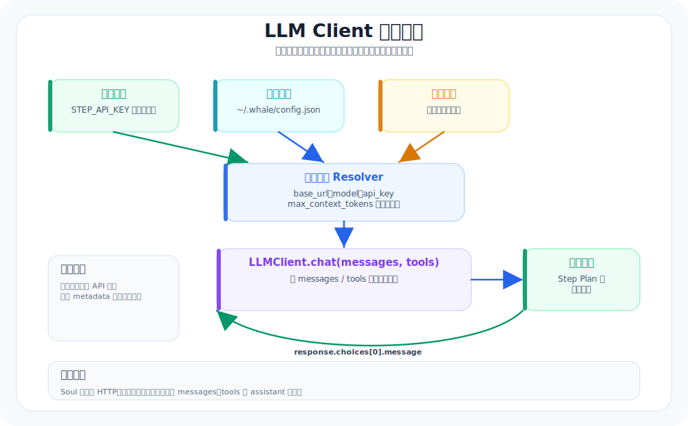

# 03. 最小 LLM Client：先打通“对话”，再考虑工具

本章导航：

- 新增机制：把 API Key、端点、模型名和一次 `chat()` 调用收在 LLMClient 内。
- 正式入口：`src/whale_cli/llm/client.py`。
- 验证方式：`./.venv/bin/python -m pytest tests/test_llm_client.py -q`。
- 本章不展开：多 provider 能力协商、流式输出和 retry 策略属于生产差距。

这一章的目标非常单纯：**先把“稳定对话”打通，再谈工具调用**。

很多人一上来就想做工具系统，结果卡在最底层：调用模型这一步不稳、接口不统一、换个 provider 就全崩。

所以我们先把“地基”打好。

---

## 本章目标（验收标准）

完成这两条，就算通过：
- 输入一句话，模型能稳定回一句（先不调用工具）
- 只改配置（key / model / base_url），不改 agent loop

> 补充：`step-explore` 不是 OpenAI Chat Completions 兼容模型。Whale 会在 `model=step-explore` 时自动切换到 StepFun 的 Anthropic Messages API（`/v1/messages`、`x-api-key`、`anthropic-version`），并发送必填的 `max_tokens`。它当前不接受本项目的 OpenAI 工具 schema、`thinking` 或 OpenAI 图片输入，因此适合纯文本对话、总结和规划；要运行工具循环请使用 `step-3.7-flash`。

---

## 这一章真正要解决的问题

不是”怎么调 API”，而是”怎么把 API 变成稳定的系统接口”。



在本仓库里，这个”稳定接口”对应两层代码：
- `src/whale_cli/llm/client.py`：`LLMClient`，负责“发请求 + 拿到 assistant message”
- `src/whale_cli/soul/soul.py`：`Soul`，负责“消息记录 +（后续）工具循环”，并把消息转换成模型能吃的格式

---

## 先看代码：当前的最小 LLMClient 长什么样

打开 `src/whale_cli/llm/client.py`，你会看到这几个关键点：

### 1) Key 的读取顺序（保证“可跑”）

`get_api_key()` 现在支持三种来源（按优先级）：
- 环境变量：`STEP_API_KEY` / `OPENAI_API_KEY`
- 本地配置文件：`~/.whale/config.json`，路径为 `llm.api_key`
- 交互式输入：运行时提示你手动输入（适合本地试玩，不推荐 CI）

这样做的好处是：你不用为了“先跑起来”就立刻引入复杂的配置系统。

---

### 2) OpenAI SDK + Step Plan base_url（先稳定对话）

`LLMClient.__init__()` 里用的是 OpenAI Python SDK：
- `base_url` 默认是 `https://api.stepfun.com/step_plan/v1`
- `model` 默认是 `step-3.7-flash`

这意味着：**目前这个 demo 的“provider 抽象”还没做**（这是刻意的：先把“对话打通”）。

---

### 3) 最小调用接口：`LLMClient.chat(messages, tools=None)`

`chat()` 做了两件事：
- 把 `tools`（一组工具对象）转成 `api_tools = [t.schema for t in tools]`
- 调用 `self.client.chat.completions.create(...)`，然后返回 `response.choices[0].message`

这里返回的 `message` 是 OpenAI SDK 的 message 对象（在 `Soul` 里会再做一次“标准化”）。

---

## 你真正要“定死”的：消息结构 & 出站裁剪

这个项目里，“存储用的消息结构”和“发给 LLM 的消息结构”是分开的：

### 1) 存储用消息（更丰富）

在 `src/whale_cli/soul/soul.py` 的 `Soul._append_message()` 里，每条消息会被补齐：
- `timestamp`：UTC ISO 时间（用于审计/回放）
- `metadata`：留作扩展（比如 token 统计、trace_id、来源等）

这让后面的“会话恢复 / 工具写回 / 上下文压缩”更自然。

---

### 2) 发给 LLM 的消息（严格裁剪）

OpenAI-compatible 的 Chat Completions 对 message 字段很严格，所以 `Soul._to_llm_message()` 会把消息裁剪为只包含：
- `role`, `content`
- `name`, `tool_call_id`, `tool_calls`, `function_call`（有就带上）

也就是说：你可以在内部随意给消息加字段（`timestamp`/`metadata`），但**出站永远是“干净的 messages”**。

---

## 本章验收：只做“稳定对话”（不碰工具）

虽然 `Soul` 已经把 tools 列表传给了 `LLMClient.chat(...)`，但你在验收阶段可以先把目标定小：
- 最小验收只关心：`LLMClient` 能不能稳定返回 `assistant.content`
- 工具循环放到后面的章节再展开（这能显著降低排查成本）

### 验收 1：最小对话（直接跑 CLI）

按 `README.md` 的方式启动：

```bash
export STEP_API_KEY="your_key"  # macOS/Linux
whale-cli
# 或在仓库根目录以模块方式启动
PYTHONPATH=src python -m whale_cli.ui.shell.main
```

PowerShell 使用 `$env:STEP_API_KEY="your_key"`。不要把真实 key 写进仓库或教程截图。

输入：

```text
你好，请用两句话介绍你自己。
```

预期：能稳定返回文本。

---

### 验收 2：只改 key / model，不改 agent loop

在当前代码里，你可以这样改：
- key：改环境变量 `STEP_API_KEY` / `OPENAI_API_KEY`，或改 `~/.whale/config.json`
- model：设置 `LLM_MODEL`，或改 `~/.whale/config.json` 中的 `llm.model`

预期：仍能稳定对话。

---

### 验收 3：错误可解释、不会把循环搞崩

故意制造一个错误（例如：
- key 置空
- model 写错
）

预期：
- `LLMClient.chat()` 会打印错误后重新抛出异常
- `Soul.run()` 会捕获该异常，打印 `[Fatal Error]` 并结束本次请求；它不会自动重试

---

## 本章小结（你现在真正获得的能力）

- 你已经把“对话”这条链路打通：`Soul -> LLMClient -> OpenAI SDK -> 模型 -> assistant message`
- 你已经把“消息存储”和“消息出站”分开：内部字段自由扩展，出站严格裁剪
- 下一步才是把 `LLMClient` 升级为“可配置/可替换”的 provider 接口（保持 `Soul` 不动）

建议下一步阅读：
- `docs/新手入门/02-REPL与会话-把聊天框做成系统.md`
- （或继续按大纲）Agent Loop v0

## 本章测试与边界

默认测试用 Fake OpenAI SDK，不会访问网络：

```bash
./.venv/bin/python -m pytest tests/test_llm_client.py -q
```

当前 `LLMClient` 是 OpenAI Chat Completions 兼容层，不是完整的多 provider 抽象。它返回原始 SDK assistant message；消息标准化和异常收束由 `Soul` 负责。

---

## 本章模块化代码

这一章看 `LLMClient`。它的目标不是“封装很多功能”，而是把模型调用变成一个稳定的小接口。

### 1. 配置优先级

文件：`src/whale_cli/llm/client.py`

```python
DEFAULT_BASE_URL = "https://api.stepfun.com/step_plan/v1"
DEFAULT_MODEL = "step-3.7-flash"
DEFAULT_MAX_CONTEXT_TOKENS = 256_000


def _config_candidates() -> list[Path]:
    return [
        Path.home() / ".whale" / "config.json",
    ]


def get_api_key() -> str:
    for env_var in ("STEP_API_KEY", "OPENAI_API_KEY", "MOONSHOT_API_KEY"):
        key = os.getenv(env_var)
        if key:
            return key

    cfg_key = _llm_config_section().get("api_key")
    if cfg_key:
        return str(cfg_key)

    api_key = getpass.getpass("Please enter your API Key: ")
    if not api_key:
        raise ValueError("API Key is required to run Whale CLI.")
    return api_key
```

### 2. 构造 OpenAI 兼容客户端

```python
class LLMClient:
    def __init__(self, api_key=None, base_url=None, model=None, max_context_tokens=None):
        self.api_key = api_key or get_api_key()
        self.base_url = resolve_base_url(base_url)
        self.model = resolve_model(model)
        self.max_context_tokens = resolve_max_context_tokens(max_context_tokens)
        self.client = OpenAI(api_key=self.api_key, base_url=self.base_url)
```

### 3. 对外只暴露一个 `chat()`

```python
def chat(self, messages: list[dict], tools: list | None = None, **kwargs):
    api_tools = [t.schema for t in tools] if tools else None
    response = self.client.chat.completions.create(
        model=self.model,
        messages=messages,
        tools=api_tools,
        temperature=kwargs.get("temperature", self.temperature),
    )
    return response.choices[0].message
```

`Soul` 不需要知道 Step Plan、OpenAI SDK、配置文件怎么读。它只需要调用 `llm.chat(messages, tools)`。

## 本章小结

`LLMClient` 把配置优先级、OpenAI 兼容请求和模型返回值收在一个边界内。上层只依赖 `chat(messages, tools)`，因此工具循环不必了解具体 provider。下一章会让这个返回值决定“直接回答”还是“调用工具”。

下一章：[04-AgentLoopv0-从聊天到会做事的循环.md](04-AgentLoopv0-从聊天到会做事的循环.md)。它只新增模型和工具之间的循环。
