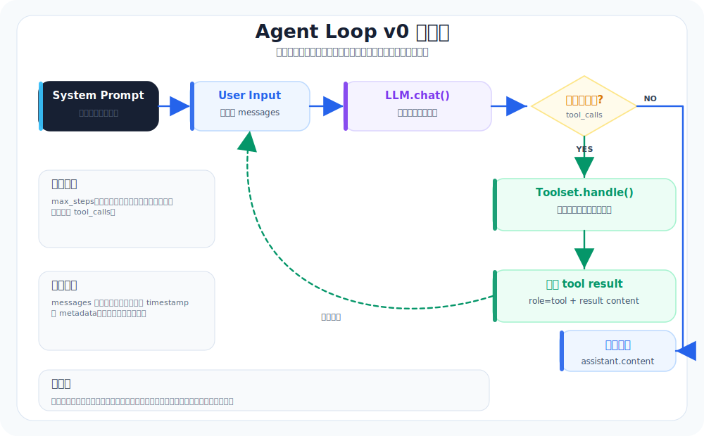

# 04. Agent Loop v0：从“聊天”升级为“会做事的循环”

本章导航：

- 新增机制：把模型响应、工具调用、工具结果和下一轮模型调用接成循环。
- 正式入口：`src/whale_cli/soul/soul.py::Soul.run`。
- 验证方式：`./.venv/bin/python -m pytest tests/test_soul_integration.py -q`。
- 本章不展开：并行工具、流式 step 生命周期和跨进程恢复属于生产差距。

这一章讲的不是“提示词技巧”，而是一个更朴素的问题：

> 为什么同样是 LLM，有的只是会聊天，有的却能把任务做完？

答案通常不在模型，而在 **loop（循环）**。

---

## 本章目标（验收标准）

完成下面任意一条，就算通过：

1. 你给一个目标，它能自己拆步骤，执行一步，观察结果，再决定下一步。
2. 用只读任务验证：它能通过多轮探索（读/查/列）完成“查找某文件并解释它”。

---

## 先把 loop 想清楚：它是一个小型状态机

Agent Loop v0 可以理解成一个很简单的状态机：



这套“推理 + 行动 + 观察”的交错路径，和 ReAct 的核心思想一致：模型在思考的同时生成动作，动作再把外部环境的观察带回到下一轮思考里（见“参考阅读”1、2）。 

你不需要把它做得很复杂。v0 版本只要做到两点就够了：
- 能推进（每轮都更接近目标）
- 能停下（有上限、有退出条件）

---

## 关键模块：你要实现的不是“聪明”，而是“可控”

### 1) Loop 主干（五步走）

每一轮都做同样的事：

1. interpret：把用户目标转成“当前要解决的子问题”
2. plan：写出下一步要做什么（可以是 1~3 步，但别贪多）
3. act：调用工具或输出答案
4. observe：把工具结果写回上下文，提取关键观察
5. adjust：决定继续、换路、还是结束

ReAct 的论文里强调：思考痕迹能帮助模型“跟踪进度、处理异常、更新计划”，而动作让它能从外部拿到更可靠的事实（见“参考阅读”1、2）。 

### 2) 每轮状态记录（你未来排错全靠它）

你至少要有三类日志：
- iteration log：第几轮、做了什么决策
- tool log：调用了哪个工具、参数是什么、结果是什么
- decision log：为什么继续、为什么停、为什么换方案

Mini-Agent 这种“最小但专业”的 demo 项目，把“完整执行闭环 + 全量日志”当作默认能力，这个方向很值得抄作业（见“参考阅读”3）。 

---

## 两条硬规则：没有它们，loop 迟早失控

### 规则 1：最大迭代次数（防止无限转圈）

你需要一个明确上限，比如：
- `max_steps = 10 ~ 20`

如果超过上限：
- 输出“我卡住了”的原因
- 给出下一步建议（需要用户补信息/需要更多权限/需要换策略）

### 规则 2：失败退出条件（防止“看起来在干活”）

常见失败信号：
- 同一个工具反复调用，输入几乎没变
- 工具连续失败（exit_code 非 0）
- 上下文里没有新增有效信息（没有“新观察”）

这些信号出现时，别硬撑。停下来问一句澄清问题，通常比继续撞墙快。

---

## 一个够用的 v0 伪代码（照着写就能跑）

下面这段逻辑很粗，但它能支撑完整闭环：

```text
messages = [system]
messages += [user_goal]

for step in 1..max_steps:
  assistant = llm.chat(messages)
  messages += [assistant]

  if assistant wants tool:
    tool_result = run_tool(...)
    messages += [tool_message(tool_result)]
    continue

  if assistant says done:
    return

  # 没有工具也没结束：
  # 让它给出下一步计划，或者主动追问缺失信息

return "Max steps reached"
```

工具调用的“标准动作”基本都是：
- 模型提出 tool use
- 你执行工具
- 把结果回填到对话历史
- 让模型基于观察继续

这套流程在 Claude 的工具使用文档里也有明确分解（尤其强调了“把工具结果返回给模型后再继续生成”，见“参考阅读”4、5）。 

---

## 你的 loop 要和哪些数据结构打交道

### 1) messages（对话历史）

messages 是 loop 的“记忆体”。

最小结构：
- system：规则与工具说明
- user：目标与补充信息
- assistant：模型输出（可能含工具调用）
- tool：工具执行结果（观察）

**不要只保存最终答案。** 你要保存过程，后面做回放、总结、审计都靠它。

### 2) 当前状态（可选，但很实用）

v0 版本可以很轻：
- `goal`：当前目标
- `step`：当前轮次
- `working_set`：当前关注的文件/路径
- `last_tool_calls`：最近几次工具调用摘要

这能显著减少“它看起来很忙，但我不知道它在干啥”的情况。

---

## 本章验收：用“只读任务”验证 loop 是否真的能跑

选一个不会改代码的任务，很适合验证 v0：

### 验收任务：查找某文件并解释它

把 `xxx` 换成你仓库里确实存在的模块名：

```text
请先用工具探索仓库，找到负责启动/入口的文件，然后解释它的执行流程。
要求：每次工具调用后，用 2 句话总结你观察到了什么，再决定下一步。
```

你应该看到的“好迹象”：
- 它会先列目录/搜索关键词，再读文件
- 工具结果会影响下一步选择（不是固定脚本）
- 最后能把过程收束成一段可读的解释

你应该警惕的“坏迹象”：
- 一直在重复同一个工具
- 解释完全不基于仓库内容
- 每轮没有新增信息

---

## 小结：v0 版本做到这几件事就够了

- 有一个明确的循环骨架（interpret → plan → act → observe → adjust → done，见“参考阅读”1、2）
- 有最大步数和失败退出条件（否则一定会 doom loop）
- 每轮留痕（否则你根本调不动，见“参考阅读”3）

下一章你就可以把 loop 接上最小工具集（read/grep/list），让它真正具备“repo awareness”。

---

## 参考阅读

1. ReAct 论文：Synergizing Reasoning and Acting in Language Models（arXiv:2210.03629）  
   `https://arxiv.org/abs/2210.03629`
2. ReAct 项目页（作者整理的材料与示例）  
   `https://react-lm.github.io/`
3. Mini-AI-Agent（Mini-Agent）仓库（完整执行闭环、日志与扩展方向）  
   `https://github.com/Jonathan-Adly/Mini-AI-Agent`
4. Anthropic：Tool use overview（工具使用总览）  
   `https://docs.anthropic.com/en/docs/build-with-claude/tool-use/overview`
5. Anthropic：Implement tool use（工具使用实现步骤）  
   `https://docs.anthropic.com/en/docs/build-with-claude/tool-use/implement-tool-use`

---

## 本章模块化代码

learn-claude-code 的 s01 会把 agent loop 直接贴出来。Whale CLI 的 loop 在 `Soul.run()`，形状也是同一个：模型 → 工具 → 结果 → 模型。

文件：`src/whale_cli/soul/soul.py`

```python
def run(self, user_input: str, pause_hook=None) -> None:
    self._append_message({"role": "user", "content": user_input})

    step = 0
    while step < self.max_steps:
        step += 1
        self._maybe_compact()

        llm_messages = [self._to_llm_message(m) for m in self.messages]
        response_msg = self.llm.chat(llm_messages, list(self.toolset))
        self._append_message(self._normalize_assistant_message(response_msg))

        tool_calls = getattr(response_msg, "tool_calls", None)
        if not tool_calls:
            print(f"Whale: {getattr(response_msg, 'content', '')}")
            return

        for tool_call in tool_calls:
            func_name = tool_call.function.name
            args_str = tool_call.function.arguments
            result = self.toolset.handle(func_name, args_str)

            self._append_message({
                "role": "tool",
                "tool_call_id": tool_call.id,
                "name": func_name,
                "content": self._format_tool_result(result),
            })
```

把细节折叠掉以后，它就是：

```text
while step < max_steps:
  call model
  if no tool call: stop
  execute tool
  append tool result
```

后面所有高级能力都是挂在这个循环周围，而不是替换这个循环。

## 本章测试与边界

先运行离线回归，再读测试名称对应的行为：

```bash
./.venv/bin/python -m pytest tests/test_soul_integration.py -q
```

`test_soul_tool_call_round_trip` 验证一轮“模型请求工具 -> 工具结果回填 -> 模型总结”，`test_soul_max_steps_caps_loop` 验证步数上限。当前工具调用按顺序执行，没有并行调度；停止条件还包括模型不返回 `tool_calls`、用户暂停和模型调用失败。

## 本章小结

Agent Loop 的工作是把“模型选择动作”和“真实环境观察”交替起来。它不负责具体文件操作，也不决定权限；这些职责会交给 Toolset 和 Tool。下一章只增加最小只读工具，让 Loop 有东西可以观察。

下一章：[05-Toolsv0-最小工具箱.md](05-Toolsv0-最小工具箱.md)。
