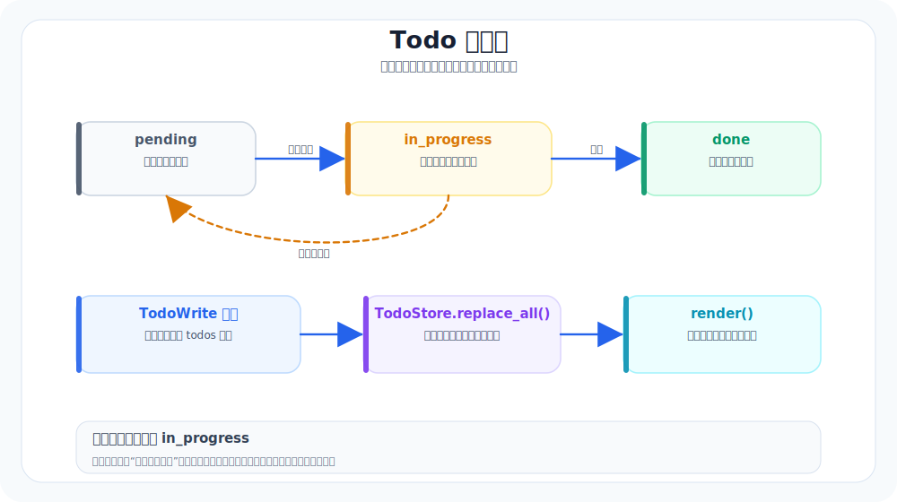

# 07. Todo List：把计划变成“可追踪任务”

本章导航：

- 新增机制：把多步计划保存为当前 Soul 的 Todo 状态，并让模型整体更新。
- 正式入口：`src/whale_cli/soul/todo_store.py`、`src/whale_cli/tools/todo/todo_tool.py`。
- 验证方式：`./.venv/bin/python -m pytest tests/test_todo.py -q`。
- 本章不展开：Todo 不会跨进程恢复，也没有依赖图或多人协作。

如果你只让 Agent“说计划”，你很快会遇到一个问题：

它说得头头是道，但你不知道它现在做到哪一步了。

Todo List 解决的就是这件事。它把计划从一段文字，变成一个**可以更新、可以查看、可以回放的状态**。

---

## 本章目标（验收标准）

完成下面两条，就算通过：

1. Agent 会把计划写成 todo，并在执行过程中持续更新状态。
2. 用户能用 `/todo` 随时看到它当前在做什么。

你会明显感受到：可控感变强了。

---

## Todo 在系统里扮演什么角色



把 todo 当成一个”可视化心智模型”比较准确：
- 它告诉用户：Agent 认为什么是步骤
- 它告诉系统：Agent 现在做到哪
- 它也能约束 Agent：别随便跳步、别忘了收尾

这类“可追踪计划”已经是很多工程型 agent 的常见组件。

---

## 关键模块：两件事就够用

### 1) Todo store（当前是内存态）

当前 `TodoStore` 只挂在 `Soul` 实例上：同一个会话运行期间，REPL 和 TodoWrite 都能看到它；重启 CLI 或恢复历史消息后，Todo 不会自动恢复。

把 Todo 写入 JSONL 或 SQLite 是合理的扩展练习，但不是当前实现。会话消息持久化和 Todo 持久化是两条不同的状态链。

### 2) todo tools（todoread / todowrite）

当前工具接口只有 `TodoWrite`：传入 `todos` 时整体替换；不传 `todos` 时读取当前清单。

把它做成工具而不是“内置字符串输出”，有两个好处：
- 记录可审计（工具调用有日志）
- 便于权限控制（后面做权限系统会更顺）

---

## Todo 数据结构（最小但够用）

当前实现只有两个字段：
- `title`
- `status`：`pending` / `in_progress` / `done`

一个例子：

```json
{
  "title": "定位入口文件并解释启动流程",
  "status": "in_progress"
}
```

你不需要一次设计成 Jira。先保证这四个字段全程能跑通。

---

## 状态更新的规则（别让 todo 变成摆设）

Todo 有效的前提是：它必须跟着 loop 动。

建议你定两条硬规则：

1) 每次进入新步骤前，先把对应 todo 标记为 `doing`
2) 每次完成一个步骤后，让模型提交一份新的完整清单

当前 `/todo` 能展示正在做什么，但不保存 notes，也不会跨进程恢复。先把最小状态机跑稳，再扩字段和持久化。

---

## 本章验收脚本（直接复制）

### 验收 1：生成 todo 并展示

```text
请把这个任务拆成 todo 列表：找到项目入口并解释启动流程。
要求：输出 todo，并把它写入 todo store。
```

然后输入：

```text
/todo
```

预期：你能看到清单。

---

### 验收 2：执行过程中动态更新

```text
按你的 todo 逐项执行。每完成一项就更新状态。
要求：每轮结束后都能用 /todo 看到变化。
```

预期：
- todo 状态从 todo → doing → done
- notes 会逐步变具体

---

## 参考阅读

1. OpenAI Cookbook：Techniques to improve reliability（包含把复杂任务拆解为步骤、用结构化方式跟踪进度等实践思路）
   `https://cookbook.openai.com/`
2. OpenCode：Tools / todo（todoread/todowrite 的工具化思路与工程化约束）
   `https://opencode.ai/docs`

> 注：todo 的价值不在“写出来”，而在“执行过程中持续更新”。

---

## 本章模块化代码

Todo 分两层：`TodoStore` 管状态，`TodoWriteTool` 把状态暴露给模型。

### 1. Todo 数据结构

文件：`src/whale_cli/soul/todo_store.py`

```python
VALID_STATUSES = ("pending", "in_progress", "done")


@dataclass
class Todo:
    title: str
    status: str = "pending"

    def __post_init__(self):
        if self.status not in VALID_STATUSES:
            raise ValueError(f"invalid todo status {self.status!r}")
```

### 2. 整体替换语义

```python
@dataclass
class TodoStore:
    _todos: list[Todo] = field(default_factory=list)

    def replace_all(self, items: list[Todo]) -> None:
        self._todos = list(items)

    def render(self) -> str:
        if not self._todos:
            return "(no todos)"
        return "\n".join(f"{i}. {t.status} {t.title}" for i, t in enumerate(self._todos, 1))
```

### 3. 模型调用的 TodoWrite

文件：`src/whale_cli/tools/todo/todo_tool.py`

```python
class TodoWriteTool(Tool):
    name = "TodoWrite"
    description = "Create or update the agent's task list (wholesale replace)."

    def __init__(self, store: TodoStore):
        self.store = store

    def __call__(self, *, todos: list[dict] | None = None) -> dict:
        if todos is None:
            return ok("Current todo list:\n" + self.store.render())

        new_items = [Todo(title=item["title"], status=item.get("status", "pending")) for item in todos]
        self.store.replace_all(new_items)
        return ok("Updated todo list:\n" + self.store.render())
```

为什么是整体替换？因为 LLM 每次都给出完整清单，状态更容易校验，也不容易出现“旧任务没删干净”。

## 本章测试与边界

```bash
./.venv/bin/python -m pytest tests/test_todo.py -q
```

测试覆盖状态校验、整体替换、读取模式、空列表清空和 Toolset 调用。当前 Todo 不是数据库，也不是任务依赖图；它只是当前 Soul 的轻量任务清单。

## 本章小结

Todo 把计划变成受状态约束的数据，而不是一段容易漂移的描述。当前实现选择整体替换，换来简单校验，代价是它只属于当前 Soul。下一章会把重复的做事步骤沉淀成可发现的 Skill。

下一章：[08-Skills-把套路沉淀成能力包.md](08-Skills-把套路沉淀成能力包.md)。
