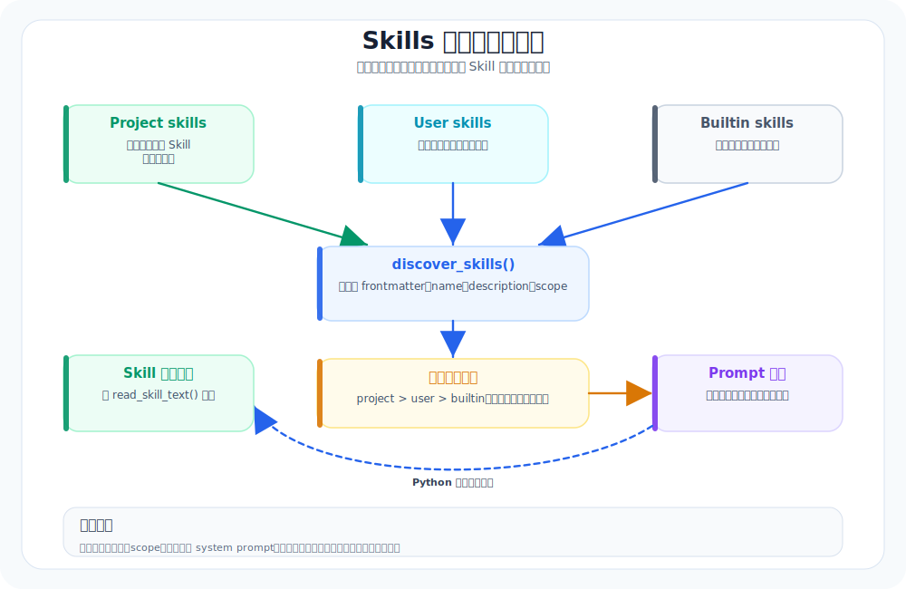

# 08. Skills：把套路沉淀成可复用能力包

本章导航：

- 新增机制：发现 `SKILL.md`，再把技能索引写入 system prompt。
- 正式入口：`src/whale_cli/skill/discovery.py`。
- 验证方式：`./.venv/bin/python -m pytest tests/test_skills_and_agents.py -q`。
- 本章不展开：当前模型不能通过专用 Tool 按需读取完整 Skill 正文。

当你把 Agent 用了一阵子，会出现一个很现实的问题：

同一个任务，今天它做得很稳，明天又开始飘。

Skills 的意义就是把“偶尔表现好”变成“经常表现好”。

它不是魔法，也不是更复杂的 prompt，而是一种工程化的复用方式：把好用的套路写成文档，让系统在合适的时机把它塞回模型上下文。

---

## 本章目标（验收标准）

完成下面两条，就算通过：

1. 支持 `skills/<name>/SKILL.md`（能被发现、能被读取、能被注入）
2. 写一个 `BugFix` skill，用同一个 bug 任务对比：有 skill 时更稳

---

## Skills 在系统里的位置



你可以把 skills 当成”可检索的战术手册”。

它通常具备三件事：
- 文件在仓库里（可版本控制）
- 有索引（能被发现）
- 能按需注入（不会把 prompt 撑爆）

---

## 关键模块：三件事做对就够了

### 1) Skill index（扫描与摘要）

你需要一个索引层，否则就只能靠“把所有 skill 全塞给模型”。

索引层通常做两件事：
- 扫描目录：`skills/*/SKILL.md`
- 提取摘要：name / 描述 / 关键适用场景 / 触发关键词

摘要不需要很聪明，先能跑通即可。后面可以再加 embedding 或关键词匹配。

### 2) Skill loader（按需加载）

加载器负责把完整 skill 文本读出来。

原则很简单：
- 只有在需要时才加载全文
- 加载后要在上下文中标注来源（便于调试）

### 3) Skill 注入策略（什么时候注入、注入多少）

这一步决定“好用”还是“拖累”。

常见的低级坑：
- 一上来就把所有 skill 全注入 → 上下文爆炸
- 注入太频繁 → 模型注意力被分散

更稳的策略是：
- 基于任务类型匹配（比如 bugfix / refactor / test / docs）
- 基于工具使用阶段匹配（比如写代码前注入、跑测试前注入）
- 限制注入长度（必要时做截断或只注入摘要）

---

## 一个很实用的 v0 注入策略（推荐直接用）

v0 别搞复杂，按下面三条走基本就不会翻车：

1) 默认不注入
- 只有模型明确要做某类任务时才注入（比如“修 bug”“补测试”“重构”）

2) 先注入摘要，后注入全文
- 先给模型看“有哪些可用 skill”
- 需要时再把对应 skill 的全文塞进去

3) 每轮最多注入 1 个 skill
- 不要贪多
- 能避免 prompt 变成垃圾堆

---

## 让读者马上能用：写一个 BugFix skill

建议你把 `BugFix` 写得很“工具化”，不要写成鸡汤。

示例结构（直接照这个写）：

```md
# BugFix

## 目标
把 bug 修掉，并留下可验证的证据。

## 步骤
1. 先复现：跑最小复现命令，记录错误信息。
2. 定位根因：找到触发路径与相关文件。
3. 最小修复：优先修原因，不绕路。
4. 加测试：至少覆盖失败用例。
5. 复盘：说明改了什么、怎么验证。

## 常见坑
- 不复现就动手改
- 改得太大，难验证
- 修了但没测试
```

---

## 本章验收脚本（对比就很明显）

选一个你仓库里真实存在的 bug（或你刻意造一个）。然后做两次：

### 版本 A：不使用 skill

```text
请修复这个 bug，并补测试。
```

### 版本 B：使用 BugFix skill

```text
请使用 BugFix skill 的流程修复这个 bug，并补测试。
```

对比点：
- 它是否更倾向于先复现？
- 它是否更倾向于最小改动？
- 它是否更愿意补测试并说明验证方式？

如果这些指标变好了，你的 skill 就值了。

---

## 参考阅读

1. OpenCode：Skills（skills 的组织、加载与工程化用法）
   `https://opencode.ai/docs`
2. Anthropic：Prompt engineering overview（把流程写成“可执行步骤”，减少模型自由发挥）
   `https://docs.anthropic.com/en/docs/build-with-claude/prompt-engineering/overview`

> 注：skills 的价值在于“让模型少自由发挥，多按既定流程做事”。

---

## 本章模块化代码

第 08 章讲的是 skill 的思想；现在项目里已经有可运行的 skill 发现模块。先看 skill 文件长什么样。

### 1. 一个 skill 就是一个目录

文件：`src/whale_cli/skills/whale-cli-help/SKILL.md`

```markdown
---
name: whale-cli-help
description: Explain the Whale CLI project structure and where to start.
---

# Whale CLI Help

Use this skill when a user asks how Whale CLI is organized or where to begin.
```

### 2. skill 元数据模型

文件：`src/whale_cli/skill/models.py`

```python
@dataclass(frozen=True)
class SkillRoot:
    path: Path
    scope: Literal["project", "user", "builtin"]


@dataclass(frozen=True)
class Skill:
    name: str
    description: str
    path: Path
    scope: Literal["project", "user", "builtin"]
```

### 3. system prompt 里只注入索引

文件：`src/whale_cli/skill/discovery.py`

```python
def format_skills_for_prompt(skills: Iterable[Skill]) -> str:
    lines = []
    for skill in skills:
        desc = f": {skill.description}" if skill.description else ""
        lines.append(f"- {skill.name} ({skill.scope}){desc}")
    return "\n".join(lines)
```

当前实现会发现 Skill 并把名称、scope 和描述注入 system prompt。`read_skill_text()` 已经提供给 Python 侧使用，但还没有作为专用 Tool 暴露给模型。因此“模型主动按需读取全文”是下一步接线工作，不是当前自动发生的行为。

## 本章测试与边界

```bash
./.venv/bin/python -m pytest tests/test_skills_and_agents.py -q
```

Skill 是知识文件，不是可执行插件；Tool 是模型可调用的动作；Plugin 是会被动态导入并注册为 Tool 的 Python 扩展。先把这三者分开，后续章节就不容易混淆。

## 本章小结

Skill 把可复用的工作方法留在文件中，当前实现只把它的索引放进 system prompt。这样模型知道有哪些套路，但不会自动读取每份正文。下一章转向长对话，讨论怎样在上下文变大后保留任务状态。

下一章：[09-SessionNote与上下文压缩-稳态系统.md](09-SessionNote与上下文压缩-稳态系统.md)。
