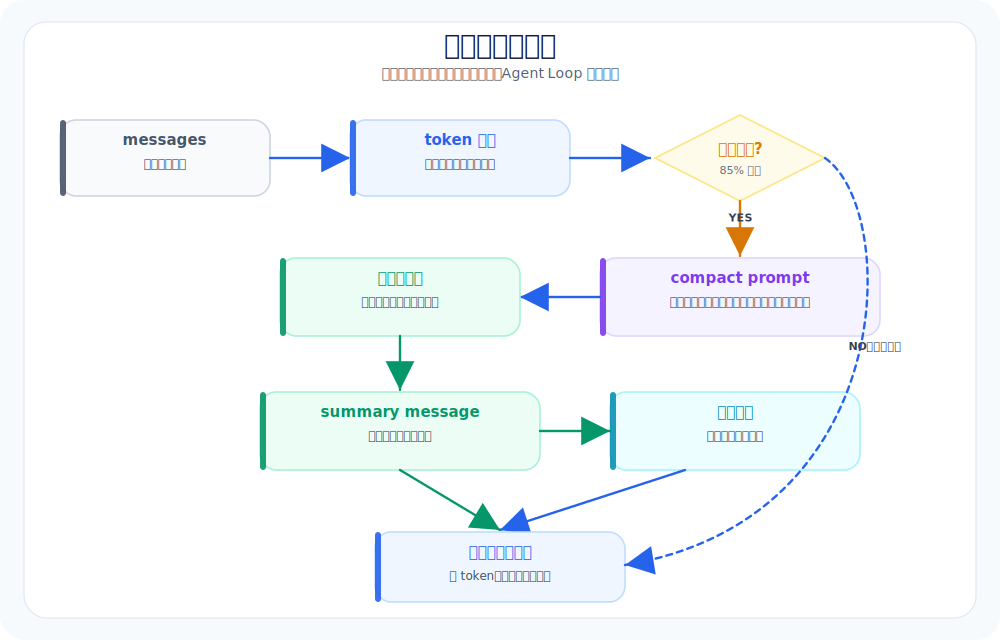

# 09. 上下文压缩：让长对话能续下去（Session Note 是下一步）

本章导航：

- 新增机制：在上下文接近阈值时生成摘要，并保留系统提示与最近消息。
- 正式入口：`src/whale_cli/soul/compaction.py`、`src/whale_cli/soul/soul.py`。
- 验证方式：`./.venv/bin/python -m pytest tests/test_compaction.py -q`。
- 本章不展开：独立 Session Note 存储和精确 provider token 计数尚未实现。

当你的 Agent 只能处理短对话时，它看起来还行。

一旦任务变长（几十轮，甚至上百轮），很多系统会出现同一种崩坏：
- 忘记目标
- 忘记关键决策
- 重复做同一件事
- 细节越聊越多，但推进变慢

这章解决的就是这个问题：让系统进入一种“稳态”。

---

## 本章目标（验收标准）

完成下面两条，就算通过：

1. 压缩触发后，最近消息和摘要仍能让模型继续任务。
2. 关键决策不丢：能在压缩后继续基于“当前状态”推进。

---

## 上下文压缩全景



---

## 你要做的两件事（就这两件）

### 1) Session Note：下一步可以加入的长期状态

Session Note 不是“再写一份摘要”。它适合保存跨会话的事实、决策和进度。

它更像一张工作便签，只写三类信息：
- 事实：已经确认的关键事实（入口文件、测试命令、环境限制等）
- 决策：我们决定怎么做（采用哪种方案，为什么）
- 状态：当前进度（todo 到哪、正在改哪些文件、下一步做什么）

当前 Whale CLI 还没有独立的 Session Note store。本章先讲已实现的上下文压缩，再把 Session Note 留作扩展练习。

### 2) Summarizer / Compaction：压缩历史，但保留状态机

压缩不是简单删消息。

你要做的是：
- 把“过程”压扁
- 把“状态”保住

很多系统走到后面不稳，就是因为压缩只顾着缩短长度，却把状态机拆了。

---

## 什么时候压缩？用 token 阈值控制

最稳妥的触发方式是：
- 达到 token 阈值就压缩

比如：
- 总历史接近模型上下文上限的 70%~80% 就触发

你不需要做很精确的 token 计算。

入门版可以先用粗指标：
- 消息条数
- 字符数

做到“有阈值、有触发、有结果”就够了。

---

## 压缩时必须强制保留的 4 类内容

这是本章的硬要求。压缩可以丢细节，但这四类必须保留：

1. todo 状态
- 列表是什么
- 每项做到哪

2. 正在修改/关注的文件（working set）
- 哪些文件被读过/改过
- 哪些文件是关键入口

3. 已做出的关键决策
- 选择了哪条方案
- 为什么这么选

4. 下一步计划
- 下一步要做什么
- 需要什么输入/权限

这四类东西，其实就是“状态机”。保住它，你的系统就能续航。

---

## 一个可落地的 v0 实现（别追求完美）

### Step 1：看清当前只有一个消息区

当前实现只有 `messages`。压缩后它会保留 system message、一个摘要消息和最近两条消息。若要加入 Session Note，需要新增独立存储，再在压缩时把它写入和读回。

### Step 2：定一个 compaction 流程

流程建议固定：

1. 提取状态
- 从 todo / working set / 最近决策里提取“必须保留”的四类内容

2. 生成摘要
- 让模型把历史压成一段短摘要（过程压扁）

3. 写回
- 当前版本把 `messages` 替换为：`[system] + [summary] + [recent_messages]`
- 扩展版本才会额外更新 `session_note`

### Step 3：把压缩动作变成“可观察事件”

不要悄悄压缩。

你至少要让用户看到：
- 什么时候压缩了
- 压缩后保留了什么
- 丢掉了什么

这对排错很关键。

---

## 本章验收脚本（你可以直接用）

### 验收 1：长对话保持目标

给它一个需要多轮推进的任务，比如：

```text
请在仓库里找到入口文件，解释启动流程，然后给出一份改造方案：
把工具结果结构统一为 stdout/stderr/exit_code/changed_files。
要求：先只读探索，再给方案，再执行。
```

你可以故意把对话拉长（追问细节、让它复盘、让它解释原因）。

预期：
- 它不会忘记最初目标
- 它不会重复做已经做过的探索

### 验收 2：触发压缩后还能续聊

当你确认压缩触发后，继续问：

```text
我们刚才决定的方案是什么？下一步准备改哪个文件？
```

预期：
- 它能回答“方案是什么、下一步是什么”，而不是重新猜

---

## 参考阅读

1. OpenAI Cookbook：Summarizing long documents / Managing context（关于用摘要维持长任务可用性的实践）
   `https://cookbook.openai.com/`
2. Anthropic：Prompt engineering（如何把“必须保留的状态”写成明确约束）
   `https://docs.anthropic.com/en/docs/build-with-claude/prompt-engineering/overview`
3. OpenCode：Compaction / Hooks（上下文压缩与 compaction hook 的工程化方向）
   `https://opencode.ai/docs`

> 注：长任务不是靠“更大模型”解决的。你需要一个能保留状态的系统。

---

## 本章模块化代码

上下文压缩不是“删掉旧消息”这么粗暴。Whale CLI 做三件事：估算 token、判断是否触发、调用模型生成结构化摘要。

### 1. token 估算与触发阈值

文件：`src/whale_cli/soul/compaction.py`

```python
DEFAULT_RATIO = 0.85


def estimate_tokens(messages: list[dict]) -> int:
    total_chars = 0
    for m in messages:
        content = m.get("content")
        if isinstance(content, str):
            total_chars += len(content)
        elif content is not None:
            total_chars += len(json.dumps(content, ensure_ascii=False))
        total_chars += len(str(m.get("name", ""))) + len(str(m.get("role", "")))
    return total_chars // 4


def should_compact(token_count: int, max_context_tokens: int, ratio: float = DEFAULT_RATIO) -> bool:
    return max_context_tokens > 0 and token_count >= int(max_context_tokens * ratio)
```

### 2. 压缩时保留 system 和最近消息

```python
def compact(messages: list[dict], llm, preserve_recent: int = 2) -> list[dict]:
    system_msg = messages[0] if messages and messages[0].get("role") == "system" else None
    rest = messages[1:] if system_msg else messages[:]

    to_compact = rest[:-preserve_recent]
    preserved = rest[-preserve_recent:]

    response = llm.chat(compact_request, tools=None)
    summary_message = {
        "role": "user",
        "content": "Previous context has been compacted.\n\n" + response.content,
        "metadata": {"compacted": True},
    }

    return [system_msg, summary_message, *preserved] if system_msg else [summary_message, *preserved]
```

### 3. 压缩 prompt 要求结构化输出

文件：`src/whale_cli/prompts/compact.md`

```xml
<current_focus>
[现在正在做什么]
</current_focus>

<completed_tasks>
- [任务]: [简要结果]
</completed_tasks>

<active_issues>
- [问题]: [状态/下一步]
</active_issues>

<code_state>
...
</code_state>
```

压缩不是为了省 token 而省 token；它是为了让 agent 在长任务里保留任务状态。

## 本章测试与边界

```bash
./.venv/bin/python -m pytest tests/test_compaction.py -q
```

当前 token 数是字符数除以 4 的估算，阈值是 `max_context_tokens * 0.85`，并非模型服务端的精确计数。压缩只替换内存中的 `messages`，不会重写已经追加到会话 JSONL 的完整历史；压缩模型调用失败时，本次任务会继续使用原始历史。

## 本章小结

压缩的目的不是单纯减少 token，而是保留当前目标、已完成工作和未解决问题。当前实现用估算阈值和一次模型摘要换取更长的可用会话，代价是摘要可能遗漏细节。下一章不再增加新运行时能力，而是把 Part 1 组合成可复现 Demo。

下一章：[10-Part1结尾-Demo清单.md](10-Part1结尾-Demo清单.md)。
