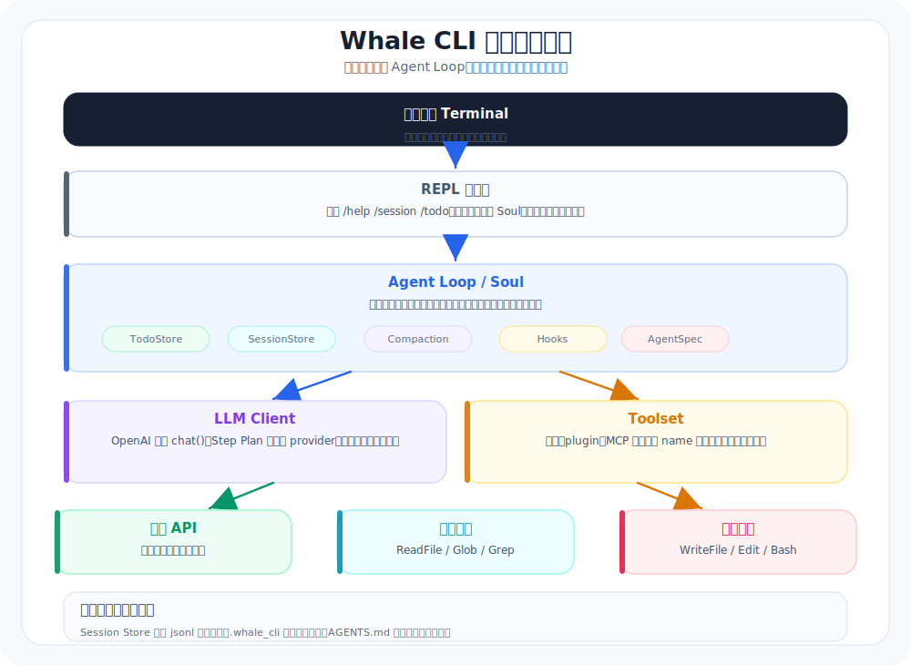

# 10. Part 1 结尾：你现在拥有的是什么（以及怎么做一次像样的 Demo）

本章导航：

- 新增机制：没有新增运行时模块；把 01 至 09 章组合成可复现 Demo。
- 正式入口：`src/whale_cli/ui/shell/main.py`、`src/whale_cli/soul/soul.py`。
- 验证方式：运行 Part 1 回归测试，再按本章脚本完成一次人工演示。
- 本章不展开：agents、hooks、subagents 等扩展结构从 11 章开始。

到这里，你应该已经能做出一个“能干活”的 CLI 雏形。

我建议你别急着往 Part 2 冲，先把这个阶段做成一个**可演示、可复现的 Demo**。这一步很关键：它能把你从“写了一堆功能”拉回到“这个东西真的能用”。

---

## 你现在应该具备的能力清单（别加戏）



如果 Part 1 的实现完成度够，你至少会有这些东西：

- REPL：能持续对话，有基本命令（/help /exit /clear 等）
- Agent Loop：规划 → 执行 → 观察 → 调整
- Tools：read/grep/list/glob + write/edit + bash
- Skills：把可发现的知识索引注入 system prompt
- Todo：本次运行内可追踪
- 自动压缩：接近上下文阈值时保留摘要和最近消息

这已经是一个工程代理的教学底座。它仍有明确边界：Todo 不跨进程持久化，Session Note 尚未实现，审批也不是沙箱。

---

## 这份 Demo 应该怎么演（推荐脚本）

下面是一条我认为很稳的演示路径。它不求炫技，但能把“闭环”和“可控”讲清楚。

### Demo 任务：加一条日志并跑测试（最小闭环）

1) 让它先探索（只读）

```text
请先用工具探索仓库：入口文件在哪？启动流程是什么？
要求：不要修改代码。
```

2) 让它先给计划，再写 todo

```text
请把“加一条启动日志并跑测试”拆成 todo 列表，并标注每步的验证方式。
```

3) 让它执行，但要可控

```text
可以开始执行。写文件或运行命令时请等待审批提示；我会逐次确认。
每一步执行后用 2 句话汇报结果，然后更新 todo。
```

4) 让它收尾（总结 + 提交说明）

```text
请输出：改动点清单 / 风险点 / 验证步骤 / 提交说明草稿。
```

你会得到一个很清晰的展示：
- 它不是在“聊天”，它在推进一个任务
- 它不是在“脑补”，它在用工具拿事实
- 它不是黑盒，todo 和日志让你知道它在干什么

---

## 你需要特别检查的 3 个点（很容易偷工减料）

### 1) 工具结果有没有稳定结构

如果工具输出没有 `stdout/stderr/exit_code/changed_files` 这类稳定结构，你后面会付出代价：
- 模型很难判断成功/失败
- 你很难回放与审计

### 2) 有没有“停下来的能力”

loop 一定要能停：
- max steps
- 失败退出条件

否则你迟早会遇到“它一直转圈”。

### 3) 产物能不能复现

你最好能做到：
- 同样的 repo
- 同样的提示词

在不同时间跑两次，结果都差不多。

这就是从 demo 到工具的分界线。

## 可复现的 Demo 方式

不要直接改当前项目。先复制一个小型示例目录，或在临时目录里创建一个只有一两个 Python 文件的项目，再让 Agent 完成“读取入口、加日志、跑测试”。这样第二次演示不会叠加上一次的改动。

Demo 中最好故意保留一个会失败的断言。观察 Agent 是否读取 stderr、解释失败原因，再在获得审批后修复。不要把“每次都一次成功”当成通过标准。

---

## 参考阅读

1. OpenAI Cookbook：可靠性与评估（把任务拆解、结构化跟踪、用可复现方式验证）
   `https://cookbook.openai.com/`
2. OpenCode：工具与权限体系（工程化 agent 的基本边界）
   `https://opencode.ai/docs`

> 注：你做的 Demo 不需要华丽，但必须可复现。越朴素，越能看出系统是否真的稳定。

---

## 本章模块化代码

Part 1 的终点不是“写了很多文件”，而是所有模块已经能被 `Soul` 组装成一个可运行 agent。

### 1. 默认工具装配

文件：`src/whale_cli/soul/soul.py`

```python
def _default_tools(
    todo_store: TodoStore,
    llm: LLMClient,
    approval: Approval,
    background: BackgroundTaskManager,
) -> tuple[list[Tool], MCPLifecycle]:
    tools: list[Tool] = [
        ReadFileTool(), GlobTool(), GrepTool(),
        WriteFileTool(), EditTool(), BashTool(),
        SearchWebTool(), FetchURLTool(),
        TodoWriteTool(todo_store),
        GetDateTool(),
        AgentTool(llm=llm, approval=approval),
        BackgroundStartTool(background),
        BackgroundListTool(background),
        BackgroundOutputTool(background),
    ]
    tools.extend(load_plugin_tools())
    mcp_lifecycle, mcp_tools = load_mcp_tools_with_lifecycle()
    tools.extend(mcp_tools)
    return tools, mcp_lifecycle
```

Part 1 的最小闭环不依赖 MCP 配置；这里仍展示真实默认工具池，原因是当前 `Soul` 启动时会一并发现已配置的 MCP tools。没有配置文件时，MCP 工具列表为空，主线不受影响。

### 2. `Soul.__init__()` 串起运行时对象

```python
class Soul:
    def __init__(self, session_store=None, session_id=None, *, llm=None, tools=None, approval=None):
        self.llm = llm or LLMClient()
        self.todos = TodoStore()
        self.approval = approval or Approval()
        self.hooks = HookEngine()
        self.background = BackgroundTaskManager()
        self._mcp_lifecycle = MCPLifecycle()

        if tools is None:
            default_tools, self._mcp_lifecycle = _default_tools(
                self.todos, self.llm, self.approval, self.background
            )
            tools = default_tools
        self.toolset = Toolset(tools, hook_engine=self.hooks, session_id=session_id, cwd=os.getcwd())
        self.toolset.set_approver(self.approval.as_approver())

    def close(self) -> None:
        self._mcp_lifecycle.close()
```

`Soul.close()` 会在 REPL 退出、`/clear` 和切换会话前被调用。它只处理本实例创建的 MCP lifecycle；调用者自己传入 `tools` 时，不会被这个方法接管。

### 3. Part 1 的回归测试入口

```bash
./.venv/bin/python -m pytest \
  tests/test_llm_client.py \
  tests/test_toolset.py \
  tests/test_file_tools.py \
  tests/test_todo.py \
  tests/test_soul_integration.py
```

如果这些测试能过，说明 Part 1 的“模型、工具、循环、任务、会话”已经能作为一个整体工作。

## 本章测试

这组测试覆盖 LLM 配置、工具注册与文件工具、Todo 和完整的模型工具回合。它不使用真实模型；真实模型 e2e 需要显式设置 `RUN_E2E=1`。

## Part 1 完成边界

Part 1 没有实现工作区沙箱、持久化 Todo 和独立 Session Note。仓库当前已经在后续章节实现 MCP、子 Agent、后台任务和 Loop 模式；它们不属于 Part 1 的最小学习闭环。

## 本章小结

Part 1 的验收不是功能数量，而是一条可回归的任务链：模型收到消息，选择工具，工具返回结果，模型再总结。Todo、压缩和会话让这条链在多步任务中仍能维持状态。下一阶段会把可配置 prompt、事件、子上下文和后台运行逐个接到这条主线。

下一章：[11-Agents与系统提示词-把配置从代码里拿出来.md](11-Agents与系统提示词-把配置从代码里拿出来.md)。它只新增“系统提示词从代码移到配置和模板”的机制。
