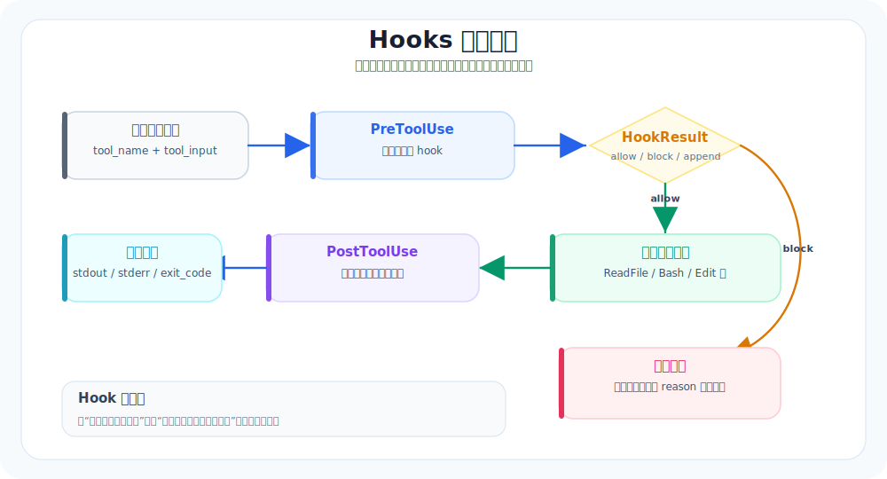

# 12. Hooks：把自动化护栏挂在循环外

本章导航：

- 新增机制：在工具执行和上下文压缩前后发送事件，让外部规则观察、阻止或改写结果。
- 正式入口：`src/whale_cli/hooks/`、`src/whale_cli/soul/toolset.py`。
- 验证方式：`./.venv/bin/python -m pytest tests/test_hooks.py -q`。
- 本章不展开：异步 hook、配置化 matcher 和跨进程 hook server 尚未实现。

前面我们已经有了审批：`Bash`、`WriteFile`、`Edit` 这类危险工具，在执行前会问用户。

但审批只解决“能不能做”。成熟 CLI Agent 还需要另一类能力：**每次做某些事之前或之后，自动执行一段检查或通知。**

这就是 hooks。

## 本章目标（验收标准）

读完这一章，你应该能区分：

- approval：工具执行前的权限闸门
- hook：循环里的扩展点，可以记录日志、阻断动作、补充提醒、发通知
- 为什么 hook 应该挂在 loop 外，而不是把 if/else 写进 `Soul.run()`

## 生产级参考实现里的真实结构



生产级参考实现的 hooks 大致分三层：

```text
production_cli/hooks/
├── events.py    # 为每类事件构造输入 payload
├── config.py    # 从配置读取 hook 定义
├── runner.py    # 执行单个 hook 命令
└── engine.py    # 匹配事件 + 并发执行 hook + 汇总结果
```

核心事件包括：

| 事件 | 触发时机 |
|---|---|
| `UserPromptSubmit` | 用户提交 prompt 后 |
| `PreToolUse` | 工具执行前 |
| `PostToolUse` | 工具执行成功后 |
| `PostToolUseFailure` | 工具执行失败后 |
| `PreCompact` / `PostCompact` | 上下文压缩前后 |
| `SessionStart` / `SessionEnd` | 会话开始和结束 |
| `SubagentStart` / `SubagentStop` | 子 agent 生命周期 |

你会发现，hook 不是“权限系统的别名”。它是 agent loop 的事件总线。

## Whale CLI 现在在哪里

Whale CLI 当前有一个简单但正确的审批点：

```text
Toolset.handle()
  ├── 解析 JSON 参数
  ├── 找工具
  ├── approval gate
  ├── tool(**args)
  └── 标准化 result
```

这适合 `ask / approve / reject`，但不适合做这些事：

- 每次 `WriteFile` 后自动打印 changed files
- 每次 `Bash` 后如果失败就提示 agent 先读 stderr
- 每次用户提交 prompt 后记录一份审计日志
- 每次 compact 前后输出 token 变化

这些都应该是 hook，而不是继续往 `Toolset.handle()` 里塞逻辑。

## 教学版应该怎么补

Whale CLI 的 hook v0 可以非常小：

```text
src/whale_cli/
└── hooks/
    ├── __init__.py
    ├── events.py      # 构造 payload
    └── engine.py      # 注册 callback，按事件触发
```

第一版不需要 shell hook，也不需要配置文件。先支持 Python callback：

```python
class HookEngine:
    def __init__(self):
        self._hooks = {}

    def on(self, event, fn):
        self._hooks.setdefault(event, []).append(fn)

    def trigger(self, event, payload):
        results = []
        for fn in self._hooks.get(event, []):
            results.append(fn(payload))
        return results
```

然后在三个地方接入：

```text
Soul.run()
  ├── UserPromptSubmit
  ├── PreCompact / PostCompact
  └── Stop

Toolset.handle()
  ├── PreToolUse
  ├── PostToolUse
  └── PostToolUseFailure
```

## HookResult 的最小语义

教学版只需要三种结果：

| action | 含义 |
|---|---|
| `allow` | 继续执行 |
| `block` | 阻断本次动作，返回错误给 agent |
| `append` | 不阻断，但追加一条提醒 |

真实生产级参考实现还会处理 wire hook、超时、并发执行、去重、客户端订阅等。Whale CLI 先不碰这些。

## 本章验收

可以写三个最小 hook：

1. `PreToolUse`：如果工具是 `Bash` 且命令包含 `rm -rf`，直接 block。
2. `PostToolUseFailure`：如果工具失败，输出一条提醒：“先读 stderr，再决定下一步。”
3. `PreCompact` / `PostCompact`：打印压缩前后的 token 估算。

验收不是“hook 很强”，而是：

- 新增 hook 不需要改工具实现
- 新增 hook 不需要改 LLMClient
- 主循环只多几个清晰的触发点

## 和生产级参考实现的差距

生产级参考实现的 hook engine 支持：

- 通过配置声明 hook
- matcher 正则匹配工具名或事件目标
- server-side shell hook
- client-side wire hook
- 并发执行和超时
- hook 触发与结果通过 wire 反馈给 UI

Whale CLI 教学版先只保留最重要的思想：**loop 留扩展点，扩展逻辑不要写死进 loop。**

---

## 本章模块化代码

Hook 的关键不是功能多，而是“主循环留事件点，扩展逻辑挂在外面”。

### 1. HookResult 和 HookEngine

文件：`src/whale_cli/hooks/engine.py`

```python
@dataclass(frozen=True)
class HookResult:
    action: Literal["allow", "block", "append"] = "allow"
    reason: str = ""
    append: str = ""


class HookEngine:
    def __init__(self) -> None:
        self._hooks: dict[str, list[HookCallback]] = {}

    def on(self, event: str, callback: HookCallback) -> None:
        self._hooks.setdefault(event, []).append(callback)

    def trigger(self, event: str, payload: dict) -> list[HookResult]:
        results = []
        for callback in self._hooks.get(event, []):
            try:
                result = callback(dict(payload))
            except Exception as exc:
                results.append(HookResult(action="block", reason=f"Hook failed: {exc}"))
                continue
            results.append(result if isinstance(result, HookResult) else HookResult(action="block"))
        return results
```

### 2. 事件 payload 统一生成

文件：`src/whale_cli/hooks/events.py`

```python
def pre_tool_use(*, session_id: str | None, cwd: str, tool_name: str, tool_input: dict) -> dict:
    return {
        "hook_event_name": "PreToolUse",
        "session_id": session_id or "",
        "cwd": cwd,
        "tool_name": tool_name,
        "tool_input": tool_input,
    }
```

### 3. Toolset 在调用工具前触发

文件：`src/whale_cli/soul/toolset.py`

```python
pre_results = self._hook_engine.trigger(
    "PreToolUse",
    hook_events.pre_tool_use(
        session_id=self._session_id,
        cwd=self._cwd,
        tool_name=name,
        tool_input=args,
    ),
)
blocked = self._hook_engine.first_block(pre_results)
if blocked is not None:
    return {"stdout": "", "stderr": blocked.reason, "exit_code": 125, "changed_files": []}
```

这就是 hook 的最小闭环：注册 callback → 事件触发 → block/allow/append。

## 本章测试与边界

```bash
./.venv/bin/python -m pytest tests/test_hooks.py tests/test_toolset.py -q
```

当前 HookEngine 只在内存中注册同步 Python callback，没有 hook 配置文件、shell hook、异步队列或进程重启后的恢复。`append` 是一个可聚合结果；只有调用方主动读取它时，文本才会进入后续行为，不能把它理解成自动注入模型上下文。

## 本章小结

Hook 是循环边缘的扩展点，不替代 Agent Loop。它能观察或阻止既有动作，但当前不会自行跨进程保存或调度。下一章会利用独立 Soul 和受限工具集，把一段聚焦工作从父会话中隔离出去。

下一章：[13-Subagents-把复杂任务交给干净上下文.md](13-Subagents-把复杂任务交给干净上下文.md)。
