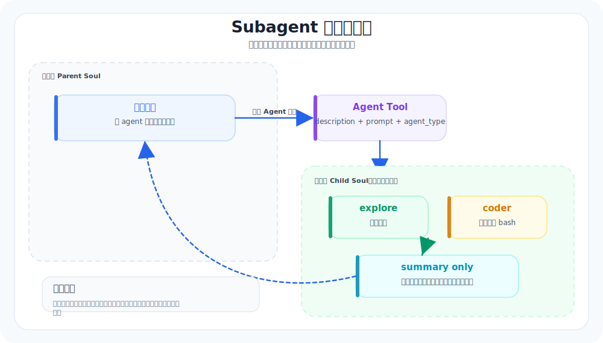

# 13. Subagents：把复杂任务交给干净上下文

本章导航：

- 新增机制：父 Agent 将聚焦任务交给独立消息历史和受限工具集的子 Agent。
- 正式入口：`src/whale_cli/subagents/runner.py`、`src/whale_cli/tools/agent/`。
- 验证方式：`./.venv/bin/python -m pytest tests/test_plugin_and_subagent.py -q`。
- 本章不展开：并行子 agent、后台 resume 和持久化任务存储尚未实现。

一个 agent 能做很多事，但一个上下文不能无限塞。

当用户让 agent “先调研整个项目，再改三处代码，再写测试，再总结风险”时，如果所有探索、尝试、错误输出都堆进主会话，主 agent 很快会被噪声淹没。

Subagent 的价值不是“多一个智能体很酷”，而是：**把一段复杂探索放进干净上下文里，最后只把结论带回来。**

## 本章目标（验收标准）

读完这一章，你应该能说明：

- subagent 和普通工具调用有什么不同
- 为什么 subagent 要有独立 messages
- 生产级参考实现的 Agent 工具大概如何启动 coder / explore / plan 这类子 agent
- Whale CLI 如何做一个最小但正确的 subagent 教学版

## Subagent 上下文隔离机制



---

## 生产级参考实现里的真实结构

生产级参考实现里和 subagent 相关的结构很多：

```text
production_cli/
├── tools/agent/              # Agent 工具，给模型调用
├── subagents/
│   ├── models.py             # AgentLaunchSpec / AgentTypeDefinition
│   ├── builder.py            # 根据 type 构建 agent
│   ├── core.py               # prepare_soul：构建 + 恢复上下文 + 写 prompt
│   ├── runner.py             # 前台运行
│   ├── store.py              # 子 agent 实例状态
│   └── git_context.py        # explore agent 的 git 上下文
└── agents/default/
    ├── coder.yaml
    ├── explore.yaml
    └── plan.yaml
```

真实流程可以压缩成 6 步：

```text
Agent tool called
  ↓
选择 subagent_type（coder / explore / plan）
  ↓
创建或恢复 agent_id
  ↓
为子 agent 构建独立 Agent + Runtime
  ↓
用独立 Context 跑一轮 AgentLoop
  ↓
把 summary 返回主 agent
```

重点：子 agent 不是共享主 agent 的完整消息列表，而是有自己的上下文。

## Whale CLI 现在在哪里

Whale CLI 目前还没有 subagent。它的所有工作都发生在一个 `Soul.messages` 里。

这没问题。入门阶段应该先把单 agent 做清楚。

但从生产级参考实现的实现看，subagent 一旦要补，不能随手写成：

```python
self.run("帮我调研一下")
```

这样会污染同一个 messages，失去 subagent 最大的意义。

## 教学版应该怎么补

Whale CLI v0 可以只支持一个 `Agent` 工具：

```text
src/whale_cli/
├── subagents/
│   ├── __init__.py
│   ├── models.py       # SubagentResult / SubagentSpec
│   └── runner.py       # 创建新 Soul，跑独立上下文
└── tools/
    └── agent/
        └── agent_tool.py
```

最小工具 schema：

```json
{
  "name": "Agent",
  "description": "Run a focused subagent with a fresh context and return its summary.",
  "parameters": {
    "description": "3-5 word task summary",
    "prompt": "The focused task for the subagent",
    "agent_type": "explore | coder"
  }
}
```

最小运行逻辑：

```text
AgentTool.__call__()
  ├── 创建一个新的 Soul
  ├── 只给它一个专门的 system prompt
  ├── 传入 prompt
  ├── 限制 max_steps，比如 8
  └── 返回最后回答 + 使用过的工具摘要
```

先不要做后台运行、恢复、模型覆盖、子 agent 继续启动子 agent。那些是生产版复杂度。

## 子 agent 的三条硬规则

1. **上下文隔离**
   子 agent 不继承主 agent 的完整 messages，只继承必要环境：工作目录、工具、审批策略。

2. **结果收敛**
   子 agent 返回给主 agent 的应该是 summary，不是完整聊天记录。

3. **权限冒泡**
   子 agent 遇到危险工具时，仍然走主会话的审批，而不是偷偷执行。

这三条比“能不能并发”更重要。

## 本章验收

可以用一个场景验证：

```text
请派一个 explore 子 agent 调研这个项目的测试结构，然后只返回：
1. 测试入口
2. 关键测试文件
3. 建议优先补测的模块
```

合格表现：

- 主会话只看到最终摘要
- 子 agent 可以用 read/grep/glob 探索
- 子 agent 的工具失败不会让主会话崩掉
- 主 agent 能基于摘要继续行动

## 和生产级参考实现的差距

生产级参考实现还支持：

- foreground / background 两种运行方式
- resume 已存在的 subagent
- subagent store 持久化实例
- explore agent 自动注入 git context
- 模型覆盖和工具 allowlist
- 子 agent 生命周期事件

Whale CLI 先只学一件事：**复杂探索用干净上下文完成，主会话只接收压缩后的结论。**

---

## 本章模块化代码

Subagent 的核心是“新建一个 child Soul”，而不是复用主会话的 `messages`。

### 1. 子 agent 工具集

文件：`src/whale_cli/subagents/runner.py`

```python
def default_subagent_tools(agent_type: str) -> list[Tool]:
    base: list[Tool] = [ReadFileTool(), GlobTool(), GrepTool(), GetDateTool()]
    if agent_type == "coder":
        base.extend([WriteFileTool(), EditTool(), BashTool()])
    return base
```

`explore` 默认只读；`coder` 才给写文件和 bash。

### 2. 创建干净上下文并运行

```python
class SubagentRunner:
    def run(self, prompt: str, agent_type: str = "explore") -> SubagentResult:
        from ..soul.soul import Soul

        child = Soul(
            llm=self.llm,
            tools=self.tool_factory(agent_type),
            max_steps=self.max_steps,
            approval=self.approval,
        )
        child.messages[0]["content"] += f"\n\nSubagent role: {agent_type}."
        child.run(prompt)
        return SubagentResult(summary=last_assistant_text(child.messages), transcript=transcript)
```

注意：这里没有把父会话 messages 传给 child，这就是“干净上下文”。

### 3. 暴露成模型可调用的 Agent 工具

文件：`src/whale_cli/tools/agent/agent_tool.py`

```python
class AgentTool(Tool):
    name = "Agent"
    description = "Run a focused subagent with a fresh context and return its compact summary."

    def __init__(self, *, llm: Any, approval: Approval, max_steps: int = 8):
        self.runner = SubagentRunner(llm=llm, approval=approval, max_steps=max_steps)

    def __call__(self, description: str, prompt: str, agent_type: str = "explore"):
        result = self.runner.run(prompt=prompt, agent_type=agent_type or "explore")
        return ok(f"[{agent_type}] {description}\n{result.summary}")
```

从模型视角看，subagent 只是一个工具；从 harness 视角看，它是一个独立 loop。

## 本章测试与边界

```bash
./.venv/bin/python -m pytest tests/test_plugin_and_subagent.py -q
```

子 Agent 与父 Agent 共享 LLMClient 和 Approval，因此 coder 子 Agent 的写入和命令仍需同一套确认；它不共享 messages、TodoStore 和 Toolset。当前 `SubagentRunner.run()` 是同步调用，不是并行 Agent 团队，父会话拿到的是摘要结果而不是子会话的完整消息流。

## 本章小结

Subagent 的价值在于限制上下文和工具，而不是多开一个聊天窗口。父会话得到摘要，避免把全部探索细节带回主线；代价是当前执行串行，且没有恢复子任务的能力。下一章把长时间 Bash 命令从前台交互中移开。

下一章：[14-BackgroundTasks-让慢任务后台跑.md](14-BackgroundTasks-让慢任务后台跑.md)。
