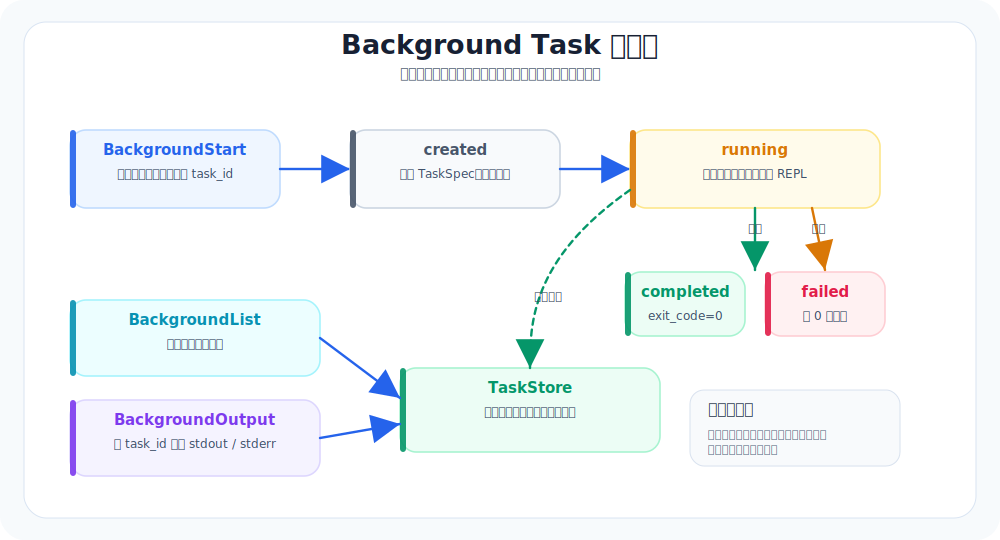

# 14. Background Tasks：让慢任务后台跑

本章导航：

- 新增机制：把慢 Bash 命令放到后台线程运行，并把状态与输出落盘。
- 正式入口：`src/whale_cli/background/manager.py`、`src/whale_cli/tools/background/`。
- 验证方式：`./.venv/bin/python -m pytest tests/test_background.py -q`。
- 本章不展开：worker 进程、重启接管、heartbeat 和分布式队列尚未实现。

有些工具调用不应该阻塞主 agent。

比如长时间测试、构建、下载、后台调研。主 agent 可以先安排它们跑起来，然后继续读代码、制定计划，等后台任务结束后再消费结果。

这就是 background tasks。

## 本章目标（验收标准）

读完这一章，你应该能回答：

- 哪些任务适合后台跑，哪些不适合
- 生产级参考实现为什么要把后台任务落盘，而不是只开一个线程
- Whale CLI 的教学版如何保留最关键的任务状态机

## Background Task 状态机



---

## 生产级参考实现里的真实结构

生产级参考实现的后台任务是一个完整子系统：

```text
production_cli/background/
├── models.py      # TaskSpec / TaskRuntime / TaskControl / TaskView
├── store.py       # 每个 task 一个目录，状态和输出落盘
├── manager.py     # 创建、列出、停止、消费任务
├── worker.py      # 独立 worker 进程执行 bash
└── agent_runner.py# 后台 subagent
```

它把一个后台任务拆成四类数据：

| 数据 | 说明 |
|---|---|
| `TaskSpec` | 任务是什么：命令、描述、cwd、timeout、owner |
| `TaskRuntime` | 任务现在怎么样：starting/running/completed/failed/killed |
| `TaskControl` | 外部控制：是否请求 kill |
| `TaskOutputChunk` | 输出流：offset、text、eof、status |

这比“开个线程跑 subprocess”复杂很多，但复杂是有原因的：任务要能恢复、能停止、能审计、能被 UI 查看。

## Whale CLI 现在在哪里

Whale CLI 当前的 `Bash` 是同步工具：

```text
模型调用 Bash
  ↓
subprocess.run(...)
  ↓
等待命令结束
  ↓
把 stdout/stderr 回填给模型
```

这对 `pytest -q`、`ls`、`rg` 这类短命令足够好。

但如果命令要跑 5 分钟，同步 Bash 会让 agent 卡住。

## 教学版应该怎么补

Whale CLI 的 background v0 可以只支持后台 Bash，不做后台 subagent：

```text
src/whale_cli/
├── background/
│   ├── __init__.py
│   ├── models.py      # TaskSpec / TaskRuntime / TaskView
│   ├── store.py       # .whale_cli/tasks/<task_id>/
│   └── manager.py     # start/list/output/stop
└── tools/
    └── background/
        ├── start_tool.py
        ├── list_tool.py
        └── output_tool.py
```

第一版可以用线程，不必独立 worker 进程。但状态必须落盘：

```text
.whale_cli/
└── tasks/
    └── bash_ab12cd34/
        ├── spec.json
        ├── runtime.json
        └── output.txt
```

最小状态机：

```text
created → running → completed
                 ↘ failed
                 ↘ killed
```

## 工具设计

建议不要让 `Bash` 自己多一个 `background=true` 参数。教学版更清楚的做法是单独三个工具：

| 工具 | 用途 |
|---|---|
| `BackgroundStart` | 启动后台命令 |
| `BackgroundList` | 查看任务状态 |
| `BackgroundOutput` | 读取某个任务的新输出 |

这样模型会更容易理解：“短命令用 Bash，长命令用 BackgroundStart。”

## 什么适合后台跑

适合：

- 长测试：`pytest tests/e2e -v`
- 长构建：`npm run build`
- 长搜索或下载
- 可以稍后再看结果的分析脚本

不适合：

- 需要马上根据 stdout 决策的命令
- 会等待交互输入的命令
- 修改大量文件且无法审计的命令

## 本章验收

可以用这组任务验证：

```text
请后台运行一个需要 5 秒的命令，然后继续解释项目结构。
稍后检查后台任务结果。
```

合格表现：

- agent 启动任务后能继续回答
- `/background` 或 `BackgroundList` 能看到任务状态
- 任务结束后能读取输出
- 失败任务不会让 CLI 崩溃

## 和生产级参考实现的差距

生产级参考实现的后台系统还有：

- 独立 worker 进程
- heartbeat 检测 lost task
- kill control
- 输出 offset 增量读取
- terminal notification
- background agent
- 最大并发限制

Whale CLI 先保留本质：**慢任务变成有 ID、有状态、有输出的持久化对象。**

---

## 本章模块化代码

后台任务分三层：状态模型、任务管理器、工具封装。

### 1. 任务状态模型

文件：`src/whale_cli/background/models.py`

```python
TaskStatus = Literal["created", "running", "completed", "failed", "killed"]


@dataclass
class TaskSpec:
    id: str
    command: str
    description: str
    cwd: str
    timeout_s: int = 300


@dataclass
class TaskRuntime:
    status: TaskStatus = "created"
    exit_code: int | None = None
    failure_reason: str = ""
```

### 2. 后台启动线程

文件：`src/whale_cli/background/manager.py`

```python
class BackgroundTaskManager:
    def start(self, command: str, description: str = "", timeout_s: int = 300, cwd: str | None = None) -> TaskView:
        task_id = f"bash_{uuid.uuid4().hex[:8]}"
        spec = TaskSpec(id=task_id, command=command, description=description or command[:80], cwd=cwd or os.getcwd())
        self.store.create(spec)
        thread = threading.Thread(target=self._run_task, args=(spec,), daemon=True)
        thread.start()
        return TaskView(spec, self.store.read_runtime(task_id))
```

### 3. 暴露成三个工具

文件：`src/whale_cli/tools/background/background_tools.py`

```python
class BackgroundStartTool(Tool):
    name = "BackgroundStart"
    approval_action = "run background command"

    def __call__(self, command: str, description: str = "", timeout_s: int = 300):
        view = self.manager.start(command=command, description=description, timeout_s=timeout_s)
        return ok(json.dumps({"task_id": view.spec.id, "status": view.runtime.status}))


class BackgroundListTool(Tool):
    name = "BackgroundList"


class BackgroundOutputTool(Tool):
    name = "BackgroundOutput"
```

这三个工具对应用户自然会问的三件事：启动、查看列表、读取输出。

## 本章测试与边界

```bash
./.venv/bin/python -m pytest tests/test_background.py -q
```

任务状态和输出会写入 `.whale_cli/tasks/`，但运行进程保存在当前进程的内存字典中。CLI 重启后可以查看遗留状态文件，却不能重新接管旧进程。`BackgroundTaskManager` 有 `stop()` 方法，但当前默认工具池没有暴露 BackgroundStop；正文不要把“可停止”写成现成的模型能力。

## 本章小结

后台任务把耗时命令的输出和前台 REPL 分开，当前用线程、子进程和文件状态实现。它能记录结果，但不能在重启后接管运行中的进程。下一章继续讲 Skill，不过关注多个来源发生重名时如何选择。

下一章：[15-Skills进阶-按来源分层发现.md](15-Skills进阶-按来源分层发现.md)。
