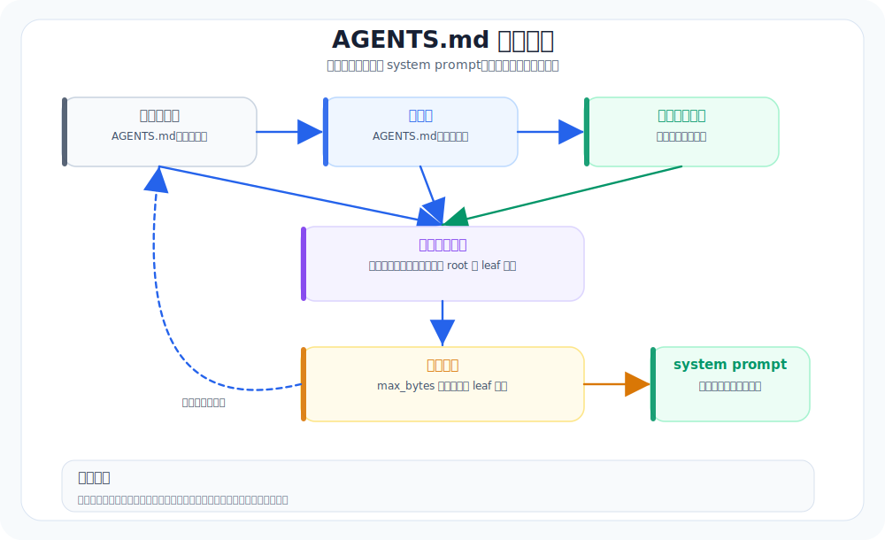

# 17. AGENTS 与项目上下文：让仓库规则自动生效

本章导航：

- 新增机制：从仓库根目录到当前目录发现 `AGENTS.md`，合并后注入系统提示词。
- 正式入口：`src/whale_cli/context/project.py`、`src/whale_cli/soul/soul.py`。
- 验证方式：`./.venv/bin/python -m pytest tests/test_project_context.py -q`。
- 本章不展开：运行中热刷新、多格式规则和冲突诊断尚未实现。

一个 coding agent 不能只靠模型记忆工作。

每个仓库都有自己的规则：怎么跑测试、代码风格、不要改哪些目录、提交前要检查什么。这些规则如果每次都靠用户重复输入，agent 很快就会漏。

所以成熟 CLI Agent 会自动读取项目上下文文件。

## 本章目标（验收标准）

读完这一章，你应该能回答：

- `AGENTS.md` 和 system prompt 是什么关系
- 生产级参考实现为什么从项目根到当前目录逐层合并 `AGENTS.md`
- Whale CLI 如何做一个简单但不容易踩坑的项目上下文加载器

## AGENTS.md 逐层合并



---

## 生产级参考实现里的真实结构

生产级参考实现的 `load_agents_md(work_dir)` 会做这些事：

1. 找到项目根目录。
2. 从项目根一路走到当前工作目录。
3. 每一层检查：
   - `.whale_cli/AGENTS.md`
   - `AGENTS.md`
   - `agents.md`
4. 按 root → leaf 顺序合并。
5. 总大小限制 32 KiB。
6. 预算 leaf-first：越靠近当前目录的规则优先保留。

这个设计很讲究。

根目录规则通常是全局约束，子目录规则通常更具体。上下文爆了时，应该优先保留更具体的规则。

## Whale CLI 现在在哪里

Whale CLI 当前 system prompt 会注入 OS、工具、时间，但还不会自动读取项目规则。

这意味着用户每次都要手动说：

```text
这个项目用 pytest，不要跑 npm test。
改代码前先看 tests。
不要修改 generated 文件。
```

这些其实应该写进 `AGENTS.md`，由 harness 自动加载。

## 教学版应该怎么补

新增一个很小的上下文加载模块：

```text
src/whale_cli/
└── context/
    ├── __init__.py
    └── project.py
```

第一版只做：

```text
从 cwd 向上找到最近的 .git，作为 project_root
从 project_root 到 cwd 逐层查找：
  .whale_cli/AGENTS.md
  AGENTS.md
  agents.md
合并文本，限制 32 KiB
```

然后在 system prompt 里加一段：

```markdown
Project instructions:
{{ agents_md }}
```

如果没找到，就不要注入这一段，避免噪声。

## 合并顺序

假设目录是：

```text
repo/
├── AGENTS.md
└── packages/api/
    └── AGENTS.md
```

从 `packages/api` 启动时，合并结果应该是：

```markdown
<!-- From: repo/AGENTS.md -->
全仓库规则

<!-- From: repo/packages/api/AGENTS.md -->
api 子项目规则
```

模型读到后会自然理解：后面的规则更具体。

## 大小限制

不要无限塞项目规则。

Whale CLI 可以沿用生产级参考实现的 32 KiB 上限。超出时优先保留 leaf 文件，也就是更靠近当前目录的规则。

这个细节很关键：规则越具体，越可能影响当前任务。

## 本章验收

准备两个文件：

```text
AGENTS.md
src/service/AGENTS.md
```

从 `src/service` 启动 Whale CLI，问：

```text
请告诉我这个项目要求怎么跑测试，哪些目录不要改。
```

合格表现：

- agent 能引用两个 AGENTS 文件里的规则
- 子目录规则不会被根目录规则覆盖
- 没有 AGENTS 文件时，prompt 不出现空壳段落

## 和生产级参考实现的差距

生产级参考实现还处理：

- 项目本地规则文件和普通 `AGENTS.md` 共存
- `AGENTS.md` / `agents.md` 大小写互斥
- leaf-first 字节预算
- KaosPath 多后端路径
- source annotation

Whale CLI 先保留最有用的一点：**项目规则是 harness 自动给模型的工作说明，不应该靠用户每次重复。**

---

## 本章模块化代码

AGENTS.md 的重点是“自动加载项目规则”，而且要从仓库根目录一路合并到当前目录。

### 1. 找项目根目录

文件：`src/whale_cli/context/project.py`

```python
def find_project_root(work_dir: str | os.PathLike[str] | None = None) -> Path:
    current = Path(work_dir or os.getcwd()).resolve()
    if current.is_file():
        current = current.parent
    for candidate in (current, *current.parents):
        if (candidate / ".git").exists():
            return candidate
    return current
```

### 2. 每层目录候选文件

```python
def _candidate_files(directory: Path) -> Iterable[Path]:
    for path in (
        directory / ".whale_cli" / "AGENTS.md",
    ):
        yield path

    upper = directory / "AGENTS.md"
    lower = directory / "agents.md"
    yield upper if upper.exists() else lower
```

### 3. root → leaf 合并，leaf 优先保留预算

```python
def load_agents_md(work_dir: str | os.PathLike[str] | None = None, *, max_bytes: int = 32 * 1024) -> str:
    cwd = Path(work_dir or os.getcwd()).resolve()
    discovered = _read_discovered(cwd)
    if not discovered:
        return ""

    remaining = max_bytes
    budgeted = [(p, "") for p, _ in discovered]
    for i in reversed(range(len(discovered))):
        path, text = discovered[i]
        encoded = text.encode("utf-8")
        if len(encoded) > remaining:
            text = encoded[:remaining].decode("utf-8", errors="ignore").strip()
        remaining -= len(text.encode("utf-8"))
        budgeted[i] = (path, text)

    return "\n\n".join(f"<!-- From: {path} -->\n{text}" for path, text in budgeted if text)
```

### 4. 注入 system prompt

文件：`src/whale_cli/soul/soul.py`

```python
agents_md = load_agents_md(os.getcwd()) or "No project instructions found."
system_prompt = render_system_prompt(spec, {
    "agents_md": agents_md,
    ...
})
```

这样用户不用每次重复“这个仓库怎么测、哪些目录不能改”，harness 会自动告诉模型。

## 本章测试与边界

```bash
./.venv/bin/python -m pytest tests/test_project_context.py -q
```

规则在 `Soul` 初始化时读入 system prompt。运行中的 `AGENTS.md` 被修改后，已有 Soul 不会自动刷新；新开会话或重新启动才会加载新内容。当前实现按 root 到 leaf 发现文件，再从 leaf 方向优先保留字节预算，因此更靠近当前目录的规则更不容易被截断。

## 本章小结

项目规则由路径决定作用域，再被合并进系统提示词。当前规则在 Soul 创建时读取，因此运行中的修改不会自动生效。下一章不再新增具体模块，而是把目前的能力和生产差距排成可执行的工程顺序。

下一章：[18-进阶收束-WhaleCLI扩展路线.md](18-进阶收束-WhaleCLI扩展路线.md)。
