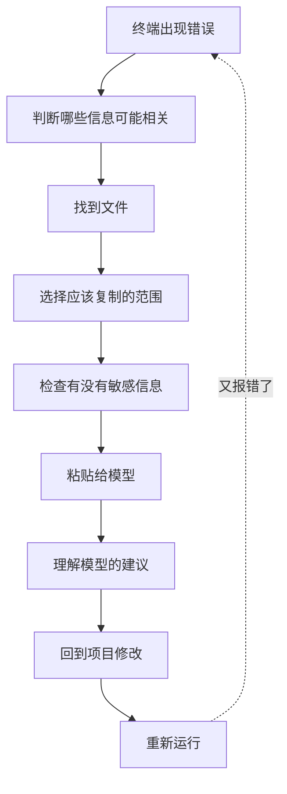
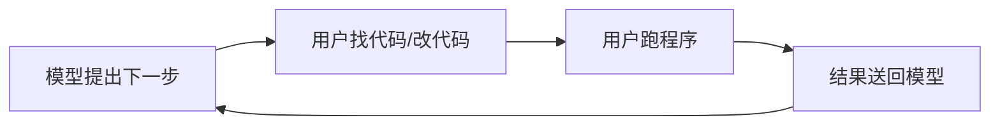
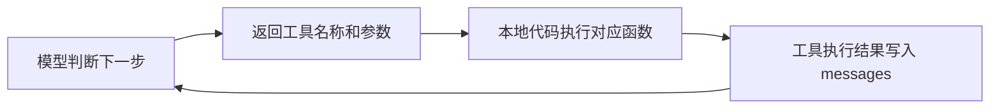
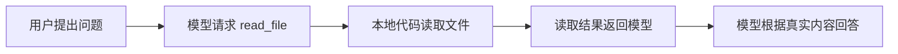

# 第 0 章 · 开篇：一起造一个 Coding Agent

---

## 1. 一起从零打造一个 Coding Agent 吧

欢迎各位来到 Whale CLI 教程。

前不久 ChatGPT 和 Codex 桌面端正式合并，Codex 的用户迅速增长。过去一年多，Coding Agent 从开发者的尝鲜工具变成了日常生产力，WorkBuddy、Claude Cowork 这些基于 Agent 能力的应用也越来越多。这正是一个学习和掌握 Agent 背后原理的好时候。

相信大家平时如果用过 Claude Code、Codex 等 Coding Agent 的话，可能会震撼于它们的强大，惊喜于它们的能力。在 Vibe Coding 的过程中，我们常常会有一种很奇妙的感觉：

明明只交代了一段话，它却能自己读取文件、搜索代码、修改实现、运行测试。测试没有通过，它还会根据新的报错继续排查，一轮接一轮，直到完成任务。

在感叹之余，我们可能也会产生很多疑问：这些能力究竟是如何实现的？它为什么可以长达数十小时地不断运行？调用这些工具的时候，参数是怎样设计的？一次工具执行的结果是怎样让模型了解到的？

<Viz src="/viz/ch00-whale-cli-autoplay.html" title="Whale CLI " />

我们希望通过这套教程，带大家从最基础的工具调用开始，研究这些工具的参数是怎样设计的，工具和模型之间是怎样的一个关系。这样，我们不仅知其然，也能知其所以然。以后再使用这些 Coding Agent 时，也能更好地理解它们、驾驭它们，发挥出更大的价值。

可能大家平时听过很多很多相关的术语，从 Prompt 到 Memory，到 Context Engineering，再到 Harness Engineering，我们后面都会一一在这套教程里给大家讲明白。

我们一起把这个程序一行一行写出来，管它叫 **Whale CLI**。它从一个只会读文件的小工具开始，一章一章加上搜索、编辑、运行测试的能力，慢慢长成一个能应对真实项目的 Coding Agent。

为什么叫 Whale **CLI**：Coding Agent 可以跑在 CLI、VS Code 插件、Web 端和桌面应用里。先从 CLI 开始，交互最简单，能把注意力集中在原理上。后面也会拓展到其他形式。

Whale CLI 是我们从零打造的 Coding Agent。整套教程里，它要面对的实战对象是 OpenClaw（龙虾）——一个 2 万多个文件的真实开源项目。每一章新加的能力，都会拿 OpenClaw 来检验：能不能在里面找到目标代码、能不能正确修改、改完能不能通过测试。你也可以换成自己的项目来跟着练。

一开始，把 Whale CLI 放进 OpenClaw 这样的大项目里，它和我们第一次接手一个陌生代码仓库差不多：眼前一大堆文件，不知道入口在哪，不知道功能藏在哪个模块。随着课程推进，它会慢慢学会先看目录、搜索函数名，沿着 import 和调用链找到相关代码。再往后，它能修改文件、运行测试、根据报错继续调整。任务变长以后，它还能记住做过什么、还剩什么没完成，并遵守项目本身的规则。

<figure class="chapter-figure">
  
  <figcaption><strong>逐章深入</strong> </figcaption>
</figure>

我们会从一次最小的工具调用开始，带着 Whale CLI 一步一步解锁这些能力。


不过，在正式开始学习之前，我们想先把时间拨回到大家还习惯使用 Chatbot 辅助编程的那个阶段。

那时，大语言模型已经能够分析报错、阅读我们贴进去的代码，也能给出看起来不错的修改建议。但如果我们的项目比较大的话，受限于上下文长度和网页端的环境，它看不到完整的项目，也不能亲自打开文件、执行命令或者验证修改结果。找文件、复制代码、切到终端运行程序、把新的报错再贴回聊天框，这些事情都要由人来完成。

今天 Coding Agent 里能直接调用的工具，其实都能在 Chatbot 时代的工作流里找到对应的人工操作。每一项能力往往来自一个我们曾经反复遇到的问题，也对应着一段过去需要人亲手完成的工作。

---

## 2. Chatbot 时代：当搬运工的日子

当时让 Chatbot 写一些小片段的代码，已经可以有不错的效果。但如果想用它辅助做大项目，事情就变得琐碎了：我们先把需求发给它，让它告诉我们要建哪些文件，然后自己去建，建完再问它代码怎么写。运行中遇到报错，我们得把错误和相关代码贴进聊天框，让它分析。如果有比较多的编码经验，还可以比较精准地告诉它哪个文件可能有问题。如果当年纯 vibe 的话，那就是来回当搬运工了。

一段代码的报错，通常取决于它所处的环境：变量从哪里来、函数是谁调用的、依赖什么版本、程序是通过什么命令启动的。这些信息散落在编辑器、终端和项目配置里，不会自动出现在聊天框中——每一条都要我们自己找到、复制、粘贴过去。

<Viz src="/viz/ch00-desktop-debug.html" title="用早期没有 agent 能力的 chatbot 辅助编码" />

假如我们在开发一个基于 FastAPI 的 todo list 项目。项目结构不算复杂——`main.py` 是入口，`app/` 目录下放着配置、路由和业务逻辑。刚写完一个新功能，在终端里启动项目，结果报错了：

```text
Traceback (most recent call last):
  File "/Users/leo/todo-list/main.py", line 4, in <module>
    from config import settings
ModuleNotFoundError: No module named 'config'
```

我们先选中这几行，复制，打开浏览器，把它粘给 chatbot

```text
我的 todo list 项目启动时报这个错误，是什么原因？

ModuleNotFoundError: No module named 'config'
```

chatbot 可能会列出几种常见原因：当前目录不对、模块没有安装、Python 搜索路径里没有项目根目录，或者 import 写错了。这些原因都可能成立，它让我们补充 `main.py` 的 import 部分和项目目录结构。于是工作重新回到我们手里——切回编辑器，打开 `main.py`，复制文件开头：

```python
from fastapi import FastAPI
from config import settings
from routes import router

app = FastAPI()
```

再切到终端，运行：

```bash
tree -L 2
```

终端输出：

```text
.
├── app
│   ├── __init__.py
│   ├── config.py
│   └── routes.py
├── main.py
├── pyproject.toml
└── tests
    └── test_api.py
```

我们把两段内容都粘进聊天框。这一次 chatbot 能看到 `config.py` 实际位于 `app/` 目录，于是建议把：

```python
from config import settings
```

改成：

```python
from app.config import settings
```

这条建议看起来有道理。我们回到编辑器，找到对应位置，手动修改文件，再切到终端重新运行：

```bash
python main.py
```

原来的导入错误消失了。终端又出现一段新的 traceback：

```text
KeyError: 'DATABASE_URL'
```

现在需要继续排查。但 chatbot 没有看到刚才的执行结果，也不知道我们已经修改了哪一行，我们得重新复制新的报错，并补充一句：

```text
导入问题解决了，现在出现这个错误。
```

它接着询问环境变量是怎样配置的。

于是我们去项目里寻找 `.env`、`.env.example` 和 `config.py`。打开 `.env` 时还要先检查里面有没有数据库密码、API Key 或其他不适合发送的内容。删掉敏感信息后，再把剩下的配置复制过去。

chatbot 看完后，也许会发现程序直接通过：

```python
os.environ["DATABASE_URL"]
```

读取环境变量，而我们的启动方式没有加载 `.env`。它建议使用 `python-dotenv`，或者在运行前手动设置变量。

我们照着修改，再运行一次。

如果又出现新的错误，整个过程就继续重复：



模型确实参与了排错，但找文件、整理上下文、执行修改、查看新的报错，这些事情仍然要由我们亲手完成。

而且，这个过程并不只是机械地复制粘贴，中间还夹杂着大量判断。

Chatbot 让我们提供"项目结构"，到底应该贴完整的 `tree`，还是只贴两层？它让我们提供"相关代码"，应该复制整个文件，还是只复制 `import` 附近的几十行？错误日志里出现了用户路径、数据库地址和 Token，要不要先处理？模型列出了三个可能原因，我们又应该先验证哪一个？

这些判断，都发生在我们按下回车以前。

回头看整个过程，会发现 Chatbot 已经能够参与分析。它会根据当前看到的信息，告诉我们下一步可能需要检查什么。

但它不能自己打开项目，也不能亲自完成这些操作。

它想看目录，我们替它运行 `tree`；它想看代码，我们替它打开文件；它给出修改建议，我们回到编辑器里手动修改；它想知道程序运行得怎么样，我们再替它执行命令，把新的报错复制回来。

整个排错过程其实已经形成了一种循环：



今天 Coding Agent 的工作方式，在这时已经隐约出现了。只不过，那时负责让这条循环转起来的，还是用户自己。

<figure class="chapter-figure">
  
  <figcaption><strong>从人工搬运，到 Agent 自己循环</strong></figcaption>
</figure>

<Viz src="/viz/ch00-two-eras.html" title="从 Chatbot 到 Coding Agent" />

---

## 3. 从 Chatbot 到 Coding Agent

回头看刚才的排错过程，Chatbot 其实已经承担了不少分析工作。

它可以根据我们提供的报错、代码和目录结构，推测问题可能出在哪里，也可以告诉我们接下来值得检查什么。

但它看到的并不是电脑里那个正在变化的项目，而是我们从项目中挑选出来，再发送进聊天框的几段内容。

例如，我们把这份目录结构贴给它：

```text
.
├── app
│   ├── config.py
│   └── routes.py
└── main.py
```

它当然可以据此判断：`config.py` 位于 `app/` 目录，当前的 `import` 很可能写错了。

但这个判断只建立在我们刚刚提供的信息上。如果我们随后移动了文件、切换了 Git 分支，或者修改了 `config.py`，却没有把这些变化重新告诉它，那么它下一轮看到的，仍然是聊天记录里的旧内容。

Chatbot 看到的更像是由用户截取的一张项目快照。真实项目在编辑器和终端里继续变化，聊天框里的信息却不会自动跟着更新。

这也是为什么当时使用 Chatbot 辅助编码，我们总要在几个窗口之间来回切换。模型想知道项目里有哪些文件，我们去翻文件树或者运行 `tree`；模型想知道某个函数在哪里，我们打开编辑器的全局搜索；模型需要看一段代码，我们找到文件、挑出相关部分，再复制进聊天框；模型给出修改建议，我们回到编辑器里手动修改；模型想知道修改以后是否正常，我们再去终端运行程序或测试，把新的结果贴回来。

如果用今天 Coding Agent 中的概念回头看，当时的用户其实一直在替模型完成这些工作：

| 当时用户做的事情 | 对应的 Coding Agent 概念 |
|---|---|
| 在文件树中寻找可能相关的路径 | Glob：按照路径和文件名寻找文件 |
| 搜索函数名、变量名和报错文本 | Grep：在文件内容中搜索关键词 |
| 打开文件，挑出相关代码发给模型 | Read：读取文件内容 |
| 根据建议创建文件或替换代码 | Write / Edit：创建或修改文件 |
| 在终端运行程序、测试和构建命令 | Bash：执行命令 |
| 整理运行结果，再发回聊天框 | 工具执行的结果（Tool Result） |

这里暂时不需要记住 Glob、Grep、Read 这些名称。后面的章节会把这些工具一个个接入 Whale CLI，并具体讨论它们的参数为什么要这样设计。

不过，用户当时替模型完成的，还不只是找文件、改代码和运行命令这些看得见的操作。

如果一项任务持续得比较久，我们还要替它记住很多事情。比如，用户最初提出了五个要求，现在已经完成了哪几个，还有哪几个没有处理；模型刚才尝试过哪些方案，哪些已经被证明行不通；下一步应该先跑局部测试，还是直接跑完整测试。这些信息散落在我们的脑子、聊天记录、便签和终端历史里。如果模型处理完一个局部报错就准备结束，我们会提醒它：

```text
注册入口还没有修改。
README 也还没有更新。
最后还要跑一次完整测试。
```

我们也一直在替模型管理上下文。项目有几千个文件，不可能全部复制进聊天框；错误日志有几千行，也不会全部发送。我们会判断哪些文件与当前问题有关，应该截取哪几十行代码，哪些旧信息已经没有用了：

```text
这个问题已经排除了数据库连接。
现在主要怀疑配置加载顺序。
刚才修改了 config.py，但测试仍然失败。
```

如果任务跨越了几天，第二天重新打开电脑，我们可能会查看昨天的聊天记录、终端历史和 Git Diff，回忆已经修改了哪些文件、测试停在什么地方，再给模型补上一段背景：

```text
继续昨天的任务。
昨天已经修好了 import，
现在还剩 DATABASE_URL 的加载问题。
```

还有一些信息，我们甚至不会特意告诉模型，因为自己早已习以为常——我们知道当前处于哪个仓库，知道这个项目用 `uv run pytest` 而不是 `pytest`，知道生成文件不能手工修改。遇到删除文件或执行危险命令时，也是用户自己在做最后判断。

回头看，用户承担的角色比"搬运工"还要更多：

| 当时用户承担的工作 | 后来在 Coding Agent 中形成的机制 |
|---|---|
| 记住哪些要求已经完成、还有什么没做 | TodoWrite |
| 决定哪些文件、代码和日志应该交给模型 | Context Management |
| 跨天保存聊天记录、修改进度和失败方案 | Session |
| 记住项目目录、测试命令和开发约定 | Project Context |
| 判断危险操作是否真的可以执行 | Approval |

这些工作在 Chatbot 时代就存在，只不过分散在人类的记忆、判断和操作里。Coding Agent 把它们写成了程序能维护的状态和规则。

甚至连操作顺序，也是用户在安排。模型列出几个可能原因以后，是我们决定先查目录还是先看代码；修改完成以后，也是我们决定先运行单个测试，还是直接启动整个项目。

所以，当时的用户不只是在和 Chatbot 对话。我们一直站在模型和项目之间：替它执行操作、管理任务、筛选上下文、维持会话，并在关键操作前做最后决定。

后来出现的 Coding Agent，首先改变的就是中间这一部分。它把原本需要用户亲手完成的文件搜索、代码读取、文件修改和命令执行，写成了一组可以在本地运行的程序工具。

例如，模型需要读取 `main.py` 时，不再要求用户手动复制文件，而是返回一条结构化的工具请求：

```json
{
  "name": "read_file",
  "arguments": {
    "path": "main.py",
    "start_line": 1,
    "end_line": 100
  }
}
```

这条请求表达的是：为了继续完成当前任务，我需要读取 `main.py` 的第 1 到 100 行。模型做到这里就停下来了——它只是给出了工具名称和参数，并没有直接打开电脑里的文件。

接下来接手工作的，是运行在本地的那段 Python 代码。先从模型返回的内容中取出工具名称和参数：

```python
tool_name = tool_call["name"]
tool_args = tool_call["arguments"]
```

然后根据工具名称，调用我们事先写好的本地函数：

```python
if tool_name == "read_file":
    result = read_file(**tool_args)
```

真正读取磁盘的是 `read_file` 函数中的代码：

```python
from pathlib import Path


def read_file(
    path: str,
    start_line: int,
    end_line: int,
) -> str:
    text = Path(path).read_text(encoding="utf-8")
    lines = text.splitlines()
    return "\n".join(
        lines[start_line - 1:end_line]
    )
```

这里的 `Path(path).read_text()` 才真正打开了我们电脑里的 `main.py`。

文件读取完成后，本地程序会把函数返回的内容包装成一条新的消息，重新放进对话中。`messages` 是一个列表，按时间顺序保存所有对话内容——用户说的话、模型的回复、工具返回的结果。每次调用模型时，都会把这个完整列表发送过去：

```python
messages.append({
    "role": "tool",
    "tool_call_id": tool_call["id"],
    "content": result,
})
```

`role` 标记这条消息是谁发出的：`"user"` 是用户，`"assistant"` 是模型，`"tool"` 是工具返回的结果。`tool_call_id` 把这条结果关联回模型之前发出的那条工具请求（模型每次请求工具时会带上一个 id，程序在返回结果时必须原样传回去，这样模型才知道哪条结果对应哪次请求）。

这条消息中保存的，就是工具执行的结果，后面我们会把它称为 **Tool Result**。然后，程序带着更新后的 `messages` 再次调用模型。

于是，原来需要用户亲手完成的过程：

```text
模型想看文件 → 用户打开文件 → 用户复制内容 → 用户粘贴回聊天框
```

变成了：

```text
模型提出读取文件的请求 → 本地代码调用 read_file → read_file 从磁盘读取内容
→ 工具执行结果进入 messages → 模型看到文件内容并继续判断
```

运行测试也是同样的过程。模型需要执行 `pytest -q` 时，会返回：

```json
{
  "name": "bash",
  "arguments": {
    "command": "pytest -q"
  }
}
```

本地代码根据工具名称调用 Bash 工具，真正启动本地进程，执行测试命令，再收集标准输出、标准错误和退出码：

```text
1 failed, 7 passed
exit_code: 1
```

这些结果也会被放回 `messages`，再一次发送给模型。模型看到测试失败，就知道任务还没有结束。它可以继续读取失败用例、检查实现、修改代码，然后再次运行测试。

过去，这条循环每转一圈，都需要用户在聊天框、编辑器和终端之间搬运信息、执行操作。工具接入以后，这条循环仍然存在，只是用户原本承担的许多工作，现在由一段本地程序自动完成：



后面的章节中，我们会把这段负责调用模型、执行工具、维护对话循环的本地程序，称为 **Agent Runtime**。现在不需要提前记住这个术语，只需要先看清楚这里的分工：

> 模型决定下一步需要做什么，本地代码负责把这一步真正执行出来。

两部分连接起来，模型就能在真实项目中持续工作了。

<WhaleInsight>

Claude Code、Cursor、Codex 的界面和产品形态各不相同，但都能看到同一条基本骨架：**模型提出下一步，本地程序执行工具，结果再回到模型。** 真正拉开差距的，是它们为模型准备了哪些工具和上下文，怎样处理错误、权限和长任务，以及什么时候继续，什么时候停下来交给人。

</WhaleInsight>

### 三个公开发布节点

公开发布页留下了三次清晰的产品变化：2021 年，GitHub Copilot 把代码建议带进编辑器；2025 年，Claude Code 进入终端，开始承接搜索、编辑和测试；2026 年，OpenAI 将 Codex 应用并入新的 ChatGPT 桌面端。模型能接触的项目状态越来越多，能够执行的动作也越来越完整。

<figure class="chapter-figure source-figure source-figure--compact">
  
  <figcaption><strong>2021 · GitHub Copilot 技术预览</strong>：代码建议进入编辑器。来源：<a href="https://github.blog/news-insights/product-news/introducing-github-copilot-ai-pair-programmer/" target="_blank" rel="noreferrer">GitHub 官方博客</a>。</figcaption>
</figure>

<figure class="chapter-figure source-figure source-figure--compact">
  
  <figcaption><strong>2025 · Claude Code research preview</strong>：Coding Agent 进入终端。来源：<a href="https://www.anthropic.com/news/claude-3-7-sonnet" target="_blank" rel="noreferrer">Anthropic 官方发布</a>。</figcaption>
</figure>

<figure class="chapter-figure source-figure source-figure--compact">
  
  <figcaption><strong>2026 · Codex 并入新版 ChatGPT 桌面应用</strong>：Chat、Work 与 Codex 汇入同一个桌面入口。来源：<a href="https://openai.com/index/chatgpt-for-your-most-ambitious-work/" target="_blank" rel="noreferrer">OpenAI 官方公告</a>。</figcaption>
</figure>

这个循环写成代码是什么样？点"下一步"，跟着 Whale CLI 走一遍：

<Viz src="/viz/ch00-whale-chat.html" title="鲸鱼带你看 Agent Loop 代码" />

---

## 4. Coding Agent 背后的运行规律

前面我们看到 Coding Agent 怎样把用户的搬运工作变成自动化的工具调用。但放进一个真实的大型项目以后，这个过程究竟是什么样的？

我们让 Claude Code 分析了 OpenClaw——追踪一条用户消息从进入系统到最终生成回复的完整调用链。没有告诉它入口文件在哪里，也没有提前给出任何相关模块。面对 2 万多个文件，它一共进行了 51 次工具调用，用时 1 分 49 秒。

<Viz src="/viz/ch00-trace-viewer.html" title="OpenClaw Trace 回放" />

一开始，它只能从目录结构和文件名中寻找可能的入口。找到 `gateway/server.ts` 后读取文件，发现只是一层重新导出：

```typescript
export * from "./server.impl.js";
```

于是继续追到 `gateway/server.impl.ts`。在新的代码里又发现了消息分发相关的函数名，再沿着这些线索搜索定义和调用位置，逐渐找到 `dispatch/index.ts`、`dispatch/router.ts`，以及后面真正负责生成和发送回复的模块。

每读到一个文件，它都会获得新的线索：一个 import 指向另一个模块，一个函数调用暴露下一层入口，一个 re-export 指向真正的实现。遇到很长的文件时先看相关范围，暂时无法确定路径时就更换关键词继续搜索。

<figure class="chapter-figure">
  
  <figcaption><strong>从 2 万多个文件，收敛到一条调用链</strong></figcaption>
</figure>

最终找到的路径：

```text
gateway/server.ts（re-export）
→ gateway/server.impl.ts
→ dispatch/index.ts
→ dispatch/router.ts
→ model-runner/get-reply.ts
→ reply-delivery/sender.ts
→ gateway/server-broadcast.ts
```

这条路径不是第一步就知道的，是在 51 次搜索、阅读和验证中一点一点拼出来的。

### 想一步、做一步、看一步

虽然 51 次调用使用的工具、参数和文件都不同，但把具体内容拿掉，背后一直在重复同一件事：

1. **Reasoning**：模型根据当前信息判断下一步——"入口文件可能在 gateway 目录"
2. **Acting**：把判断变成一次工具调用——`find ./src/gateway -name "server.ts"`
3. **Observation**：工具返回结果，模型看到新信息——"找到了 server.ts，但它只是 re-export"

然后回到第 1 步，根据新信息继续推理。这个模式有个名字：**ReAct**（Reasoning + Acting），2022 年的论文给了它一个正式定义，但背后的想法很直觉——想、做、看，循环往复。到了代码层面，模型 API 返回的结构里，推理文本在 `content` 字段，工具调用在 `tool_calls` 字段——下一章写代码时会直接碰到它们。

51 次工具调用，就是这段循环连续转了很多圈。模型不需要在任务开始时就知道完整答案，它可以先做一步，从结果中获得新信息，再决定下一步做什么。

这段循环写成代码是什么样？下一章我们会亲手把它跑起来。

---

## 5. 入门篇章节导览

现在我们已经看到了一个成熟 Coding Agent 工作时的样子。它可以在数万个文件中寻找线索，连续调用几十次工具，根据每一次返回的新信息调整下一步，最后拼出一条完整的调用链。

最初的 Whale CLI 只有一段很短的循环，以及一个最简单的工具：`read_file`。用户给出准确的文件路径，模型提出读取请求，本地代码打开文件，再把内容送回模型。到这里，它才第一次真正接触到电脑里的项目。

不过，一旦这条最小链路跑起来，新的问题马上就会出现。

加第二个工具时我们就碰到了：schema、dispatch 和函数本身要在三个地方同步维护，漏一个就出错。学完第 2 章，以后加新工具只需要写一个类，注册一行代码。

注册好了再试，拿 `read_file` 去读一个几千行的大文件，整个文件一股脑进了上下文。第 3 章解决这个问题，让 Read 学会分段读取、带行号返回。能看代码了，但建议停在终端里，磁盘上的文件纹丝不动。到了第 4 章，Whale CLI 能直接改代码了——Write 创建新文件，Edit 精确替换旧代码。

Read 和 Edit 都要求给出准确路径。可真实用户更可能说"找到那个函数，把分隔符改掉"。学完第 5 章，Whale CLI 能自己在 2 万多个文件里搜到目标，不用你告诉它路径。

改完代码，怎么知道改对了？第 6 章加入 Bash，模型自己跑测试，测试没过就根据报错继续改。任务越做越长，模型修完一个 bug 就忘了还有三个要求没处理，第 7 章的 TodoWrite 让它把要求拆成清单，做完一个勾一个。

工具都有了，但 Agent 进入一个陌生项目还是两眼一抹黑。第 8 章之后，它在开工前就能摸清项目的测试命令、目录规则。

到这里，Whale CLI 知道项目怎么跑、该遵守什么规则，Todo 清单里也记着还有哪些要求没完成。但这些信息都在本地程序的内存里，调用模型时如果只发了用户最后一句话，模型什么都看不到。第 9 章把项目规则、Todo 状态、历史消息这些东西一起打包进一次请求，让模型每一轮都能看到完整的上下文。

<Viz src="/viz/ch00-prompt-assembly.html" title="Prompt 逐层组装" />

做到一半关掉了终端，或者电脑重启了，之前的对话历史、修改进度、Todo 状态全没了。学完第 10 章和第 11 章，Whale CLI 能把过程存下来，下次接着干，消息太多时还能自动压缩，不撑爆上下文。

到这一步，Agent 能改代码、跑命令、删文件。但模型说要 `rm -rf` 的时候，真的应该直接执行吗？第 12 章加入操作审批，危险命令先暂停。

每一章都是从上一章跑出来的真实问题出发，不会先设计一套完整架构再逐个实现。

---

## 6. 从第一次读到文件开始

整条成长路线，要从最小的一步开始。

第 1 章从一个最基本的场景出发：一个运行在云端的模型，怎样第一次读到我们电脑里的文件？

Whale CLI 从一个工具 `read_file` 开始。用户提出一个必须查看本地项目才能回答的问题：

```text
读取 src/tools/execution.ts，
告诉我 formatToolExecutorRef 函数做了什么。
```

模型本身看不到这个文件。我们要亲手接通这条路径：



当这条链路第一次跑通，Whale CLI 就不再只是一个待在聊天框里的模型。它第一次真正接触到了项目中的代码。

