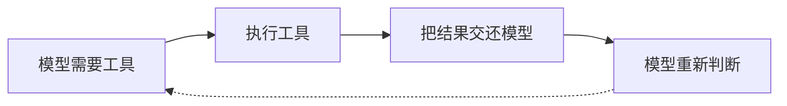
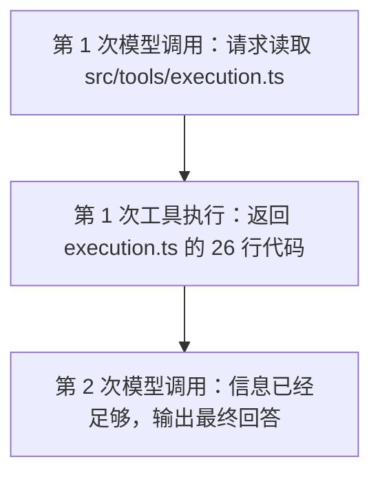
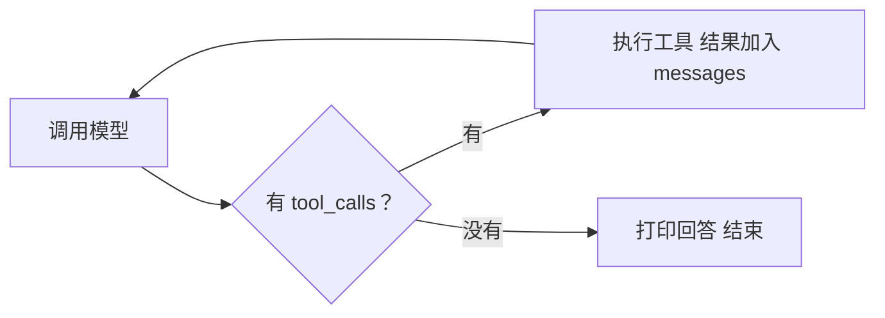

# 第 1 章 · 最小 Agent Loop

> 本章目标：只给模型一个 `read_file` 工具，跑通最小的 Agent Loop。

上一章看到的 Coding Agent 能搜索、读文件、改代码、跑命令。这一章先把那些能力全部拿掉，Whale CLI 暂时只有一个工具：读取指定文件。

> 在 Whale CLI 里输入”读取 src/tools/execution.ts”——这句话怎么就变成了一次真实的本地文件读取？

## 准备工作

教程从这一章开始构建 Whale CLI，用它分析一个真实的开源项目。

克隆目标项目。这里用 OpenClaw，一个 2 万多个文件的 TypeScript AI 助手：

```bash
git clone https://github.com/openclaw/openclaw.git
```

不需要安装它的依赖或启动服务，Whale CLI 只需要读它的源码。教程中的 trace 和行号基于 commit `5bfcd779`，使用其他版本时文件内容可能略有不同。

配置 API Key。Whale CLI 通过 API 调用大模型，我们接下来的演示都以 DeepSeek V4 Flash 为例：

<OsCommandTabs>
  <template #windows>

```powershell
$env:LLM_API_KEY = "sk-你的deepseek-key"
$env:LLM_MODEL = "deepseek-v4-flash"
$env:LLM_BASE_URL = "https://api.deepseek.com/v1"
```

  </template>
  <template #macos>

```bash
export LLM_API_KEY="sk-你的deepseek-key"
export LLM_MODEL="deepseek-v4-flash"
export LLM_BASE_URL="https://api.deepseek.com/v1"
```

  </template>
  <template #linux>

```bash
export LLM_API_KEY="sk-你的deepseek-key"
export LLM_MODEL="deepseek-v4-flash"
export LLM_BASE_URL="https://api.deepseek.com/v1"
```

  </template>
</OsCommandTabs>

其他 OpenAI 兼容接口只需要换对应的 key 和 base_url。

安装依赖并运行。教程用 [uv](https://docs.astral.sh/uv/) 管理 Python 环境，没装的话先装一下：

```bash
# macOS / Linux
curl -LsSf https://astral.sh/uv/install.sh | sh

# Windows (PowerShell)
powershell -ExecutionPolicy ByPass -c "irm https://astral.sh/uv/install.ps1 | iex"
```

每章的配套代码在 `code/chapter-NN/` 目录下。安装依赖只需要一次：

```bash
uv venv
uv pip install openai rich
```

然后进入目标项目目录运行：

```bash
cd openclaw
python ../code/chapter-01/main.py "你的任务"
```

Whale CLI 会在当前目录下工作——它读取、搜索和修改的都是当前目录里的文件。后续章节的运行方式相同，只是换成 `chapter-02`、`chapter-03`……

我们慢慢来。前四章的重点是工具本身——怎么定义、模型怎么选、返回什么，跑法就用最省事的一种：任务当命令行参数塞进去，跑完就退。第 5 章把代码拆成模块之后会打包成 `whale-cli` 命令，那时候才进对话式界面。


---

## 1. 同一个问题，两次不同的回答

OpenClaw 的目录结构大致长这样：

```text
openclaw/
├── README.md
├── package.json
├── src/
│   ├── entry.ts
│   ├── gateway/
│   ├── tools/
│   ├── sessions/
│   └── ...
└── ...
```

进入 OpenClaw 目录，运行本章的 `main.py`：

```bash
cd openclaw
python ../code/chapter-01/main.py "读取 src/tools/execution.ts，告诉我 formatToolExecutorRef 函数的逻辑"
```

这条命令启动了 Whale CLI。它会把引号里的任务发给模型，然后进入 Agent Loop。先从一个简单的任务开始——直接给出文件路径：

```text
读取 src/tools/execution.ts，告诉我 formatToolExecutorRef 函数的逻辑
```

先看看 Whale CLI 内部发生了什么。调用大模型的 API 时，我们要发送一个 `messages` 数组。这个数组就是整段对话的历史记录，每一条消息带一个 `role`，标明它是谁说的。LLM API 是无状态的：服务端不会记得上一次请求的内容，每次调用都要把完整的对话历史重新发过去。这一点和网页聊天的体验很不一样，后面会反复碰到。

我们先做一个对比实验。第一遍只发送一条 `user` 消息，不给模型任何工具，看看它会怎么回答：

```python
messages = [
    {
        "role": "user",
        "content": "读取 src/tools/execution.ts，告诉我 formatToolExecutorRef 函数的逻辑",
    }
]

response = client.chat.completions.create(
    model=model,
    messages=messages,
)
```

这里用的是 OpenAI 的 Chat Completions API 格式。国内外的模型服务商大多兼容这套格式，所以同一段代码换个 `base_url` 和 `api_key` 就能跑不同的模型。Whale CLI 全程走这套协议。

模型回答：

```text
我无法直接访问你电脑上的项目文件。请把 src/tools/execution.ts 的内容发给我。
```

这个回答没有错。模型运行在远程服务器上，它收到的请求中只有一句 user 消息，既没有文件的内容，也没有访问本地文件系统的方式。现在保持同样的问题不变，只在请求中增加一个 `tools` 参数：

```python
response = client.chat.completions.create(
    model=model,
    messages=messages,
    tools=TOOLS,
)
```

再试一次，这回把工具列表也传进去。模型不再返回普通文字，它返回了一段结构化的工具调用请求：

```json
{
  "role": "assistant",
  "content": null,
  "tool_calls": [
    {
      "id": "call_7fj3",
      "type": "function",
      "function": {
        "name": "read_file",
        "arguments": "{\"path\":\"src/tools/execution.ts\"}"
      }
    }
  ]
}
```

两次请求用的是同一个模型，问的也是同一句话。第二次请求只是多了一份工具说明，模型的行为就变了：

| 请求中的工具配置 | 模型的行为 |
| --- | --- |
| 没有 `tools` | 请你把文件内容粘贴过来 |
| 提供 `read_file` | 请求调用 `read_file("src/tools/execution.ts")` |

但模型此时仍然没有读到文件。它只表达了一个意图：

> 我想调用 `read_file`，参数是 `src/tools/execution.ts`。

真正的文件读取还没有发生。

## 2. tools 参数做了什么

模型能够返回结构化的工具调用请求，这个能力有个名字叫 **Function Calling**——2023 年 6 月 OpenAI 在 GPT-3.5/4 的 API 里首次发布。在这之前，想让模型调工具只能让它输出一段约定格式的纯文本（比如 `Action: search\nAction Input: "Python GIL"`），然后用正则去解析，格式稍微歪一下就解析失败。Function Calling 把工具调用变成了 API 层面的正式功能，可靠性大幅提升。同年 11 月 OpenAI 又升级成了 **Tool Calling**（`tool_calls` 字段 + `role: "tool"`），最关键的变化是支持并行调用——模型一次可以同时请求多个工具。Anthropic 后来也实现了类似的机制，叫 **Tool Use**，设计思路一样。

所以 Function Calling、Tool Calling、Tool Use 说的都是同一件事：模型返回结构化的工具请求，程序执行后把结果送回去。名字不同，但底层逻辑一致。

<Viz src="/viz/ch01-function-to-tool-evolution.html" title="从 Function Calling 到 Tool Calling 的演变" />

传给模型的工具说明长这样（参数描述遵循 JSON Schema 格式——一种标准化的 JSON 结构定义方式）：

```python
TOOLS = [
    {
        "type": "function",
        "function": {
            "name": "read_file",
            "description": (
                "读取当前项目中的 UTF-8 文本文件。"
                "当回答问题需要知道本地文件内容时使用。"
            ),
            "parameters": {
                "type": "object",
                "properties": {
                    "path": {
                        "type": "string",
                        "description": "相对于当前工作目录的文件路径",
                    }
                },
                "required": ["path"],
            },
        },
    }
]
```

`parameters` 里的 `"type": "object"` 表示参数整体是一个对象，`properties` 列出每个参数的类型和说明，`required` 标明哪些必须传。这个格式是 OpenAI 定的，DeepSeek 等兼容供应商都用同一套。

这里没有 `Path.read_text()`，也没有任何能够访问磁盘的代码。它只告诉模型：有一个工具叫 `read_file`；适合在需要本地文件内容时使用；调用时必须提供 `path`。可以把它看成一份菜单——模型负责看菜单、判断当前是否需要某个工具，并生成调用请求，至于工具怎样执行，模型不知道。把 `tools` 传给 OpenAI 或 DeepSeek，并不意味着云端模型获得了你电脑的文件权限。模型始终没有碰到你的磁盘。本地程序收到 `tool_calls` 后，才会根据工具名找到相应的 Python 函数：

```python
from pathlib import Path


def read_file(path: str) -> str:
    try:
        return Path(path).read_text(encoding="utf-8")
    except Exception as exc:
        return f"Error: {type(exc).__name__}: {exc}"
```

模型点菜，本地程序上菜。如果把 `read_file` 从 `TOOLS` 中删掉，再问同一个问题，模型通常会重新要求你把文件内容粘贴过来。以后加入 Bash 工具，模型也可能选择执行：

```bash
cat README.md
```

如果 `read_file` 的描述只写一句含糊的”处理文件”，模型分不清它是读文件、改文件还是查文件信息，工具选择就不稳定了。工具集和工具说明，会改变模型探索问题的方式。这个顺序没有写死在主循环里。

<Viz src="/viz/ch01-schema-compare.html" title="工具描述写法对比" />


## 3. 从工具请求到真正执行

拆开看看这条工具调用长什么样：

```json
{
  "id": "call_7fj3",
  "function": {
    "name": "read_file",
    "arguments": "{\"path\":\"src/tools/execution.ts\"}"
  }
}
```

本地程序先解析参数：

```python
import json

call = response["tool_calls"][0]
name = call["function"]["name"]
args = json.loads(call["function"]["arguments"])
```

这里的 `arguments` 看起来像 JSON 对象，实际类型却是字符串（`'{"path":"src/tools/execution.ts"}'`），所以要先经过一次 `json.loads()`，才能得到 Python 字典：

```python
{"path": "src/tools/execution.ts"}
```

接着执行函数：

```python
result = read_file(**args)
```

`src/tools/execution.ts` 的内容只有 26 行：

```typescript
import type { ToolExecutorRef } from "./types.js";

export function formatToolExecutorRef(ref: ToolExecutorRef): string {
  switch (ref.kind) {
    case "core":
      return `core:${ref.executorId}`;
    case "plugin":
      return `plugin:${ref.pluginId}:${ref.toolName}`;
    case "channel":
      return `channel:${ref.channelId}:${ref.actionId}`;
    case "mcp":
      return `mcp:${ref.serverId}:${ref.toolName}`;
    default: {
      const exhaustive: never = ref;
      return exhaustive;
    }
  }
}
```

`result` 就是这段文本。但模型还没有看到它——文件内容只存在于 Whale CLI 这个 Python 进程的内存中。要让模型继续判断，得把工具结果放回 `messages`。

<figure class="chapter-figure">
  
  <figcaption><strong>第 1 章 · 模型发请求，本地程序打开文件</strong>：<code>tool_call</code> 只描述动作；磁盘访问发生在 Whale CLI 的本地进程里。</figcaption>
</figure>

## 4. 把工具请求也存进 messages

工具执行完成后，不能只追加结果：

```python
messages.append({
    "role": "tool",
    "content": result,
})
```

在添加工具结果之前，要先保存模型刚刚返回的 assistant message：

```python
messages.append(response)
```

然后再添加工具结果：

```python
messages.append({
    "role": "tool",
    "tool_call_id": call["id"],
    "content": result,
})
```

走到这一步，`messages` 数组里已经积累了三条消息，结构大致是这样：

```json
[
  {
    "role": "user",
    "content": "读取 src/tools/execution.ts，告诉我 formatToolExecutorRef 函数的逻辑"
  },
  {
    "role": "assistant",
    "content": null,
    "tool_calls": [
      {
        "id": "call_7fj3",
        "function": {
          "name": "read_file",
          "arguments": "{\"path\":\"src/tools/execution.ts\"}"
        }
      }
    ]
  },
  {
    "role": "tool",
    "tool_call_id": "call_7fj3",
    "content": "import type { ToolExecutorRef } from \"./types.js\";\n\nexport function formatToolExecutorRef(ref: ToolExecutorRef): string {\n  switch (ref.kind) {\n    case \"core\":\n      return `core:${ref.executorId}`;\n……"
  }
]
```

第二条消息表达：模型请求读取 `execution.ts`。第三条消息表达：这个请求的执行结果在这里。`tool_call_id` 把请求和结果对应起来。当前只有一个工具调用，看起来好像没有 ID 也能猜出来，但模型可以在一次响应中同时请求读取多个文件：

```text
call_001 → read_file("src/tools/execution.ts")
call_002 → read_file("src/tools/types.ts")
call_003 → read_file("src/tools/planner.ts")
```

三个结果都来自 `read_file`，仅凭工具名分不清谁对应谁。`tool_call_id` 就是这三组请求与结果之间的配对编号。消息顺序也不能倒过来——如果 `tool` 消息先出现，API 会看到一个来历不明的结果：前面还没有 assistant 声明过 `call_7fj3`，后面却突然出现了它的执行结果。顺序只能是：

```text
assistant：我要调用 call_7fj3
tool：这是 call_7fj3 的结果
```

消息顺序是协议规定的。

<Viz src="/viz/ch01-message-order.html" title="为什么工具结果必须跟在工具请求后面" />

<figure class="chapter-figure">
  
  <figcaption><strong>第 1 章 · 一次工具调用，messages 多出两条</strong>：<code>assistant.tool_calls</code> 记录请求，<code>tool</code> 记录与 <code>call_7</code> 对应的结果。</figcaption>
</figure>

工具执行结果怎么放回 messages，OpenAI 和 Anthropic 的格式不一样：

::: code-group

```python [Whale CLI — OpenAI 格式]
messages.append({
    "role": "tool",
    "tool_call_id": call["id"],
    "content": result,
})
```

```python [Kimi CLI — OpenAI 格式]
Message(role="tool", content=content, tool_call_id=tool_call_id)
# role 是 "tool"，和 assistant 的 tool_call_id 对应
```

```typescript [Claude Code — Anthropic 格式]
createUserMessage({
  content: [{
    type: "tool_result",
    tool_use_id: toolUse.id,
    content: resultText,
    is_error: false,
  }],
})
// Anthropic 没有 role: "tool"，结果放在 role: "user" 的内容块里
```

```typescript [Pi Agent — 自定义格式]
{ role: "toolResult",
  toolCallId: string,
  content: (TextContent | ImageContent)[],
  isError: boolean }
// 自己定义了 provider 无关的中间格式，再由适配层转换
```

```typescript [Gemini CLI — Gemini API 格式]
// functionResponse part：
{ functionResponse: {
    name: toolName,
    response: { output: resultText }
}}
// Google 的格式又不一样，用 functionResponse 包装
```

```rust [Codex CLI — Responses API 格式]
// function_call_output item：
// { type: "function_call_output",
//   call_id: "...", output: "..." }
```

:::

Whale CLI 和 Kimi CLI 都走 OpenAI 兼容格式，用 `role: "tool"` + `tool_call_id` 回传结果。Claude Code 走 Anthropic 格式，没有 `role: "tool"`，结果放在 `role: "user"` 的 `tool_result` 内容块里。Gemini CLI 用 Google 的 `functionResponse` 包装。Pi Agent 自己定义了一层中间格式，再由适配层转成各家 API 需要的样子。Codex CLI 走 OpenAI 的 Responses API，用 `function_call_output` item。

## 5. 第二次调用模型，它会直接回答吗

现在把更新后的完整 `messages` 再发给模型：

```python
response = client.chat.completions.create(
    model=model,
    messages=messages,
    tools=TOOLS,
)
```

模型已经看到 `execution.ts` 的全部 26 行代码，信息足够回答了。这次响应里没有 `tool_calls`，模型直接给出了文字回答：

```text
formatToolExecutorRef 函数接收一个 ToolExecutorRef 类型的参数，
根据其 kind 属性的不同值来生成不同的字符串标签：

- core → core:{executorId}
- plugin → plugin:{pluginId}:{toolName}
- channel → channel:{channelId}:{actionId}
- mcp → mcp:{serverId}:{toolName}

如果 kind 不属于上述任何一种，会触发 TypeScript 的穷尽性检查错误。
这个函数主要用于日志记录和调试信息输出。
```

一次工具调用，模型就完成了任务。但如果文件内容不足以直接回答呢？换一个问题试试：让模型去读 `src/tools/index.ts`，问它"这些导出的函数分别在哪个文件里实现的"。模型读完 `index.ts` 后发现它只有 `export ... from` 语句，真正的实现在其他文件里。于是它会继续请求读取 `./descriptors.ts`、`./planner.ts` 等文件——每次看到的新结果，都会改变下一步。

程序只管一件事：



调用几次、先读哪个文件、什么时候停止，由任务和中间结果决定。

## 6. 最小 Agent Loop

回顾刚才的完整过程：



只有两次模型调用，一次工具执行。但换一个更复杂的问题，循环可能运行很多次。

把文件名和具体内容拿掉，只剩下一条很短的控制流：



点击下面骨架代码的每一行，看看它在循环中负责什么：

<Viz src="/viz/ch00-code-explainer.html" title="Agent Loop 骨架代码逐行解读" />

这个控制流就是第 0 章提到的 ReAct（想一步、做一步、看一步）。"调用模型"那一步是 Reasoning，模型在决定下一步干什么。返回 `tool_calls` 后本地程序执行工具，这是 Acting。执行结果塞进 `messages` 再次发给模型，模型看到结果（Observation），继续推理。三个阶段循环往复，直到模型认为信息足够、不再请求工具，循环自然结束。第 0 章那 51 次工具调用的 trace，底层跑的就是这段循环。

<figure class="chapter-figure source-figure source-figure--compact">
  
  <figcaption><strong>ReAct · Reasoning 与 Acting 共用一条循环</strong>：论文把 reasoning traces、actions 和 observations 放进同一条反馈回路。来源：<a href="https://research.google/blog/react-synergizing-reasoning-and-acting-in-language-models/" target="_blank" rel="noreferrer">Google Research</a>、<a href="https://arxiv.org/abs/2210.03629" target="_blank" rel="noreferrer">论文原文</a>。</figcaption>
</figure>

<Viz src="/viz/ch01-minimal-loop.html" title="最小 Agent Loop 步进演示" />

它没有单独的”规划模块”。模型通过每一次响应，临时决定当前需要采取什么动作。环境返回新的信息后，它再做下一次判断。读两个文件就够了，循环跑两轮；要在 2 万多个文件里定位入口，循环可能跑几十轮。轮数不是预设的，是任务本身决定的。


<WhaleInsight>

很多人以为 Agent 有个"大脑"在统筹全局。其实没有。每一轮模型只看到 messages 里已有的东西，然后决定下一步。所谓智能，是循环跑出来的，不是预设进去的。

</WhaleInsight>

## 7. 完整代码

先把工具注册和执行放进同一个文件。

```python
# tools.py

from pathlib import Path
from typing import Any, Callable


TOOLS = [
    {
        "type": "function",
        "function": {
            "name": "read_file",
            "description": (
                "读取当前项目中的 UTF-8 文本文件。"
                "当回答问题需要知道本地文件内容时使用。"
            ),
            "parameters": {
                "type": "object",
                "properties": {
                    "path": {
                        "type": "string",
                        "description": "相对于当前工作目录的文件路径",
                    }
                },
                "required": ["path"],
            },
        },
    }
]


def read_file(path: str) -> str:
    try:
        return Path(path).read_text(encoding="utf-8")
    except Exception as exc:
        return f"Error: {type(exc).__name__}: {exc}"


TOOL_FUNCTIONS: dict[str, Callable[..., str]] = {
    "read_file": read_file,
}


def run_tool(name: str, args: dict[str, Any]) -> str:
    fn = TOOL_FUNCTIONS.get(name)
    if fn is None:
        return f"Error: unknown tool '{name}'"

    try:
        return fn(**args)
    except Exception as exc:
        return f"Error: {type(exc).__name__}: {exc}"
```

这里故意保留了几份重复的工具信息：

```text
TOOLS              给模型看的工具说明
read_file          真正执行读取的函数
TOOL_FUNCTIONS     根据名字找到函数
```

一个工具时还能接受，下一章加入第二个工具后就会碰到这种写法的问题。模型调用单独包一层。这里用的是 OpenAI 的 Python SDK（`uv pip install openai`），DeepSeek 等供应商都兼容同一套接口，只需要换 `api_key` 和 `base_url`：

```python
# llm_client.py

import os

from openai import OpenAI


class LLMClient:
    def __init__(self) -> None:
        api_key = os.getenv("LLM_API_KEY")
        base_url = os.getenv("LLM_BASE_URL")
        self.model = os.getenv("LLM_MODEL")

        if not api_key:
            raise RuntimeError("请设置 LLM_API_KEY")
        if not self.model:
            raise RuntimeError("请设置 LLM_MODEL")

        self.client = OpenAI(
            api_key=api_key,
            base_url=base_url,
        )

    def chat(self, messages: list[dict], tools: list[dict]) -> dict:
        response = self.client.chat.completions.create(
            model=self.model,
            messages=messages,
            tools=tools,
        )
        return response.choices[0].message.model_dump(exclude_none=True)
```

`model_dump(exclude_none=True)` 把 SDK 返回的对象转成普通字典，方便后面用 `response.get("tool_calls")` 这种方式读取。`exclude_none` 去掉值为 `None` 的字段，保持数据干净。

主循环只剩下这一段：

```python
# main.py

import json
import sys

from llm_client import LLMClient
from tools import TOOLS, run_tool


def run_agent(task: str, max_turns: int = 10) -> str:
    llm = LLMClient()

    # system 消息不是对话的一部分，而是给模型的行为指令
    # —— 告诉它扮演什么角色、遵守什么规则
    messages: list[dict] = [
        {
            "role": "system",
            "content": (
                "你是一个代码助手。需要本地文件内容时使用提供的工具，"
                "不要猜测文件内容。"
            ),
        },
        {
            "role": "user",
            "content": task,
        },
    ]

    for _ in range(max_turns):
        response = llm.chat(messages, tools=TOOLS)

        # assistant 的工具请求必须先进入历史
        messages.append(response)

        tool_calls = response.get("tool_calls")
        if not tool_calls:
            return response.get("content", "")

        for call in tool_calls:
            name = call["function"]["name"]

            try:
                args = json.loads(call["function"]["arguments"])
                result = run_tool(name, args)
            except json.JSONDecodeError as exc:
                result = f"Error: invalid tool arguments: {exc}"

            print(f"⏺ {name}({args})", file=sys.stderr)

            messages.append(
                {
                    "role": "tool",
                    "tool_call_id": call["id"],
                    "content": result,
                }
            )

    return f"Error: 达到最大轮数 {max_turns}，任务仍未完成"


if __name__ == "__main__":
    if len(sys.argv) < 2:
        raise SystemExit('用法：python main.py "你的任务"')

    answer = run_agent(sys.argv[1])
    print(answer)
```

运行这段代码时，终端里会看到工具调用和结果交替出现。下面的交互组件模拟了这个过程——左边是代码，右边是终端输出：

<Viz src="/viz/ch01-code-terminal.html" title="代码-终端联动" />

对照 ReAct 的三个阶段，每一步在代码里的位置：

```python
# Reasoning —— 模型看到当前 messages，决定下一步
response = llm.chat(messages, tools=TOOLS)

# 模型的工具请求先进入历史（它刚才"想"了什么、"要"什么）
messages.append(response)

# Acting —— 本地程序执行模型点的工具
result = run_tool(name, args)

# Observation —— 把执行结果交还模型，下一轮它会看到
messages.append({"role": "tool", "tool_call_id": call["id"], "content": result})
```

没有单独的 reasoning 模块，也没有 observation 模块。模型的文本输出就是推理过程，`tool` 消息就是观察结果。三个阶段靠消息的 role 区分，在同一个循环体里完成。

代码里的 `for` 循环并不决定 Agent 做什么。它只负责让模型有机会在看到新结果以后再判断一次。真正控制循环是否继续的是：

```python
tool_calls = response.get("tool_calls")

if not tool_calls:
    return response.get("content", "")
```

模型继续请求工具，循环就继续。模型返回普通文本，循环在这个 `if` 处退出。

各家 Coding Agent 的循环退出判断逻辑：

::: code-group

```python [Whale CLI]
tool_calls = response.get("tool_calls")
if not tool_calls:
    return response.get("content", "")
# 没有 tool_calls → 模型给出了最终回答
```

```python [Kimi CLI]
if result.tool_calls:
    return None  # 继续循环
return StepOutcome(stop_reason="no_tool_calls")
```

```typescript [Claude Code]
// stop_reason === 'tool_use' is unreliable
// 只看响应内容里有没有 tool_use 块
if (!needsFollowUp) { /* 退出循环 */ }
```

```typescript [Pi Agent]
hasMoreToolCalls = false;
if (toolCalls.length > 0) {
    hasMoreToolCalls = !executedToolBatch.terminate;
}
// terminate 信号允许工具主动结束循环
```

```typescript [Gemini CLI]
// 依赖模型返回的 finishReason 字段
if (finishReason) {
    yield { type: GeminiEventType.Finished, ... };
}
// 不检查 functionCalls 是否为空，而是信任 finishReason
```

```rust [Codex CLI]
// Responses API 格式：检查 output 里有没有 function_call item
// 有 → 执行工具继续循环
// 没有 → 模型给出了最终回答
```

:::

Whale CLI 看响应里有没有 `tool_calls`，没有就退出。Claude Code 也是看内容，注释里写了 `stop_reason` 不可靠。Gemini CLI 不同，它信任 `finishReason` 字段。Kimi CLI 和 Codex CLI 的判断方式和 Whale CLI 一样。

## 8. 每一轮都要带上完整历史

<figure class="chapter-figure">
  
  <figcaption><strong>第 1 章 · 历史写在 messages 里</strong> —— API 不会替 Whale CLI 记住上一轮，每次请求都要重新带上运行现场。</figcaption>
</figure>

任务完成时，`messages` 中包含：

```text
system
  告诉模型怎样行动

user
  我们最初的问题

assistant
  read_file 请求

tool
  execution.ts 的内容
```

第二次调用 API 时，这些消息会被完整地再次发送。模型服务端不会替 Whale CLI 保存上一次请求，假如只发送最后一条 `tool` 消息，模型不知道：

* 我们原本问了什么；
* 为什么突然收到一段 TypeScript 代码；
* 这段内容对应哪一次工具调用。

服务器并没有持续运行一个模型进程等着下一句话。每次 API 调用都是重新开卷——把系统规则、任务描述、之前做过的动作、工具返回的结果全部重新递过去。Whale CLI 通过保存和重新发送 `messages`，维持了这次任务的连续性。

<Viz src="/viz/ch01-messages-growth.html" title="一次任务中 messages 怎样增长" />

四种 role：

| role        | 谁写的           | 在循环中起什么作用     |
| ----------- | ------------- | ------------- |
| `system`    | Whale CLI 开发者 | 规定整体行为        |
| `user`      | 用户            | 提出任务          |
| `assistant` | 模型            | 给出回答，或者提出工具请求 |
| `tool`      | 本地程序          | 返回工具执行结果      |

<Viz src="/viz/ch01-messages-roles.html" title="messages 四种 role" />

`assistant` 并不只代表自然语言回复。当模型请求工具时，这条 assistant message 的主要内容就是 `tool_calls`。

## 9. 破坏循环，观察行为变化

一次只改一个条件，看行为怎样变化。

### 拿掉 `tools=TOOLS`

同样的问题不变。模型重新回到普通 Chatbot 的行为，请你把文件内容粘贴过来。读取文件的能力来自工具接入，不是模型凭空获得了本地权限。

### 把工具描述改成一句含糊的“处理文件”

有些模型仍然可能调用它，有些模型会犹豫，也可能直接反问你。工具函数完全没有变化，仅仅修改 description，模型的选择已经可能改变。description 是写给模型看的交互界面。

### 把 `execution.ts` 中的函数实现删掉，只留签名

模型读完后发现文件只有类型签名没有实现，可能会去读其他文件找实现，也可能直接说”这个文件只有签名”。文件内容决定模型的下一步判断。

### 删除 `messages.append(response)`

程序执行工具后，只把结果送回 API。这时工具结果前面缺少对应的 assistant 请求，协议无法建立调用与结果的关系。

### 删除 `tool_call_id`

单个调用时人还能看出结果属于谁，API 仍然会拒绝这条不完整的工具消息。

### 把 `max_turns` 改成 1

假如你问的是"这个项目怎么启动"，模型读完 README.md 后还想继续读 `package.json`，但程序已经没有下一次循环机会。你会得到一个尚未完成的任务。


## 10. 给一个不存在的路径试试

刚才的任务之所以顺利，是因为我们在提问时直接给出了 `src/tools/execution.ts` 的路径。现在换一个更自然的问法：

```text
找到这个项目里处理工具可用性判断的代码，
告诉我 evaluateToolAvailability 函数做了什么。
```

模型知道自己要找什么，但不知道代码在哪个文件里。它只能照着训练中见过的项目惯例猜路径，连试了十轮：

<figure class="chapter-figure term-shot">
  
  <figcaption>十次调用全部用来猜路径，一次也没猜中。</figcaption>
</figure>

十次调用里，`.`、`src`、`src/gateway`、`src/agents`、`src/plugin-sdk` 都是目录，`read_file` 读不了；`dist` 和 `src/provider-tools` 干脆不存在。只有 `src/index.ts` 真读到了内容，但那是个 re-export 文件，里面没有它要找的东西。

这几条是另外核的，终端上并不显示。这一章的主循环只打印发出去的请求：

```python
print(f"⏺ {name}({args})", file=sys.stderr)
```

返回值直接塞回 `messages` 给模型看了。所以只知道它调了十次，不知道十次分别撞在哪。下一章会把工具结果也打出来，用一行 `⎿` 缩进显示返回的前几行。

模型是有章法的：先看根目录，再翻 `package.json`，然后沿着 `src/` 一层层往下试。这套路子放到多数项目上都算合理——问题在于它自始至终是在**猜**目录里有什么，而不是**看**。

`evaluateToolAvailability` 其实在 `src/tools/availability.ts`。这次运行里模型连 `src/tools` 都没试到，它顺着 "provider-tools" 这个词往 `src/plugin-sdk` 的方向找去了。

换个时间再跑，猜的路径会不一样，可能碰巧撞对，也可能错得更远。但只要手里只有 `read_file`，"靠猜"这件事就不会变。

2 万多个文件的项目，只凭猜测命中正确路径的概率趋近于零。模型需要一种方式来查看目录里到底有什么。仿照 `read_file`，增加一个 `list_dir`：

```python
def list_dir(path: str = ".") -> str:
    return "\n".join(
        item.name for item in Path(path).iterdir()
    )
```

然后要继续修改：

```text
TOOLS
  加入 list_dir 的 schema

TOOL_FUNCTIONS
  加入 "list_dir": list_dir

函数定义
  写出 list_dir()
```

三个地方少改一个，程序都可能表现异常。工具只有两个，重复已经出现了。

## 11. 两个工具的维护成本

到这里，Whale CLI 的 Agent Loop 已经跑通了。给一个明确路径，它能读到文件；路径未知时，它会瞎猜——这个问题以后靠 Glob 和 Grep 解决。但眼下有一个更基础的问题挡在前面。

刚才加 `list_dir` 的过程中，我们在三个不同的位置写了同一个工具的信息：schema 里写一遍名字和参数，dispatch 字典里写一遍名字到函数的映射，函数本身再写一遍。三处描述的是同一件事，却散落在代码的不同角落。

后面还要加 Write、Edit、Glob、Grep、Bash——每加一个工具都要在三处保持一致。下一章解决这个问题。

---

## 附录：OpenAI 与 Anthropic 的格式差异

OpenAI 把工具调用放在 `tool_calls` 字段里，参数是 JSON 字符串，需要 `json.loads` 解析。Anthropic 用 content blocks 数组，工具调用是其中一个 `type: "tool_use"` 的 block，参数直接是 JSON 对象，不需要额外解析。Whale CLI 走 OpenAI 兼容协议，所以代码里会看到 `json.loads(call["function"]["arguments"])`。

<Viz src="/viz/ch01-api-format-compare.html" title="OpenAI vs Anthropic 工具调用格式对比" />
